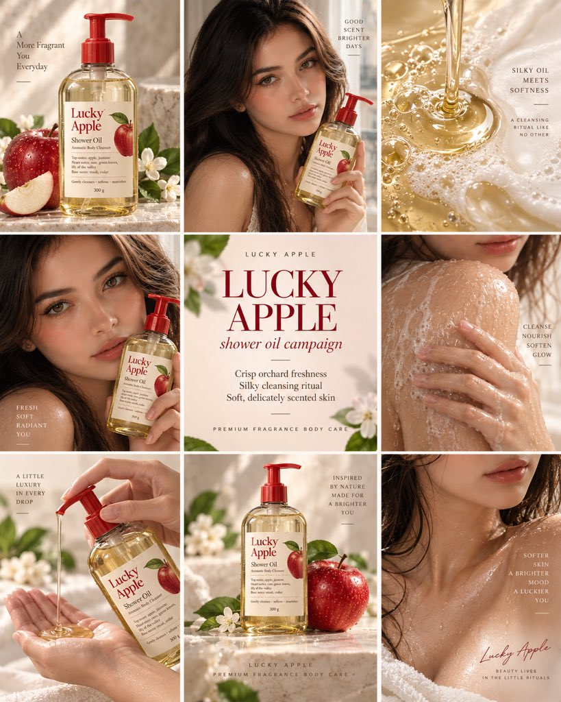

# One Product, Two Layouts: Lock Campaign Rules First

**中文标题：** 一品两出：先锁战役规则再换版式  
**ID:** `gi25-x-500` · **Mode:** `generate`  
**Categories:** `poster-typography`, `ecommerce`  
**Tags:** `x-twitter`, `community`, `gpt-image-2.5`, `xianyu`, `en`



### One Product, Two Layouts: Lock Campaign Rules First

```text
One product. Two formats. Built in GPT Image 2.5.

Campaign lock rules (keep fixed across formats):
- clear bottle + signature red pump
- apple red + cream + soft green
- red apple, blossoms, water droplets
- silky golden oil + soft emulsion
- luminous wet skin
- crisp fruit + floral + musky cedar
- fresh, feminine, fragrance-led luxury

Outputs from the same visual system:
1) cinematic commercial
2) 3×3 selling-point poster

Principle: lock campaign rules first, then change format without the brand falling apart.
```

- **Recommended model:** `gpt-image-2.5-sunburst`
- **Settings:** _(defaults)_
- **Source:** [community](https://x.com/NoravaleAI/status/2100225374974026080) — @NoravaleAI (via xianyu110/awesome-gpt-image2.5)
- **License note:** Community X post mirrored in xianyu110/awesome-gpt-image2.5; remix with attribution
- **Notes:** xianyu110 case 2100225374974026080; category=海报排版
- **Preview:** `previews/gi25-x-500.jpg`
