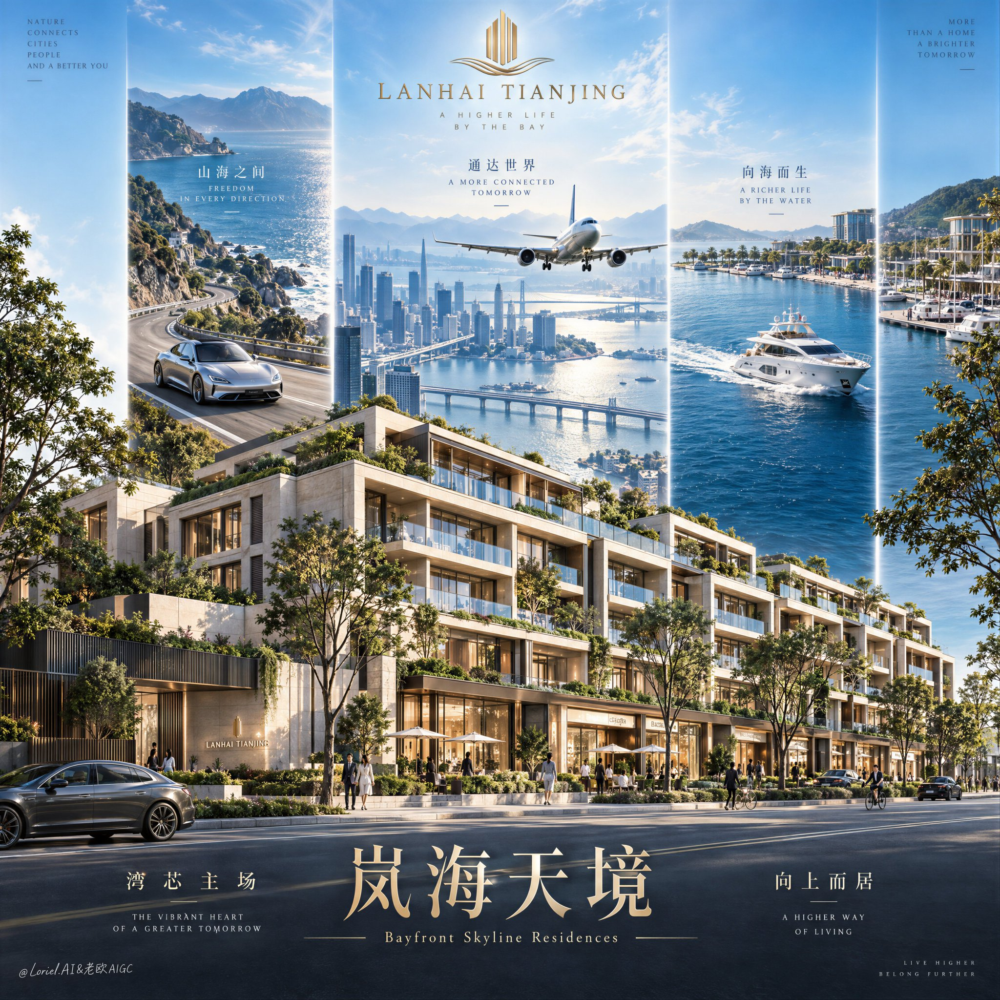

# Real-Estate Lifestyle Triptych Vertical Posters

**中文标题：** 楼盘先入镜：三竖屏生活区房地产海报  
**ID:** `gi25-x-501` · **Mode:** `edit`  
**Categories:** `poster-typography`, `ecommerce`  
**Tags:** `x-twitter`, `community`, `gpt-image-2.5`, `xianyu`, `zh`



### Real-Estate Lifestyle Triptych Vertical Posters

```text
A hyper-real premium real estate poster advertisement for a fictional domestic luxury development brand called LANHAI TIANJING, designed as a high-end architectural campaign visual that preserves a strong three-panel aspirational structure while making the residential property the absolute visual hero. In the foreground, create a highly realistic low-rise luxury mixed-use residential block occupying the full lower half of the composition: stepped contemporary architecture, elegant stone-and-glass facade, planted rooftop terraces, continuous balcony rhythm, warm boutique storefront glow at street level, mature roadside trees, a clean broad boulevard, a few small refined pedestrians and bicycles for scale, all physically plausible, meticulously detailed, and clearly premium.

Behind the building, rise three monumental vertical vision panels integrated into the poster like luminous branded portals. Keep the same tall, narrow, clean-edged three-column structure, evenly spaced, with the central panel slightly dominant. Left panel: a sunlit coastal mountain boulevard with a silver luxury electric grand tourer moving through a scenic curve, conveying freedom, status, and effortless access. Center panel: a bright bayfront skyline with waterfront towers, layered bridges, transport infrastructure, and a passenger jet flying toward camera above the city, expressing metropolitan reach, connectivity, and urban momentum. Right panel: a serene private marina scene with a sleek white yacht cutting through deep blue water near a high-end coastal leisure zone, expressing waterfront lifestyle and exclusive privilege. The three panels must feel unified in perspective, light quality, and graphic authority, acting as symbolic lifestyle extensions of the property rather than random collage fragments.

Framing and composition: vertical hero poster, slightly low eye-level architectural angle, strong rule of thirds, the property mass grounded and dominant in the lower field, the three aspiration panels rising behind it into the sky, generous negative space at the top for the logo and at the bottom for the title typography. Preserve the original visual grammar of upward ambition and layered value stacking, but sharpen the hierarchy so the residential architecture reads first, the central aspirational skyline reads second, and the side panels complete the narrative. Keep the flow from top emblem to middle triptych to building volume to bottom title band.

Lighting and color: bright cinematic daylight with polished ad-grade contrast, clear atmospheric glow in the upper sky, crisp sunlight on facade edges, soft shadow depth beneath balconies, refined glass reflections, luminous but controlled highlights across vehicles, aircraft, water, and architecture. Build stronger light-dark separation across the building mass to emphasize terrace depth and material volume. Color system: 60% clean sky blue, bay cyan, and cool daylight atmosphere; 30% warm ivory stone, greenery, and soft urban neutrals; 10% metallic gold accents in the logo and typography. The frame must feel fresh, prosperous, elegant, and globally aspirational, without muddy shadows, dead black patches, or oversaturated brochure harshness.

Materials and finish: ultra-real architectural visualization fused with luxury commercial photography. Dense matte mineral stone, crisp low-iron glass, realistic planted greenery with varied leaf density, elegant metal balcony rails, smooth asphalt, restrained storefront illumination, polished metallic vehicle bodywork, aerodynamic aircraft surface, glossy yacht hull, coherent scale relationships across every element. Maintain premium realism with clean micro-detail, subtle atmospheric depth, and highly controlled retouching, as if created for a Cannes-level property campaign.

Typography: place a refined minimal gold emblem at the top center, with the brand name "LANHAI TIANJING" below it in elegant uppercase serif. In the lower title band, set the Chinese main title exactly as "岚海天境" in large luxurious gold typography with graceful, slightly calligraphic serif character construction. Directly below it, add the English subtitle exactly as "Bayfront Skyline Residences" in a small refined serif. Add two supporting Chinese copy clusters in the lower typography zone: left cluster exactly "湾芯主场", right cluster exactly "向上而居", each paired with a subtle line of tiny English microcopy in a delicate editorial serif. Typography must feel integrated, spacious, and premium, with precise alignment, elegant kerning, controlled scale hierarchy, and safe margins away from the main building silhouette.

Output and constraints: polished luxury real estate commercial poster, architecture-first hierarchy, clean and unified visual system, no real city names, no real people names, no random clutter, no extra decorative noise. Keep architecture structurally correct, windows aligned, balconies logical, street scale believable, trees rooted, pedestrians small and anatomically normal, vehicles and yacht physically accurate, aircraft proportionally correct, typography readable and elegant. Avoid warped architecture, duplicated windows, broken perspective, malformed vehicles, unreadable text, floating objects, muddy grading, cheap CGI plastic surfaces, chaotic collage edges, distorted anatomy, extra fingers, broken limbs, black blotches, and off-style visual drift.
```

- **Recommended model:** `gpt-image-2.5-sunburst`
- **Settings:** _(defaults)_
- **Source:** [community](https://x.com/ou_zhen599/status/2100222341871726598) — @ou_zhen599 (via xianyu110/awesome-gpt-image2.5)
- **License note:** Community X post mirrored in xianyu110/awesome-gpt-image2.5; remix with attribution
- **Notes:** xianyu110 case 2100222341871726598; category=海报排版
- **Preview:** `previews/gi25-x-501.jpg`
