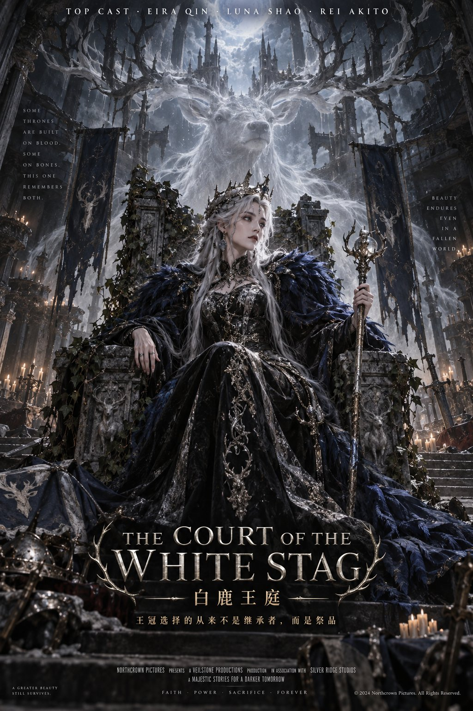

# 「白鹿王庭」Dark Fantasy Commercial Key Visual

**中文标题：** 《白鹿王庭》黑暗奇幻商业大片海报  
**ID:** `gi25-x-504` · **Mode:** `generate`  
**Categories:** `poster-typography`, `character-consistency`  
**Tags:** `x-twitter`, `community`, `gpt-image-2.5`, `xianyu`, `zh`



### 「白鹿王庭」Dark Fantasy Commercial Key Visual

```text
2:3竖版黑暗奇幻商业大片海报，电影标题《白鹿王庭 / THE COURT OF THE WHITE STAG》。原创成年动漫女王角色由真人电影演员式cosplay呈现，保留梦幻银发、锐利眼型和高辨识度轮廓，同时具有真实皮肤、精致冷调妆容与可触摸的服装材质。她头戴残缺银冠，身穿黑银刺绣长袍和深蓝羽毛披肩，端坐在被藤蔓侵蚀的古老王座上；背后浮现一头巨大白鹿的半透明灵体，鹿角延伸成枯树林与宫殿尖塔，阶梯下散落破碎旗帜。人物身体正对画面，脸略微偏向侧方，一只手扶王座，一只手握银色权杖，神态庄严疏离。月光从高处穿透穹顶，冷银轮廓光与少量烛火形成克制冷暖对比，黑色天鹅绒、金属、羽毛与石材均为电影级PBR质感，加入轻微胶片颗粒。顶部显示主演：“TOP CAST · EIRA QIN · LUNA SHAO · REI AKITO”；底部片名“THE COURT OF THE WHITE STAG”，宣传语“王冠选择的从来不是继承者，而是祭品”。下方只保留通用制片信息，不加入导演署名或手写签名。官方Key Visual，恢宏但不杂乱。
```

- **Recommended model:** `gpt-image-2.5-sunburst`
- **Settings:** _(defaults)_
- **Source:** [community](https://x.com/Mrpinecone888/status/2100204772578251107) — @Mrpinecone888 (via xianyu110/awesome-gpt-image2.5)
- **License note:** Community X post mirrored in xianyu110/awesome-gpt-image2.5; remix with attribution
- **Notes:** xianyu110 case 2100204772578251107; category=海报排版
- **Preview:** `previews/gi25-x-504.jpg`
