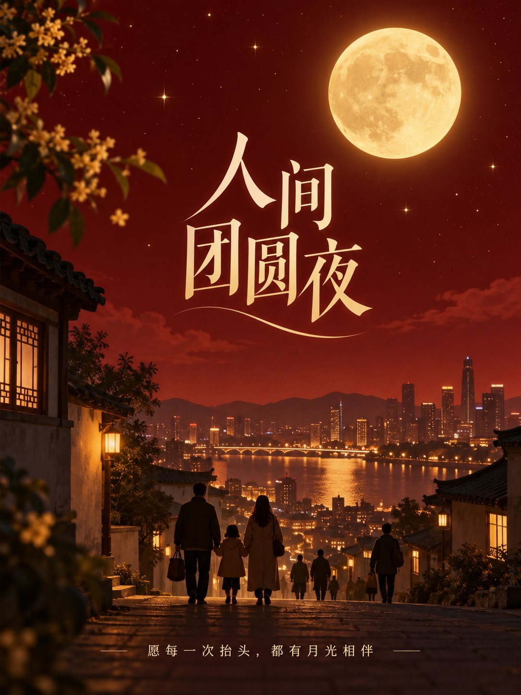

# Mid-Autumn 「人间团圆夜」 Vertical Poster

**中文标题：** 中秋「人间团圆夜」竖版海报：完整提示词  
**ID:** `gi25-x-505` · **Mode:** `generate`  
**Categories:** `poster-typography`, `xiaohongshu`  
**Tags:** `x-twitter`, `community`, `gpt-image-2.5`, `xianyu`, `zh`



### Mid-Autumn 「人间团圆夜」 Vertical Poster

```text
设计中秋节夜空海报，竖版 3:4。深红到暗红的渐变背景，暖金满月与细小星光构成简洁夜景；下方是城市屋顶与归家行人的柔和剪影。中央主标题“人间团圆夜”，底部小字“愿每一次抬头，都有月光相伴”。光影温柔，文字层级明确。只渲染指定中文，不添加其他文字、Logo、水印或乱码。
```

- **Recommended model:** `gpt-image-2.5-sunburst`
- **Settings:** _(defaults)_
- **Source:** [community](https://x.com/Mrpinecone888/status/2100204144149819616) — @Mrpinecone888 (via xianyu110/awesome-gpt-image2.5)
- **License note:** Community X post mirrored in xianyu110/awesome-gpt-image2.5; remix with attribution
- **Notes:** xianyu110 case 2100204144149819616; category=海报排版
- **Preview:** `previews/gi25-x-505.jpg`
