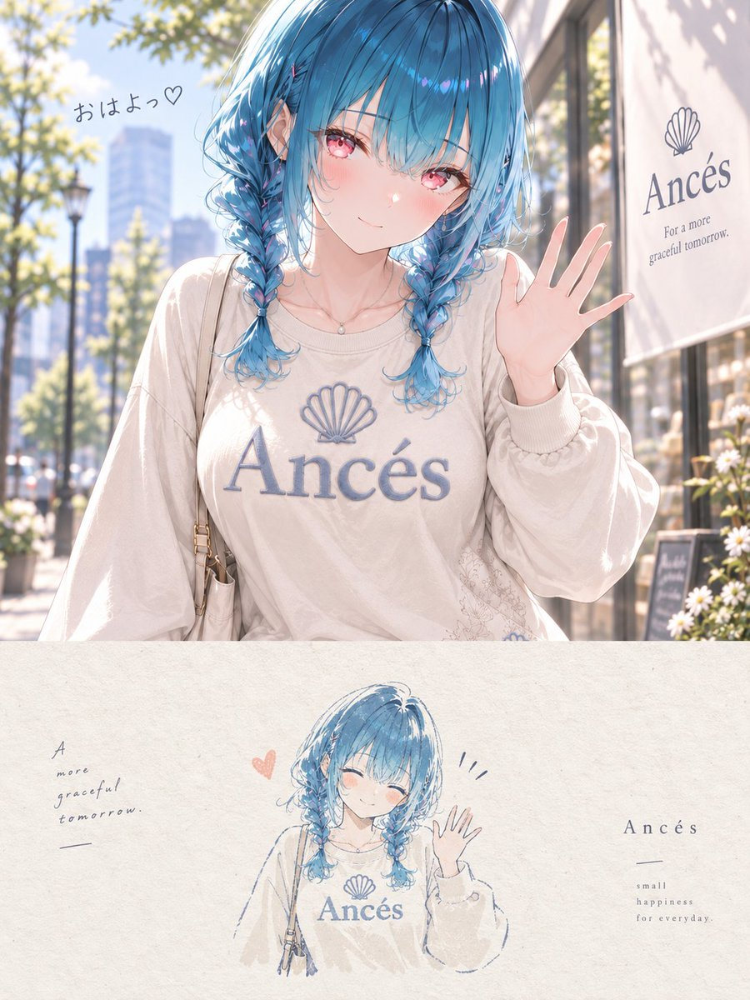

# Portfolio Split Poster: Photo Top + Sketch Bottom

**中文标题：** 上半原图 + 下半手绘：作品集切分海报  
**ID:** `gi25-x-506` · **Mode:** `edit`  
**Categories:** `poster-typography`, `edit-change-preserve`  
**Tags:** `x-twitter`, `community`, `gpt-image-2.5`, `xianyu`, `en`



### Portfolio Split Poster: Photo Top + Sketch Bottom

```text
Use the uploaded reference image.

Create one independent high-end editorial poster per image. Do not make a collage.

FORMAT
- Strict 3:4 vertical
- Exact 50/50 horizontal split
- Top half: original illustration
- Bottom half: minimalist hand-drawn reinterpretation

TOP HALF
Preserve the original image as faithfully as possible:
character identity, face, hair, eyes, expression, proportions, pose, outfit, accessories, objects, composition, art style, linework, coloring, lighting, atmosphere, and color mood.

Do not redesign the character, change the outfit or pose, make it photorealistic, convert it to 3D, or change the art style.

Apply only subtle editorial color grading.
If needed, extend only the background naturally. Do not distort the main subject.

BOTTOM HALF
Reinterpret the most recognizable elements as a small minimalist handmade illustration.

Use:
- delicate imperfect hand-drawn lines
- flat acrylic-style color shapes
- subtle brush marks
- rough off-white paper texture
- organic edges
- strong simplification

Keep only the essential silhouette, distinctive features, key pose, and important objects.

The illustrated subject should occupy only about 10–20% of the bottom half and be surrounded by generous negative space.

COLOR
Use no more than 4 main colors extracted from the original image.

TYPOGRAPHY
Optional. If used, keep it very small, minimal, and editorial.

MOOD
Quiet, poetic, refined, minimal, soft, artistic, premium.

Final result: a contemporary art-book cover combining the original digital illustration above with a small handmade reinterpretation below.
```

- **Recommended model:** `gpt-image-2.5-sunburst`
- **Settings:** _(defaults)_
- **Source:** [community](https://x.com/tokotoko_aiil/status/2100185428188168203) — @tokotoko_aiil (via xianyu110/awesome-gpt-image2.5)
- **License note:** Community X post mirrored in xianyu110/awesome-gpt-image2.5; remix with attribution
- **Notes:** xianyu110 case 2100185428188168203; category=海报排版
- **Preview:** `previews/gi25-x-506.jpg`
