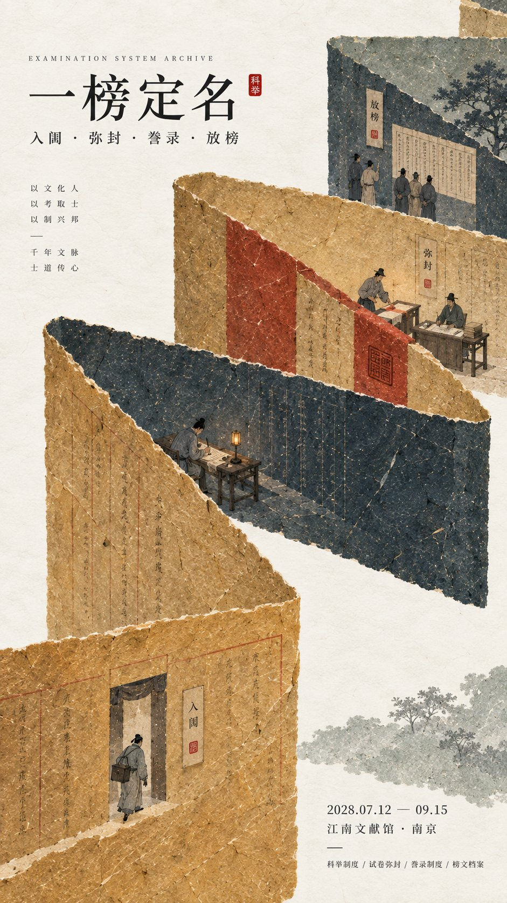

# Institutional Eastern Posters: Exam / Patrol / Timber

**中文标题：** 制度叙事东方海报：科举夜巡水利榫卯  
**ID:** `gi25-x-510` · **Mode:** `generate`  
**Categories:** `poster-typography`  
**Tags:** `x-twitter`, `community`, `gpt-image-2.5`, `xianyu`, `zh`



### Institutional Eastern Posters: Exam / Patrol / Timber

```text
【主题 / 展览名称】{填写，例如：科举制度 / 城市夜巡 / 古代水利 / 榫卯结构}
【主标题】{填写}
【核心制度 / 文化逻辑】{填写，例如：入闱→弥封→放榜 / 暮鼓→夜巡→晨启 / 分水→量水→灌溉}
【主色域】{填写 3–5 个颜色，例如：旧麦金 + 墨青 + 朱砂 / 深靛蓝 + 灰蓝 + 暖赭}
【微场景节点】{填写 2–4 个连续场景}
【展览信息】{日期 / 地点 / 展览类型，可选}
【画幅比例】9:16 竖版

设计一张具有现代东方编辑美学的历史文化海报，以「纸纤维 + 大色域 + 微场景」作为核心视觉语言。不要把传统文化理解成堆叠古建筑、书法、祥云或器物，而是先提炼【核心制度 / 文化逻辑】，再让大面积手工纸色域直接承担结构、空间、时间、流向、秩序或流程关系，使观众远看首先看到强烈而清晰的大形，近看才逐渐发现隐藏在其中的文化叙事。

使用【主色域】建立 2–5 个面积明显不同的主纸色块，保持低饱和但色彩浓度完整。所有色块具有真实丰富的手工纸、纸浆、水彩或矿物颜料质感，可见天然长短纤维、颜料沉积、轻微压痕、大尺度自然色差与不规则撕纸边缘，整体哑光、干净、完整，不做脏旧、黄斑、随机斑驳、廉价复古或数字渐变。根据主题让色域通过折叠、分叉、穿插、咬合、错层、承托、分段、围合或负空间关系表现制度运行逻辑，而不是简单作为背景装饰。

在大色域结构中嵌入【微场景节点】，人物与道具保持非常小的尺度，总体约占画面 3%–6%。每个场景都要表现一个明确动作，并且彼此存在因果或时间关系，例如“进入→执行→记录→完成”，让微型人物真正承担叙事，而不是站立摆拍。人物服装和器物符合主题时代与身份，但保持克制，不做影视古装大片；场景只保留能说明制度关系的关键道具，不堆满装饰和无关文化符号。

排版使用现代东方文化机构、博物馆或档案展览的编辑语言。主标题【主标题】使用精致宋体、明朝体或具有出版感的中文字体，字号保持中小尺度，不让文字压过大色域；辅助英文、日期、地点和说明信息使用更小字号，形成明确层级。可以加入极少朱砂印记、纸签、档案标签或节点文字，但必须与主题逻辑发生真实关系，不能只是为了“国风感”随机装饰。

整体阅读顺序应为：大色域结构与色彩关系 → 制度或空间逻辑 → 微型人物连续叙事 → 主标题与展览信息。最终画面要做到远看有强烈大形和视觉冲击，近看有纸纤维、人物动作和历史细节，兼具设计感、叙事感与文化完成度。避免书籍封面感、传统古风插画、满屏古建筑、巨大标题、PPT式规则排版、现代信息图箭头、无意义英文占位、元素堆砌、商业广告感、3D CGI、玻璃材质、霓虹色、Logo、水印、编号和星芒装饰。
```

- **Recommended model:** `gpt-image-2.5-sunburst`
- **Settings:** _(defaults)_
- **Source:** [community](https://x.com/MrLarus/status/2100159212047544806) — @MrLarus (via xianyu110/awesome-gpt-image2.5)
- **License note:** Community X post mirrored in xianyu110/awesome-gpt-image2.5; remix with attribution
- **Notes:** xianyu110 case 2100159212047544806; category=海报排版
- **Preview:** `previews/gi25-x-510.jpg`
