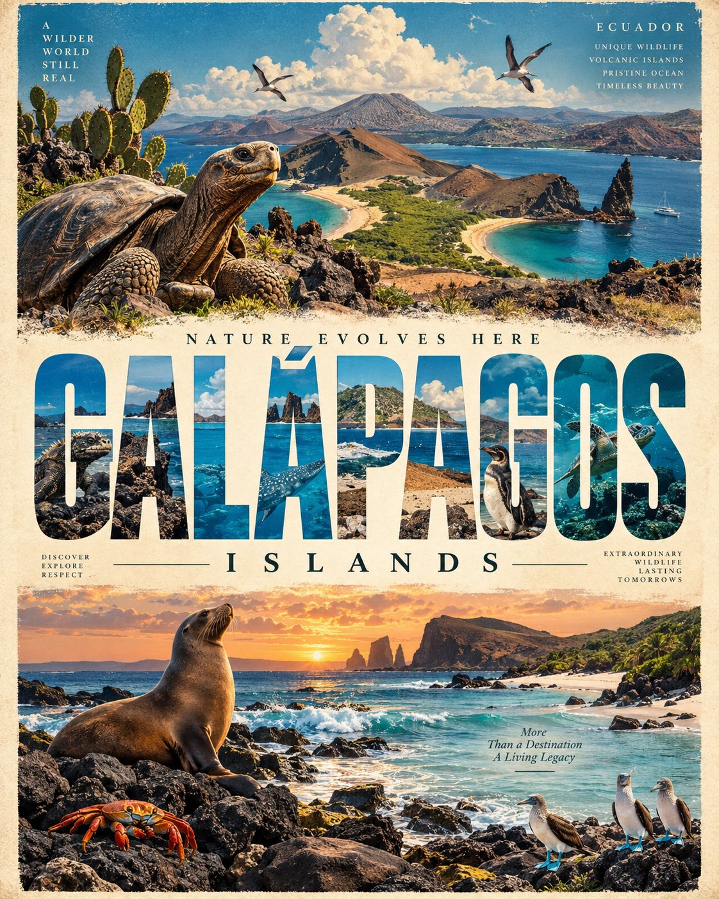

# Retro Adventure Travel Poster Template [LOCATION]

**中文标题：** 旅行海报模板：[LOCATION] 可替换复古探险  
**ID:** `gi25-x-514` · **Mode:** `edit`  
**Categories:** `poster-typography`  
**Tags:** `x-twitter`, `community`, `gpt-image-2.5`, `xianyu`, `en`



### Retro Adventure Travel Poster Template [LOCATION]

```text
Create a premium ultra-high-resolution illustrated travel poster for **[LOCATION]**, designed as a sophisticated vintage adventure-travel editorial poster in a strict **4:5 vertical format**.

Build the composition around the destination’s most iconic landscapes, landmarks, wildlife, architecture, cultural symbols, and natural features. Create a strong **three-level visual composition**:

1. **TOP SECTION:** A dramatic panoramic hero scene representing [LOCATION], featuring its most recognizable landscape or landmark under beautiful atmospheric skies. Add a few authentic destination-specific elements such as wildlife, vegetation, architecture, or local details.

2. **CENTER SECTION:** Make **“[LOCATION NAME]”** extremely large and dominant across the poster using bold condensed geometric sans-serif typography. Fill the interior of the letters with a detailed scenic image of the destination, seamlessly combining mountains, coastline, forests, architecture, glaciers, desert, cityscape, or other relevant scenery. Keep the typography perfectly readable while allowing the imagery to extend naturally through the letters.

3. **BOTTOM SECTION:** Create a second expansive scenic panorama showing another iconic aspect of [LOCATION], with foreground details such as native wildlife, vegetation, water, rocks, streets, buildings, or cultural elements. Make it visually connected to the central typography and upper landscape.

Surround the composition with subtle **editorial travel-poster typography**, including short destination-relevant phrases, geographic references, and atmospheric descriptive words. Keep all secondary text minimal, correctly spelled, evenly spaced, and visually subordinate to the main location name.

**ART STYLE:** Premium vintage travel illustration × mid-century editorial poster × modern screen print aesthetic. Handcrafted painterly texture, bold shapes, sophisticated composition, slightly weathered print character, cinematic landscapes, rich environmental detail, and authentic destination identity.

**COLOR:** Automatically derive a refined palette from [LOCATION] and its natural environment. Use harmonious earthy and atmospheric tones with strong contrast, avoiding excessive colors.

**COMPOSITION:** Strong visual hierarchy, balanced negative space, layered scenery, oversized typography, seamless image-filled lettering, panoramic landscape bands, elegant editorial spacing, and premium collectible travel-poster design.

**TEXT RULES:** The primary headline must be exactly **“[LOCATION NAME]”**. All visible text must be in English, correctly spelled, clean, intentional, and legible. Do not add random words, fake logos, watermarks, or meaningless text.

**QUALITY:** Ultra-high resolution, razor-sharp details, crisp typography, sophisticated illustration, realistic environmental depth, polished print texture, professional travel-poster finish.

**FORMAT:** STRICT **4:5 VERTICAL**.
```

- **Recommended model:** `gpt-image-2.5-sunburst`
- **Settings:** _(defaults)_
- **Source:** [community](https://x.com/Goodmanprotocol/status/2100089588559802619) — @Goodmanprotocol (via xianyu110/awesome-gpt-image2.5)
- **License note:** Community X post mirrored in xianyu110/awesome-gpt-image2.5; remix with attribution
- **Notes:** xianyu110 case 2100089588559802619; category=海报排版
- **Preview:** `previews/gi25-x-514.jpg`
