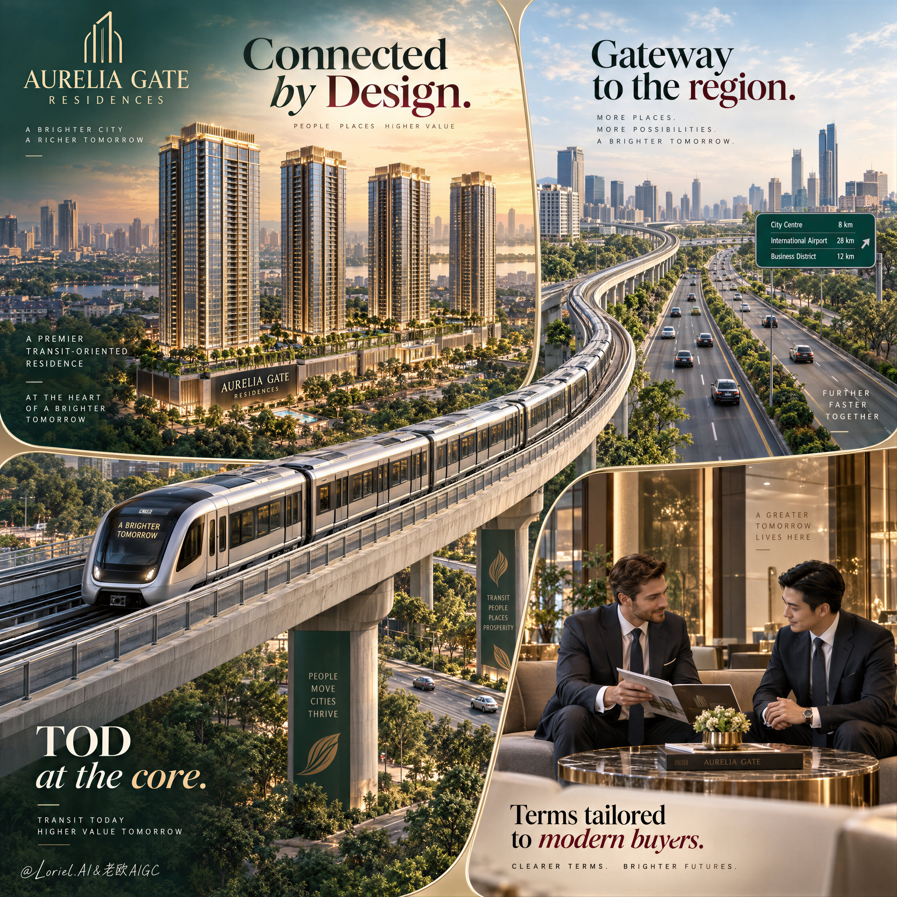

# Diagonal Metro Connectivity: Four-District Real Estate Poster

**中文标题：** 地铁斜穿连通性：四区房产海报一气呵成  
**ID:** `gi25-x-523` · **Mode:** `generate`  
**Categories:** `poster-typography`  
**Tags:** `x-twitter`, `community`, `gpt-image-2.5`, `xianyu`, `en`



### Diagonal Metro Connectivity: Four-District Real Estate Poster

```text
Create a Cannes-level ultra-premium real estate advertising poster for a fictional development brand called AURELIA GATE RESIDENCES, preserving the exact structural logic of a multi-panel infrastructure-led property campaign: a square or near-square luxury real estate poster divided into four integrated visual zones with softly curved page-like corner framing, where the top-left panel presents the hero residential towers rising above the city, the top-right panel highlights a major expressway corridor, the lower-left and center are dramatically crossed by an elevated metro line in perspective, and the bottom-right panel shows a refined private consultation meeting in an elegant sales-lounge interior. The final image must communicate that this development is defined by strategic connectivity, transit-oriented value, and premium urban lifestyle.

Core composition: structure the poster as a refined four-zone collage with thin elegant dividing lines and subtle curved panel edges, preserving the same premium brochure-meets-commercial-ad language as the reference. Top-left: one aerial oblique view of the hero residential project, with 3 to 4 slender luxury towers standing prominently above a dense low-rise city fabric, warm sunset light, and a discreet location tag integrated near the site. Top-right: one wide, clean view of a modern multi-lane expressway with landscaped medians, smooth traffic flow, and urban skyline in the distance, representing regional access. Lower-left/center: one modern elevated metro train sweeps diagonally across the composition toward the viewer, occupying strong foreground dominance and visually linking the top property panels to the lifestyle promise below. Bottom-right: one premium sales or negotiation lounge with two well-dressed business professionals seated at a round table in a polished interior, reviewing documents in a calm high-end environment. All four zones must feel part of one coherent brand story.

Hero project design: create a premium urban residential development for AURELIA GATE RESIDENCES with elegant glass-and-stone towers, warm architectural lighting, podium greenery, and a sophisticated city-integration concept. The tower cluster should feel financially aspirational, architecturally credible, and highly sellable, with clean facade rhythm, realistic balcony or glazing repetition, refined rooftop crowns, and believable urban scale. The development must remain the conceptual hero even though the transit line is visually dramatic.

Transit-oriented narrative: the metro line is a major storytelling device. Render one sleek modern elevated train with realistic carriage proportions, reflective glazing, subtle interior hints, and premium metallic finish, traveling on an elevated viaduct that cuts diagonally through the composition. The train must feel fast, clean, and future-forward, visually symbolizing convenience, rising value, and metropolitan momentum. The viaduct structure should be engineered and convincing, with support detail, guard rails, and proper perspective depth. This transit element should strengthen the real estate value proposition rather than overpower the towers.

Expressway and access panel: the top-right infrastructure panel must show a broad, elegant arterial highway or national corridor under soft daylight, with landscaped edges, a few realistic vehicles, and a clean urban horizon. The shot should communicate regional mobility, strategic access, and development upside. Avoid traffic chaos, dirty roads, or generic stock-photo feel.

Lifestyle and trust panel: the bottom-right consultation scene should communicate investment confidence and premium service. Show two adult male professionals or sales executives in tailored suits seated in a luxurious lobby or sales gallery with warm stone, wood, glass, and soft neutral furnishings. Their posture should suggest focused conversation, trust, and deal-making rather than casual chatting. Keep anatomy, hands, and facial proportions realistic and understated. This panel should feel aspirational, polished, and calm.

Typography and layout: preserve the source image’s same-type panel-based property-sales hierarchy but rewrite all wording into original English. In the top-left or upper central visual field, place a strong campaign line such as “Two Frontages. One Strategic Address.” In the top-right panel, include a concise infrastructure callout like “Gateway to Route 13” or “Connected to the City’s Main Artery.” In the lower-left or over the train zone, place a compact premium callout such as “First-Mover TOD Advantage.” In the bottom-right panel, add a short trust message like “Flexible Terms for Modern Buyers.” Typography must be elegant, highly legible, and spatially integrated into each panel, using premium serif and modern sans-serif combinations. Do not overcrowd the poster with dense brochure text.

Branding: place a small refined AURELIA GATE RESIDENCES logo lockup in the upper-left corner, with a minimal developer or partner mark if needed. Branding should feel premium, corporate, and internationally polished, not loud or crowded.

Lighting: use refined golden-hour-to-soft-daylight transitions across the panels while keeping one unified visual grade. The residential towers should glow with aspirational sunset warmth. The expressway panel should feel clear, clean, and daylight-balanced. The train should carry polished highlights and forward energy. The consultation panel should use soft interior luxury lighting with warm reflections on marble, metal, and glass. Keep contrast rich but controlled, with no muddy green shadows or dead black blocks.

Material and texture: emphasize tower facade realism, metro train metal and glass surfaces, highway asphalt and planted medians, polished sales-lounge marble and upholstery, and the crisp graphic finish of a high-end real estate poster. Every panel should feel photographically believable while still maintaining unified commercial art direction.

Color hierarchy: 50% premium deep green, ivory, and soft urban neutrals; 25% warm sunset gold and champagne architectural highlights; 15% cool steel, metro silver, and highway grey; 10% muted rose-magenta or burgundy typographic accents for premium contrast. The palette must feel upscale, strategic, modern, and trustworthy.

Design intent: the final poster must preserve the source image’s exact impact logic of panel-based real estate storytelling, transit-led motion, infrastructure access, and investor-service messaging, while elevating it into a more original, more luxurious, and more internationally art-directed property campaign. The project is not sold merely as a building, but as a strategically connected urban asset anchored by mobility, visibility, and premium sales confidence.

Rendering style: ultra-photoreal luxury real estate advertising, premium urban development campaign, transit-oriented property poster, high-end architectural visualization merged with commercial editorial design, polished infrastructure storytelling, world-class property marketing finish, print-ready realism.

Negative prompt: copied source text, real developer names, generic brochure clutter, low-detail towers, warped metro geometry, fake highway perspective, malformed hands, extra fingers, stiff business poses, muddy urban haze, overpacked text blocks, cheap condo flyer styling, distorted panel layout, black blotches, watermark
```

- **Recommended model:** `gpt-image-2.5-sunburst`
- **Settings:** _(defaults)_
- **Source:** [community](https://x.com/ou_zhen599/status/2100223219383124188) — @ou_zhen599 (via xianyu110/awesome-gpt-image2.5)
- **License note:** Community X post mirrored in xianyu110/awesome-gpt-image2.5; remix with attribution
- **Notes:** xianyu110 case 2100223219383124188; category=海报排版; verified=True
- **Preview:** `previews/gi25-x-523.jpg`
