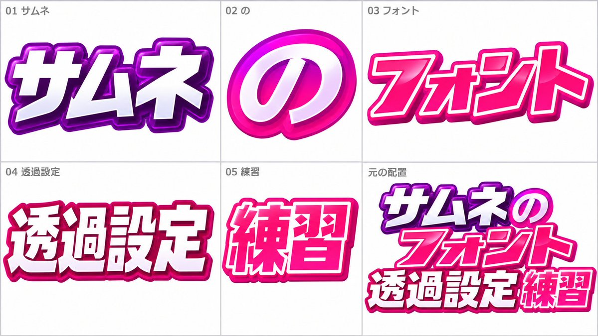

# Font Lock: Font Reference Sheet from a Thumbnail

**中文标题：** 字体也能锁：缩略图字体参考表  
**ID:** `gi25-x-527` · **Mode:** `edit`  
**Categories:** `poster-typography`  
**Tags:** `x-twitter`, `community`, `gpt-image-2.5`, `xianyu`, `ja`



### Font Lock: Font Reference Sheet from a Thumbnail

```text
画像1に写っている（または指定した）フォントの見た目・ウェイト・字間・装飾感を厳守し、画像2のようなフォントリファレンスシートを作成してください。
シートには同じ書体の：アルファベット大文字／小文字、数字、よく使う記号、短い見出し見本、サムネ向け短文見本を、きれいなグリッドで並べる。
背景はシンプル、文字以外の装飾を足さない。フォントの骨格・セリフの有無・コントラストを崩さない。
```

- **Recommended model:** `gpt-image-2.5-sunburst`
- **Settings:** _(defaults)_
- **Source:** [community](https://x.com/1banana2546/status/2100026883643670876) — @1banana2546 (via xianyu110/awesome-gpt-image2.5)
- **License note:** Community X post mirrored in xianyu110/awesome-gpt-image2.5; remix with attribution
- **Notes:** xianyu110 case 2100026883643670876; category=海报排版; verified=True
- **Preview:** `previews/gi25-x-527.jpg`
