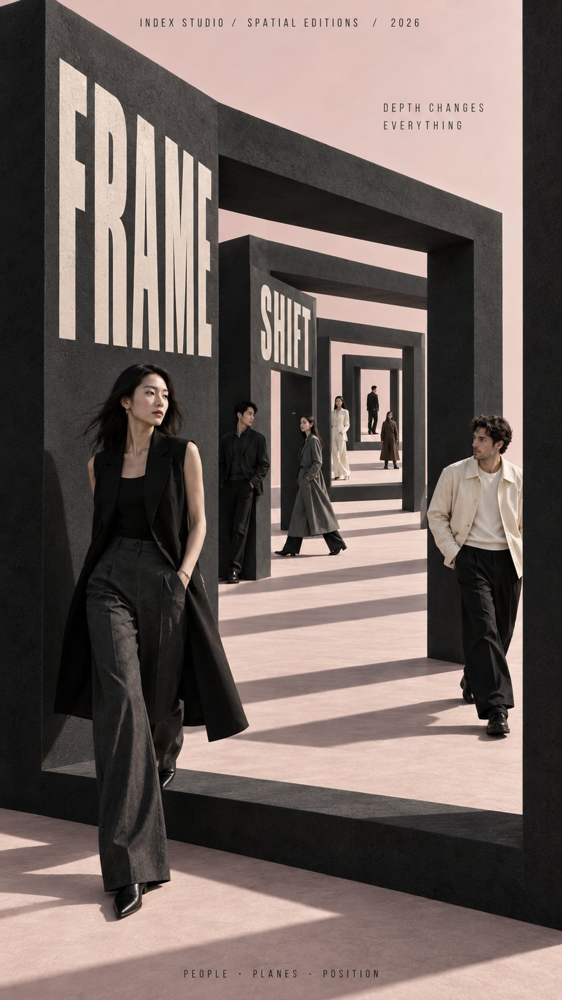

# Perspective as Design: Four Depth-System Posters

**中文标题：** 透视即设计：四种景深系统海报  
**ID:** `gi25-x-531` · **Mode:** `generate`  
**Categories:** `poster-typography`  
**Tags:** `x-twitter`, `community`, `gpt-image-2.5`, `xianyu`, `en`



### Perspective as Design: Four Depth-System Posters

```text
[BRAND NAME]: {fill in}
[CAMPAIGN / SERIES]: {fill in}
[MAIN TITLE]: {fill in}
[TAGLINE]: {fill in}
[DEPTH SYSTEM]: {nested frames / converging perspective / stacked levels / layered slabs}
[PRIMARY COLOR]: {fill in}
[ACCENT COLOR]: {fill in}
[NUMBER OF PEOPLE]: {6–8 adults}
[ASPECT RATIO]: {9:16}

Create a high-end multi-person editorial campaign poster where depth and perspective become the main design system.

Build the scene around one strong spatial structure, such as nested architectural frames, lines converging toward a vanishing point, irregular stacked platforms, or large horizontal layers. The architecture should immediately create a clear foreground, middle ground, and background.

Place multiple adult figures at different distances and heights within the same coherent perspective field. Their scale must change naturally with depth. Use one or two strong foreground figures, several smaller midground figures, and a few distant figures. Avoid evenly spaced people, grids, lineups, or team-photo compositions.

Make people and architecture physically overlap. Some figures should pass through frames, disappear behind walls, be partially hidden by platforms, appear between layers, or emerge from deeper spaces. The result should feel like one real photographed environment, not separate people pasted onto a layout.

Integrate the main title into the architecture whenever possible. Let typography follow the perspective of a frame, wall, platform, or structural edge. It may change scale, become partially occluded, or stretch across several depth planes, but it should remain readable.

Keep the environment minimal and sculptural. Use large geometric forms, controlled negative space, one dominant color system, realistic directional daylight, and consistent architectural shadows. The spatial idea should still read clearly at thumbnail size.

Use realistic fashion photography for the cast: natural skin texture, believable anatomy, real hair, accurate hands and feet, natural fabric folds, varied poses, and subtle movement. Avoid duplicated figures, plastic skin, floating bodies, or overly staged model poses.

Supporting typography should stay minimal and secondary. The final image should feel like a real contemporary fashion, cultural, or brand campaign where people, architecture, type, and perspective are all part of the same composition.
```

- **Recommended model:** `gpt-image-2.5-sunburst`
- **Settings:** _(defaults)_
- **Source:** [community](https://x.com/MrLarus/status/2099880009053917543) — @MrLarus (via xianyu110/awesome-gpt-image2.5)
- **License note:** Community X post mirrored in xianyu110/awesome-gpt-image2.5; remix with attribution
- **Notes:** xianyu110 case 2099880009053917543; category=海报排版; verified=True
- **Preview:** `previews/gi25-x-531.jpg`
