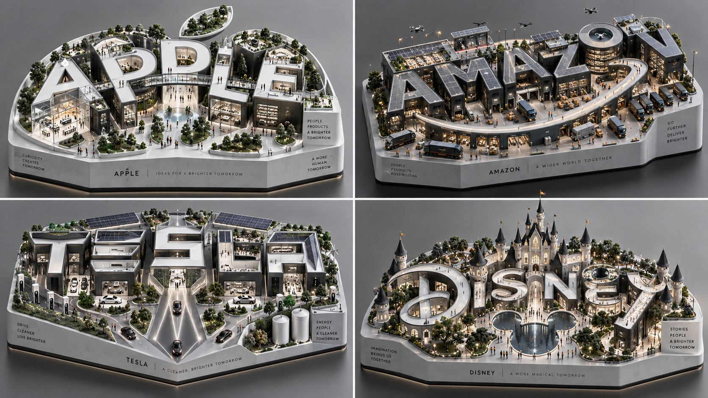

# Brand Wordmark Campus: Fortune 500 Isometric Miniature Campuses

**中文标题：** 品牌字标校园：Fortune 500 等距微缩校园  
**ID:** `gi25-x-534` · **Mode:** `generate`  
**Categories:** `poster-typography`  
**Tags:** `x-twitter`, `community`, `gpt-image-2.5`, `xianyu`, `en`



### Brand Wordmark Campus: Fortune 500 Isometric Miniature Campuses

```text
2x2 grid, 16:9, do this for 4 Fortune 500 companies: [HYBRID EQUATION]  $ SUBJECT + giant architectural typography + minimalist negative-space logo + isometric product campus + hidden silhouette inside letters + tiny people for scale + clean platform base + white/black premium material palette + rooftop gardens / rooms / plazas - copied real logos - random miniature clutter - messy typography - generic building model = subject-as-wordmark-campus-emblem  [INSTRUCTION] Render the visual solution.  VISUAL LOGIC: - The subject’s name becomes the architecture. - The architecture becomes a miniature campus. - The campus layout secretly forms the subject’s silhouette. - The negative space becomes the cleverest part of the image. - The tiny inhabitants reveal function, scale, and culture. - The final object must work as both a logo and a diorama.  TRANSFORMATION LOGIC: - Convert letters into buildings. - Convert letter counters/open spaces into courtyards, windows, eyes, mouths, portals, rooms, or symbolic holes. - Convert curves into tails, paths, ramps, bridges, handles, wings, waves, tools, or motion trails. - Convert vertical strokes into towers, legs, pillars, screens, shelves, or monuments. - Convert the subject’s essence into a hidden silhouette readable only after a second look. - Convert culture/function into tiny subject-relevant props and micro-scenes.  OUTPUT: A viral design-object where $ SUBJECT becomes a walkable typographic campus with a hidden negative-space emblem embedded into its architecture.
```

- **Recommended model:** `gpt-image-2.5-sunburst`
- **Settings:** _(defaults)_
- **Source:** [community](https://x.com/Gdgtify/status/2099807186461634953) — @Gdgtify (via xianyu110/awesome-gpt-image2.5)
- **License note:** Community X post mirrored in xianyu110/awesome-gpt-image2.5; remix with attribution
- **Notes:** xianyu110 case 2099807186461634953; category=海报排版; verified=True
- **Preview:** `previews/gi25-x-534.jpg`
