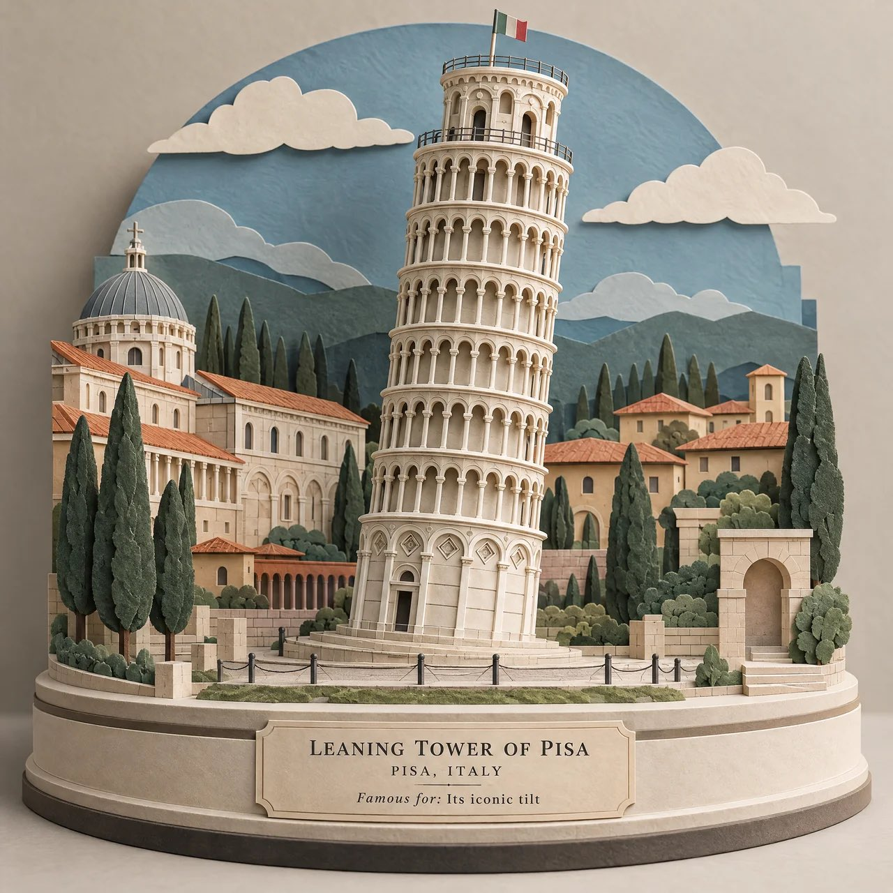

# 3D Paper-Cut Landmark: [STRUCTURE] Museum-Model Template

**中文标题：** 3D 纸雕地标：[STRUCTURE] 博物馆模型模板  
**ID:** `gi25-x-537` · **Mode:** `generate`  
**Categories:** `poster-typography`  
**Tags:** `x-twitter`, `community`, `gpt-image-2.5`, `xianyu`, `en`



### 3D Paper-Cut Landmark: [STRUCTURE] Museum-Model Template

```text
Create a premium 3D layered paper-cut artwork of [STRUCTURE NAME], transforming the famous architectural landmark into an intricate handcrafted paper sculpture.

Show the structure as the central focal point, built entirely from carefully cut and stacked paper layers, with realistic paper edges, subtle folds, depth, shadows, and raised details. Surround it with miniature architectural elements inspired by its location — tiny streets, arches, trees, steps, rooftops, clouds, or landscape details — all integrated into the same paper-cut world.

Use a sophisticated palette of warm ivory, cream, muted sage, dusty blue, terracotta, soft beige, and charcoal, with gentle natural shadows between every layer.

Place the structure on a slightly elevated museum-style paper base, giving the artwork a collectible architectural-model appearance.

Add minimal elegant typography:
[STRUCTURE NAME]
[CITY, COUNTRY]
Famous for: [KEY FEATURE]

Clean editorial composition, refined handcrafted details, soft studio lighting, premium paper texture, architectural design magazine aesthetic, subtle depth, highly detailed cut edges, elegant and artistic, no people, no photorealistic background, no clutter, no watermark.

Aspect ratio: 4:5 vertical.
```

- **Recommended model:** `gpt-image-2.5-sunburst`
- **Settings:** _(defaults)_
- **Source:** [community](https://x.com/Naiknelofar788/status/2099741955458478351) — @Naiknelofar788 (via xianyu110/awesome-gpt-image2.5)
- **License note:** Community X post mirrored in xianyu110/awesome-gpt-image2.5; remix with attribution
- **Notes:** xianyu110 case 2099741955458478351; category=海报排版; verified=True
- **Preview:** `previews/gi25-x-537.jpg`
