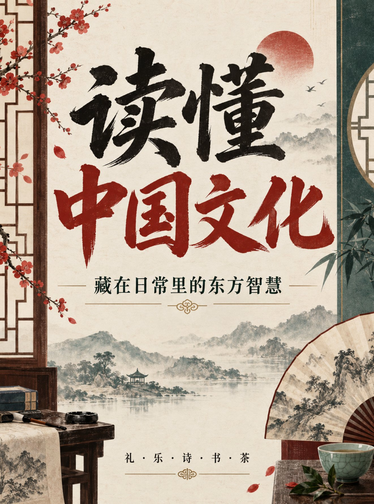

# Contemporary New-Chinese Culture Poster: Rice-Paper Grid + Seal Geometry

**中文标题：** 当代新中式文化海报：宣纸网格+印章几何  
**ID:** `gi25-x-541` · **Mode:** `generate`  
**Categories:** `poster-typography`  
**Tags:** `x-twitter`, `community`, `gpt-image-2.5`, `xianyu`, `zh`



### Contemporary New-Chinese Culture Poster: Rice-Paper Grid + Seal Geometry

```text
设计一张竖版 3:4 中国文化知识海报，采用“当代新中式”风格。暖米色宣纸背景，墨黑、朱砂红与玉石青配色，现代网格结合印章、折扇和窗棂几何元素。画面上方放置主标题“读懂中国文化”，中部副标题“藏在日常里的东方智慧”，底部小字“礼 · 乐 · 诗 · 书 · 茶”。标题占画面约60%，字体清晰有力量，留白克制。只呈现指定中文，不添加其他文字、拼音、Logo、水印或乱码。
```

- **Recommended model:** `gpt-image-2.5-sunburst`
- **Settings:** _(defaults)_
- **Source:** [community](https://x.com/Mrpinecone888/status/2099677911477551536) — @Mrpinecone888 (via xianyu110/awesome-gpt-image2.5)
- **License note:** Community X post mirrored in xianyu110/awesome-gpt-image2.5; remix with attribution
- **Notes:** xianyu110 case 2099677911477551536; category=海报排版; verified=True
- **Preview:** `previews/gi25-x-541.jpg`
