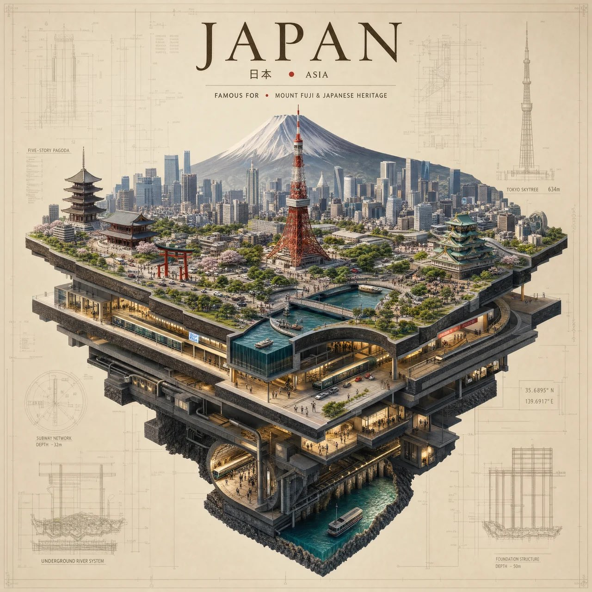

# City as Floating Miniature Sculpture Poster (Swap [CITY])

**中文标题：** 城市=悬浮微缩雕塑海报（可换 [CITY]）  
**ID:** `gi25-x-545` · **Mode:** `generate`  
**Categories:** `poster-typography`  
**Tags:** `x-twitter`, `community`, `gpt-image-2.5`, `xianyu`, `en`



### City as Floating Miniature Sculpture Poster (Swap [CITY])

```text
Create a premium 4:5 vertical architectural art poster featuring [CITY], [COUNTRY], designed as a miniature floating city sculpture.

The entire city appears as a beautifully crafted three-dimensional architectural model suspended in the air, with streets, rivers, bridges, parks, neighborhoods, and iconic buildings layered at different heights. The city is not shown as a flat map.

Place the most recognizable landmark dramatically at the center, rising above the miniature city like a sculptural centerpiece. Add tiny realistic cars, trees, boats, people, streetlights, and architectural details to create a sense of scale.

Behind the floating city, use a soft warm ivory background with subtle architectural blueprint lines, elevation drawings, coordinates, and delicate technical annotations.

At the top:

[CITY NAME]
[COUNTRY] • [REGION]

Below it, a small elegant line:

FAMOUS FOR • [LANDMARK / CULTURAL FEATURE]

Use museum-model aesthetics, precision architectural model-making, sophisticated neutral colors, realistic miniature textures, soft studio lighting, subtle shadows, clean negative space, luxury architecture magazine aesthetic, highly detailed, photorealistic 3D render.

No flat map, no ordinary travel collage, no excessive text, no busy background, no watermark.

Make the city look like a giant architectural “cutaway” — as if the top layer of the city has been lifted away, revealing subways, underground stations, foundations, tunnels, rivers and buildings beneath it.
```

- **Recommended model:** `gpt-image-2.5-sunburst`
- **Settings:** _(defaults)_
- **Source:** [community](https://x.com/Naiknelofar788/status/2099465141641470114) — @Naiknelofar788 (via xianyu110/awesome-gpt-image2.5)
- **License note:** Community X post mirrored in xianyu110/awesome-gpt-image2.5; remix with attribution
- **Notes:** xianyu110 case 2099465141641470114; category=海报排版; verified=True
- **Preview:** `previews/gi25-x-545.jpg`
