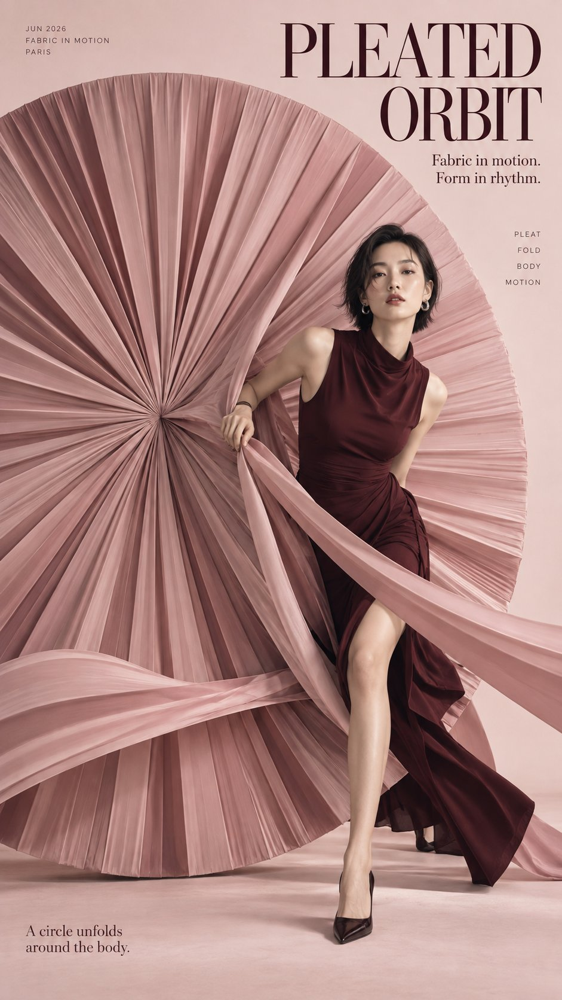

# Circular-Frame Fashion Poster Quad: Step In, Step Out, Ring, Lean

**中文标题：** 圆形构图时尚海报四联：穿进/踏出/戴环/靠弧  
**ID:** `gi25-x-546` · **Mode:** `generate`  
**Categories:** `poster-typography`  
**Tags:** `x-twitter`, `community`, `gpt-image-2.5`, `xianyu`, `en`



### Circular-Frame Fashion Poster Quad: Step In, Step Out, Ring, Lean

```text
Create a 9:16 high-fashion editorial poster series built around elegant circular framing and direct interaction between the model and the circular form.

The overall style should feel like international fashion magazine covers, couture campaigns, and luxury editorial photography: refined studio lighting, realistic skin and fabric, clean backgrounds, sophisticated serif typography, controlled negative space, and strong visual hierarchy.

The circle should never feel like a simple background graphic. It must become part of the styling, pose, garment, or physical set, with the model actively sitting in it, stepping through it, wearing it, or opening it.

Keep all typography in English, with large fashion-editorial headlines and a small amount of meaningful secondary copy. Avoid logos, watermarks, numbered labels, fake magazine branding, and meaningless filler text.

For this third set, create four independent poster variations under the same visual system:

1. “PLEATED ORBIT” — a woman in a deep burgundy dress stepping through a huge blush-pink circular structure made from radial couture pleats, gently pulling one fold aside as fabric layers pass in front of and behind her body, soft and elegant but visually striking.

2. “SCARLET EXIT” — a woman in a structured black fashion look stepping out through a monumental thick scarlet-red ring, one leg still inside and the other already outside, with direct eye contact, strong movement, clean ivory background, and bold magazine-cover energy.

3. “HALO FORM” — a close-up beauty editorial of a short-haired woman in a minimal black dress wearing an oversized burnished-copper circular couture collar around her shoulders, with part of the circle open so one shoulder and hand break through the structure.

4. “ECLIPSE LOUNGE” — a young man in warm ivory and tobacco tailoring seated naturally on the inner curve of a monumental burnt-amber crescent sculpture, relaxed posture, soft cream background, warm luxury lighting, and a refined menswear editorial mood.

All four images should feel like one fashion story while using completely different relationships between the body and the circle. Keep the visuals polished, elegant, modern, and strong enough to work as magazine covers or campaign posters.
```

- **Recommended model:** `gpt-image-2.5-sunburst`
- **Settings:** _(defaults)_
- **Source:** [community](https://x.com/MrLarus/status/2099463499588018438) — @MrLarus (via xianyu110/awesome-gpt-image2.5)
- **License note:** Community X post mirrored in xianyu110/awesome-gpt-image2.5; remix with attribution
- **Notes:** xianyu110 case 2099463499588018438; category=海报排版; verified=True
- **Preview:** `previews/gi25-x-546.jpg`
