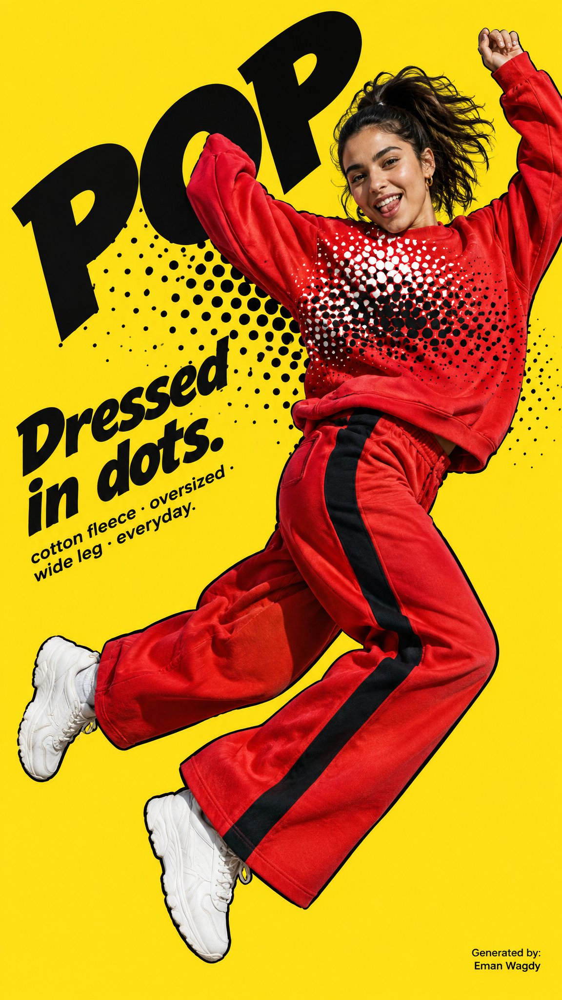

# Flare Fashion Poster: Pose-Driven Bold Typography Series

**中文标题：** Fashion 海报 Flare：姿势驱动大字排版系列  
**ID:** `gi25-x-554` · **Mode:** `generate`  
**Categories:** `poster-typography`  
**Tags:** `x-twitter`, `community`, `gpt-image-2.5`, `xianyu`, `en`



### Flare Fashion Poster: Pose-Driven Bold Typography Series

```text
Create a 9:16 editorial fashion poster. Model: an Arab Middle Eastern woman, unveiled, early twenties, expressive Gen Z energy, realistic photographic style, ultra-high resolution.
Build the entire poster around the natural shape and direction of the model's pose and the garment's movement. Use highly realistic fashion photography: visible fabric weave, seams, stitching, folds, fabric in motion, natural skin texture, real shadows.
Avoid CGI, plastic skin, generic e-commerce catalog look. Use oversized editorial typography as an active part of the composition: the main word very large, cropped by the canvas, partially hidden behind the model, split, rotated or curved according to the pose direction.
Model and typography must overlap and interact. Clear hierarchy: oversized display type, hero fashion photography, headline, supporting product details, small tags. Restrained color system: one background, realistic garment colors, 1–2 accents. A few graphic elements only (thin lines, dots, open frames, sticker-like labels).
Energetic, asymmetric, carefully art-directed, enough negative space. No brand names, no logos.
INPUTS: Create a 9:16 editorial fashion poster, pop art style. Model: Arab Middle Eastern woman, unveiled, early twenties, playful expression, realistic photography, ultra-high resolution.
Outfit: oversized sweatshirt in bright cherry red printed with large black-and-white halftone dots fading across the chest, matching wide-leg sweatpants in the same red with a bold black side stripe, white chunky sneakers, small gold hoops, hair in a high ponytail.
Background: flat sunshine yellow. Accents: black, white. Typography word: POP. Composition: diagonal — model mid-jump from bottom-left to top-right, POP in thick black comic display type along the same diagonal, her sleeve covers the O, halftone dots spill from the sweatshirt into the background.
Headline: "Dressed in dots." Supporting text: cotton fleece · oversized · wide leg · everyday. Thick black outline around the model like a comic cutout. Bottom corner "Generated by: Eman Wagdy". No brand names, no logos.
```

- **Recommended model:** `gpt-image-2.5-flare`
- **Settings:** _(defaults)_
- **Source:** [community](https://x.com/em_wagdy/status/2099400757560648122) — @em_wagdy (via xianyu110/awesome-gpt-image2.5)
- **License note:** Community X post mirrored in xianyu110/awesome-gpt-image2.5; remix with attribution
- **Notes:** xianyu110 case 2099400757560648122; category=海报排版; verified=True
- **Preview:** `previews/gi25-x-554.jpg`
