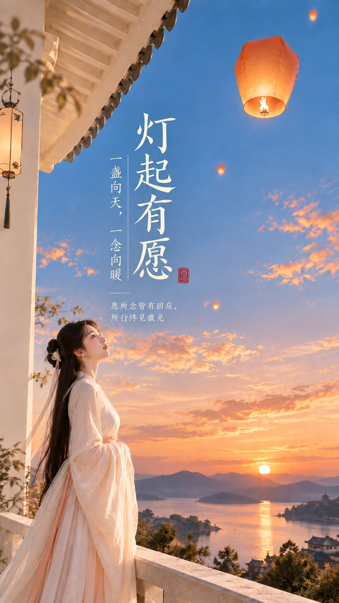

# Zen Sky-Lantern Cover: Sectioned Chinese Minimalist Poster

**中文标题：** 东方禅意天灯封面：分段中文极简海报  
**ID:** `gi25-x-555` · **Mode:** `generate`  
**Categories:** `poster-typography`  
**Tags:** `x-twitter`, `community`, `gpt-image-2.5`, `xianyu`, `zh`



### Zen Sky-Lantern Cover: Sectioned Chinese Minimalist Poster

```text
主题方向：东方禅意极简封面海报
风格分支：女性审美高传播型
主体内容：一位古风女子站在极简屋檐下，抬头看向空中的天灯
情绪母题：温暖、祝愿、轻梦感
场景与意象：浅色屋檐、橘子橙天灯、青黛蓝暮空、女子、留白天空
构图与空间：9:16 竖版构图，人物位于下方偏一侧，屋檐切入画面上缘，天空占据大面积主空间，方便排标题
色彩控制：暖白作为建筑和背景基底，青黛蓝用于天空，橘子橙只用于天灯与少量暖反光，人物服装建议珍珠白或浅桃白；避免全图变成橙蓝滤镜
光线与质感：柔亮傍晚光，清晰轮廓，现代东方海报感，轻微柔光即可
画幅比例：9:16
补充要求：天空必须干净通透，天灯要有记忆点，整体不能压暗成夜景
```

- **Recommended model:** `gpt-image-2.5-sunburst`
- **Settings:** _(defaults)_
- **Source:** [community](https://x.com/liyue_ai/status/2099392886207045950) — @liyue_ai (via xianyu110/awesome-gpt-image2.5)
- **License note:** Community X post mirrored in xianyu110/awesome-gpt-image2.5; remix with attribution
- **Notes:** xianyu110 case 2099392886207045950; category=海报排版; verified=True
- **Preview:** `previews/gi25-x-555.jpg`
