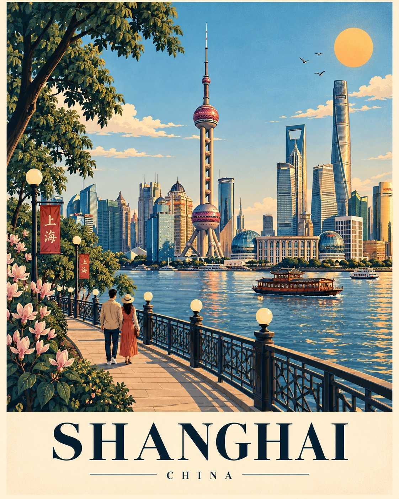

# Travel Poster [LOCATION] Series Template: Locked Layout, Swap the City

**中文标题：** 旅行海报 [LOCATION] 系列模板：构图锁死只换城  
**ID:** `gi25-x-557` · **Mode:** `generate`  
**Categories:** `poster-typography`  
**Tags:** `x-twitter`, `community`, `gpt-image-2.5`, `xianyu`, `en`



### Travel Poster [LOCATION] Series Template: Locked Layout, Swap the City

```text
Create a premium illustrated travel poster for [LOCATION] in an exact 4:5 vertical format. This is part of a cohesive global poster series, so keep the composition fixed across every destination; only adapt the landmarks, architecture, landscape, vegetation, and cultural details.

COMPOSITION

Illustration fills 82–85%; reserve the bottom for a warm cream typography panel.

Dense vegetation frames the left edge, with one tall natural anchor in the upper-left.

A curved promenade sweeps from the lower-left toward the center, with globe lamps, dark decorative railing, and a small strolling couple.

A broad water/open-space field occupies the lower-middle; use authentic boats when appropriate.

Place the single most iconic landmark of [LOCATION] as the central hero, with the clearest silhouette and strongest visual focus.

Add one major horizontal landmark behind/beside it for balance.

Build a simplified layered local skyline/landscape with 6–12 major forms.

Add one distinctive tall local landmark near the upper-center as a vertical counterweight.

Keep the upper sky open, bright, and uncluttered, with 2–4 soft clouds, a few birds, and a warm sun in the upper-right.

VISUAL FLOW

Vegetation → promenade/couple → water/open space → central landmark → horizontal landmark → sky/sun → typography.

Never let secondary elements compete with the hero.

STYLE

Sophisticated contemporary travel-poster illustration; clean vector shapes + subtle gouache/screen-print texture, crisp dark-navy outlines, softly shaded color blocks, slight organic imperfection, refined editorial aesthetic, premium collectible quality.

No photorealism, 3D, CGI, glossy rendering, or generic clip-art.

COLOR

Harmonious destination-specific palette using dark navy outlines, natural greens, cool environmental tones, warm architectural tones, and one restrained warm accent.

AUTHENTICITY

Use only genuinely recognizable features of [LOCATION]. Prioritize iconic silhouettes and authenticity over excessive detail. Do not invent landmarks.

TYPOGRAPHY

Bottom cream panel:
[LOCATION] — large elegant uppercase serif
Thin horizontal rule
[COUNTRY / REGION] — small widely spaced uppercase text.

COMPOSITION LOCK

4:5 • left vegetation • upper-left anchor • curved promenade • couple • globe lamps • railing • lower-middle water/open space • central hero • horizontal anchor • layered background • upper-center vertical counterweight • open sky • upper-right sun • bottom typography.

Keep this structure identical for every destination. Adapt the content, never the composition.
```

- **Recommended model:** `gpt-image-2.5-sunburst`
- **Settings:** _(defaults)_
- **Source:** [community](https://x.com/Goodmanprotocol/status/2099352799893172430) — @Goodmanprotocol (via xianyu110/awesome-gpt-image2.5)
- **License note:** Community X post mirrored in xianyu110/awesome-gpt-image2.5; remix with attribution
- **Notes:** xianyu110 case 2099352799893172430; category=海报排版; verified=True
- **Preview:** `previews/gi25-x-557.jpg`
