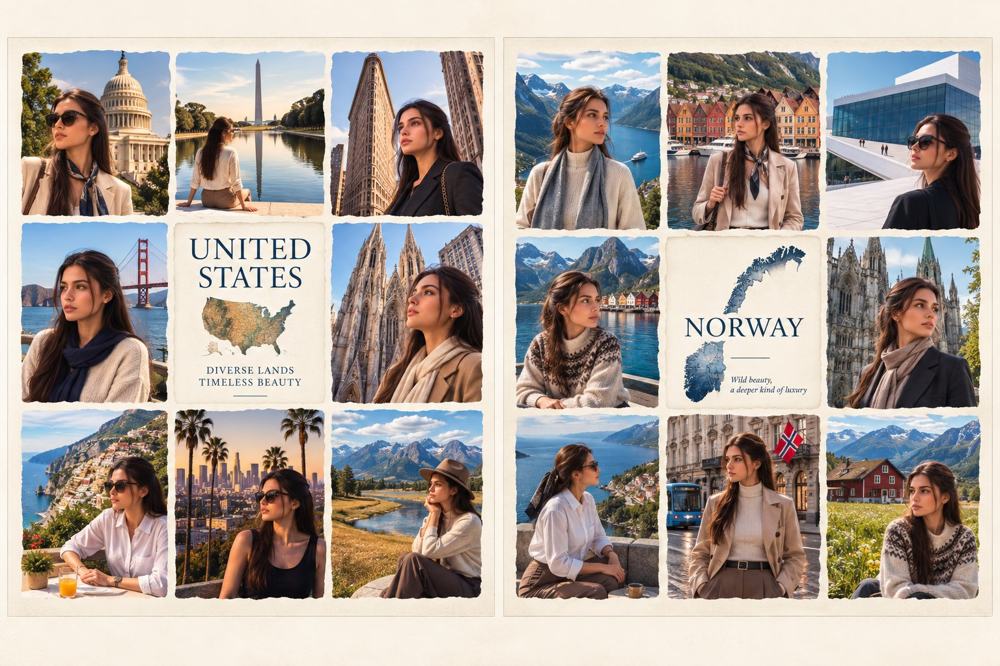

# Photo to Luxury Travel Spread Story: Identity-Locked Collage Template

**中文标题：** 照片→奢华旅行双页故事：锁脸拼贴模板  
**ID:** `gi25-x-559` · **Mode:** `edit`  
**Categories:** `poster-typography`  
**Tags:** `x-twitter`, `community`, `gpt-image-2.5`, `xianyu`, `en`



### Photo to Luxury Travel Spread Story: Identity-Locked Collage Template

```text
Use my uploaded photo as the SAME main female character throughout the entire image. Preserve her exact facial identity, facial features, skin tone, hairstyle, body proportions and natural appearance.

Create a premium vintage travel editorial poster in a WIDE LANDSCAPE FORMAT, specifically optimized for X/Twitter so the complete image is visible without important areas being cropped.

Divide the canvas into TWO equal vertical framed panels placed side by side.

LEFT PANEL — UNITED STATES:
Create a sophisticated 3×3 torn-paper travel collage featuring the same woman visiting iconic American destinations:
Washington D.C. with the U.S. Capitol and Washington Monument, New York City with the Flatiron Building, San Francisco with the Golden Gate Bridge, New York cathedral architecture, Los Angeles with palm trees and skyline, and dramatic American mountain landscapes.

In the CENTER of the left panel, place an elegant cream paper card with:
"UNITED STATES"
"DIVERSE LANDS"
"TIMELESS BEAUTY"
and a subtle vintage map of the United States.

RIGHT PANEL — NORWAY:
Create a matching 3×3 torn-paper travel collage featuring the same woman exploring Norway:
Norwegian fjords, Bergen colorful waterfront, Oslo modern architecture, dramatic mountain villages, historic Scandinavian architecture, coastal viewpoints, Norwegian streets with a tram, and peaceful alpine landscapes.

In the CENTER of the right panel, place an elegant cream paper card with:
"NORWAY"
"Wild beauty,"
"a deeper kind of luxury"
and a subtle watercolor map of Norway.

IMPORTANT:
Keep both complete panels fully visible inside the outer frame.
Use generous margins around the entire composition.
Do NOT make the image tall or portrait-oriented.
Do NOT crop either panel.
Both USA and Norway must be equally prominent and clearly visible at first glance.

Style: luxury travel magazine, vintage editorial photography, refined cream paper texture, subtle torn edges, cinematic natural lighting, realistic photography, elegant serif typography, premium composition, sophisticated color grading, clean negative space, highly detailed, photorealistic.

Aspect ratio: approximately 16:9 landscape.
```

- **Recommended model:** `gpt-image-2.5-sunburst`
- **Settings:** _(defaults)_
- **Source:** [community](https://x.com/Alina_with_Ai/status/2099320489797947424) — @Alina_with_Ai (via xianyu110/awesome-gpt-image2.5)
- **License note:** Community X post mirrored in xianyu110/awesome-gpt-image2.5; remix with attribution
- **Notes:** xianyu110 case 2099320489797947424; category=海报排版; verified=True
- **Preview:** `previews/gi25-x-559.jpg`
