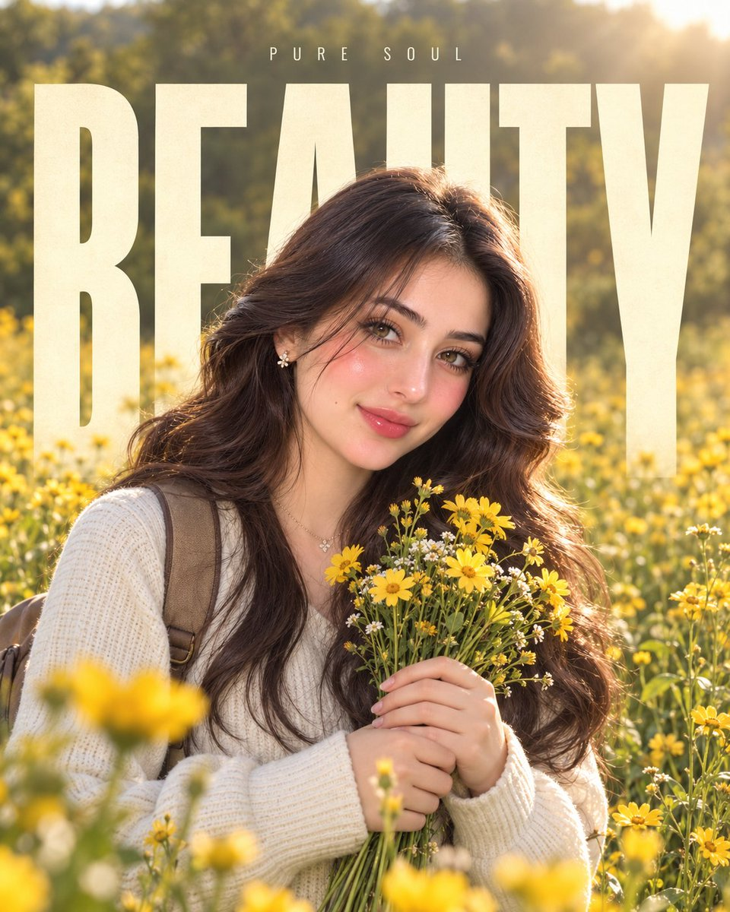

# Custom Giant-Text Background: TEXT HERE Editorial Poster

**中文标题：** 自定义大字背景：TEXT HERE 一键换 editorial 海报  
**ID:** `gi25-x-560` · **Mode:** `edit`  
**Categories:** `poster-typography`  
**Tags:** `x-twitter`, `community`, `gpt-image-2.5`, `xianyu`, `en`



### Custom Giant-Text Background: TEXT HERE Editorial Poster

```text
MASTER PROMPT — REFERENCE-BASED EDITORIAL PORTRAIT

REFERENCE IMAGE IS MANDATORY.

Use the uploaded reference image as the PRIMARY VISUAL REFERENCE for the entire composition, layout, typography treatment, background, lighting, proportions, depth, and overall premium editorial poster aesthetic.

Use the user's uploaded personal image as the PRIMARY IDENTITY REFERENCE for the subject.

The uploaded subject can be ANY PERSON, male or female. Preserve the exact identity of the person from the uploaded image, including facial structure, facial features, skin tone, hairstyle, hair texture, age, and natural appearance. Do not replace or redesign the person's face.

==================================================
CUSTOM TEXT CONTROL
==================================================

TEXT HERE: [TYPE ANY WORD OR SHORT TEXT HERE]

IMPORTANT:
Whatever text the user writes after "TEXT HERE:" must become the MAIN LARGE BACKGROUND TYPOGRAPHY.

The user can write ANY word, name, phrase, or short custom text they want.

Examples:
TEXT HERE: LOVE
TEXT HERE: DREAM
TEXT HERE: MAGIC
TEXT HERE: FOREVER
TEXT HERE: LIFE
TEXT HERE: WILD
TEXT HERE: HOPE
TEXT HERE: ZARNAB
TEXT HERE: MY STORY
TEXT HERE: CREATE
TEXT HERE: FREEDOM

Never automatically use "LOVE" unless the user specifically writes LOVE.

Use the user's exact custom text. Do not invent, replace, misspell, remove, or add words.

==================================================
SUBJECT & IDENTITY
==================================================

Place the person naturally in the center of the composition, matching the approximate position, scale, and framing of the reference image.

Preserve the person's exact identity from the uploaded image.

The subject should have a relaxed, natural, candid editorial pose.

The person is holding a small bouquet of fresh yellow wildflowers naturally in both hands, similar to the reference.

Maintain realistic anatomy, natural body proportions, realistic hands and fingers, authentic facial expression, realistic skin texture, and natural hair.

The final image must look like a professionally photographed version of the person, not an AI-generated replacement person.

==================================================
OUTFIT
==================================================

Create a clean, casual, elegant outfit inspired by the reference image while keeping it natural for the person's gender, appearance, and identity.

Use realistic fabric texture, natural folds, stitching, shadows, and physically accurate clothing.

Include subtle backpack straps similar to the reference when visually appropriate.

Do not make the outfit overly dramatic or fantasy-like.

==================================================
BACKGROUND
==================================================

Recreate the same overall outdoor environment as the reference:

A beautiful dreamy yellow wildflower meadow with soft green foliage and trees in the background, abundant yellow flowers throughout the foreground and midground, warm natural daylight, soft golden sunlight, subtle atmospheric haze, delicate floating light particles, cinematic depth, and a peaceful premium editorial atmosphere.

Keep the background visually very similar in mood, color balance, depth, and softness to the reference image.

Use realistic natural vegetation and physically accurate flowers.

==================================================
MAIN TYPOGRAPHY
==================================================

Place the CUSTOM TEXT behind the subject.

The text must be:

- Extremely large
- Bold
- Tall and condensed
- Uppercase
- Minimal
- Elegant
- Cream/off-white
- Highly readable
- Vertically dominant

The typography should occupy most of the background, similar to the reference composition.

The person's body must naturally overlap and partially cover the letters, creating a realistic foreground/background layering effect.

The text must remain BEHIND the person — never place the main typography over the person's face or body as a foreground graphic.

Match the reference's typography scale, spacing, positioning, and visual hierarchy as closely as possible.

If the custom text contains multiple words, arrange them in a visually balanced way while keeping the same oversized editorial poster aesthetic.

==================================================
SMALL TOP TEXT
==================================================

Add a small minimalist uppercase text above the main typography.

SMALL TEXT HERE: [TYPE SHORT TEXT HERE]

Keep this text subtle, centered, thin/minimal, with generous letter spacing.

If the user does not provide small text, use a simple minimal decorative uppercase word that complements the main custom text without distracting from it.

==================================================
COMPOSITION
==================================================

Match the reference image's composition as closely as possible.

Portrait 4:5 aspect ratio.

Keep the subject centered.

Use the oversized custom typography behind the subject.

Maintain the same approximate proportions between:

subject,
background typography,
flower field,
foreground,
negative space,
and upper text.

Create strong natural foreground, midground, and background depth.

The final result should feel like a premium fashion/editorial social-media poster.

==================================================
LIGHTING & CAMERA
==================================================

Natural soft golden daylight.

Warm cinematic exposure.

Soft realistic shadows.

Gentle highlights.

Natural skin illumination.

Shallow depth of field.

Realistic optical bokeh.

50mm professional portrait photography look.

Subtle cinematic filmic softness.

High dynamic range.

Natural premium color grading.

Avoid excessive HDR, artificial glow, plastic skin, or oversaturated colors.

==================================================
PHOTOREALISM
==================================================

Make the final image highly photorealistic.

Preserve:

- Realistic skin pores and texture
- Individual hair strands
- Natural facial details
- Realistic eyes
- Realistic hands and fingers
- Physically accurate flowers
- Natural fabric texture
- Correct shadows
- Realistic depth of field
- Natural perspective
- Authentic photographic imperfections

The final image should look like a real professional photograph captured with a high-end camera.

==================================================
STRICT REFERENCE RULES
==================================================

Use the reference image ONLY for:

- Composition
- Layout
- Typography style
- Typography placement
- Background environment
- Lighting
- Color mood
- Subject positioning
- Depth
- Overall visual aesthetic

Do NOT copy the identity, face, or personal appearance of the person in the reference image.

The user's uploaded image is the ONLY identity reference for the subject.

Do not change the person's identity.

Do not create an unrelated face.

Do not distort the face, hands, fingers, body, flowers, backpack, or clothing.

Do not put the large custom text in front of the person.

Do not use random words.

Do not automatically use "LOVE".

Use EXACTLY the text provided after:

TEXT HERE:

Keep all typography clean, correctly spelled, readable, and professionally integrated into the photograph.

FINAL GOAL:
Create a highly realistic premium editorial portrait that feels like the SAME visual concept, composition, typography treatment, background, lighting, and aesthetic as the reference image, while using the user's uploaded person as the subject and allowing the user to freely control the large background text through "TEXT HERE:".
```

- **Recommended model:** `gpt-image-2.5-sunburst`
- **Settings:** _(defaults)_
- **Source:** [community](https://x.com/meAsifAi/status/2099302118104444953) — @meAsifAi (via xianyu110/awesome-gpt-image2.5)
- **License note:** Community X post mirrored in xianyu110/awesome-gpt-image2.5; remix with attribution
- **Notes:** xianyu110 case 2099302118104444953; category=海报排版; verified=True
- **Preview:** `previews/gi25-x-560.jpg`
