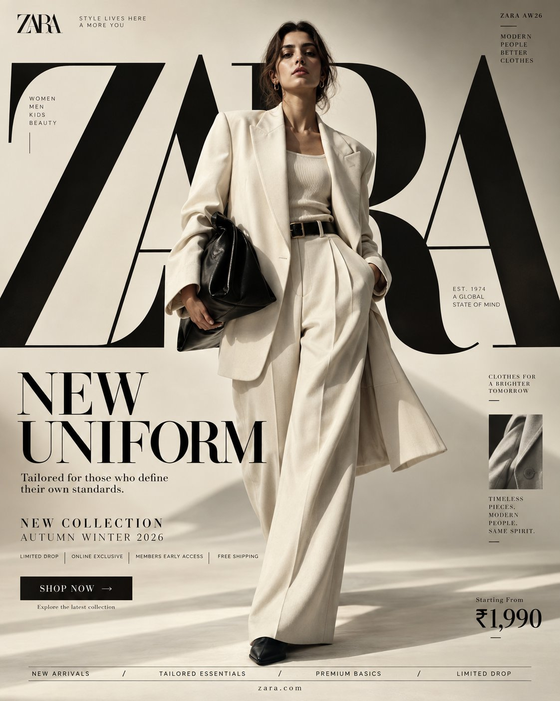

# Zara / H&M / Mango / Tommy: Four Fashion Campaign Systems

**中文标题：** Zara / H&M / Mango / Tommy 四套时尚 campaign 系统  
**ID:** `gi25-x-562` · **Mode:** `generate`  
**Categories:** `poster-typography`  
**Tags:** `x-twitter`, `community`, `gpt-image-2.5`, `xianyu`, `en`



### Zara / H&M / Mango / Tommy: Four Fashion Campaign Systems

```text
PROMPT — H&M "NEW UNIFORM"
FORMAT Ultra-Premium H&M Fashion SMM Promotional Poster Vertical 4:5 Instagram Hero Creative Global Fashion Retail Campaign Contemporary Fashion Advertising Commercial Fashion Graphic Design Agency-Level Art Direction Behance Front Page Quality 8K UHD Hyper-Realistic Fashion × Graphic Design × Street Culture Fusion High-Impact Visual Communication Zero AI Soft Zero Generic Fast-Fashion Advertising Zero Catalogue Aesthetic Zero Luxury-Copycat Aesthetic

CORE STRATEGY This is not simply a clothing advertisement. This is H&M turned into a visual statement. The campaign should communicate: fashion moves fast. culture moves faster. H&M should feel: accessible + expressive + contemporary + youthful + global + confident. The visual language should combine: H&M fashion campaign × editorial magazine × street-culture poster × high-fashion graphic design × digital-first social advertising The result should feel unmistakably H&M, not Zara, Mango, COS or a generic luxury fashion brand.

CAMPAIGN IDEA "NEW UNIFORM" Forget traditional uniforms. This is: THE UNIFORM OF NOW. THE UNIFORM CHANGES. YOU DON'T HAVE TO.

MASTER VISUAL Create an enormous typographic structure reading: H&M occupying ~60–70% of the composition — bold compressed graphic energetic slightly disruptive; partially cropped, stacked, layered, intersecting red graphic blocks.

HERO SUBJECT Young female fashion model. Natural skin. Confident. Mid-stride. Oversized black leather-effect bomber, white fitted tank, relaxed wide-leg grey trousers, chunky black footwear, small silver jewelry, structured mini shoulder bag, subtle red accessory.

H&M COLOR SYSTEM PRIMARY H&M RED ~#E50010; BLACK #000000; WHITE #FFFFFF. Ratio ~60% white/light / 20% black / 15% red / 5% photo tones.

Composition hierarchy: H&M → NEW UNIFORM → MODEL → COLLECTION INFO → CTA. Vertical 4:5, 8K UHD, dramatic in-the-moment fashion photography, agency-level art direction. Full brand system prompts for Zara / Mango / Tommy are in the original thread comments.
```

- **Recommended model:** `gpt-image-2.5-sunburst`
- **Settings:** _(defaults)_
- **Source:** [community](https://x.com/Diplomeme/status/2098411659002012050) — @Diplomeme (via xianyu110/awesome-gpt-image2.5)
- **License note:** Community X post mirrored in xianyu110/awesome-gpt-image2.5; remix with attribution
- **Notes:** xianyu110 case 2098411659002012050; category=海报排版; verified=True
- **Preview:** `previews/gi25-x-562.jpg`
