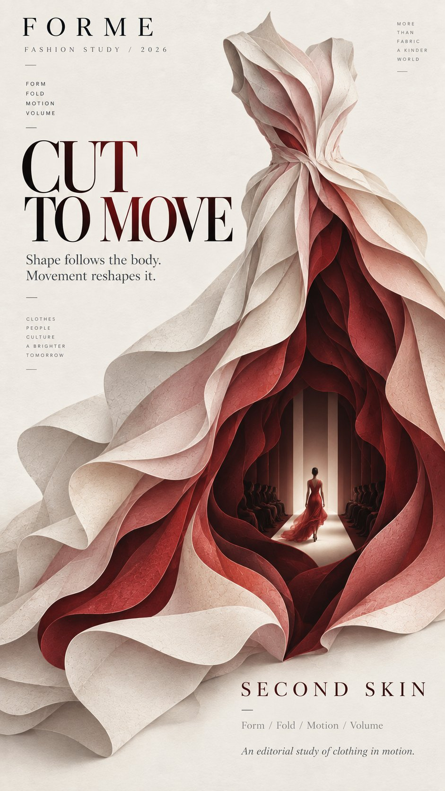

# Paper-Cut Poster Quartet: Each Layer Cuts Open a Tiny World

**中文标题：** 剪纸海报四联：一层剪开一个小世界  
**ID:** `gi25-x-564` · **Mode:** `generate`  
**Categories:** `poster-typography`  
**Tags:** `x-twitter`, `community`, `gpt-image-2.5`, `xianyu`, `en`



### Paper-Cut Poster Quartet: Each Layer Cuts Open a Tiny World

```text
Theme: {fashion / ocean / memory / architecture / other}
Title: {main title}
Main silhouette: {dress / whale / planet / arch / other bold shape}
Inner world: {runway / deep ocean / memory space / courtyard / other scene}
Color palette: {3–5 restrained colors}
Editorial tone: {fashion / cultural / artistic / architectural}
Aspect ratio: 9:16

Create a refined layered paper-cut editorial poster built around one bold, instantly recognizable silhouette.

Let the main silhouette occupy around 60–70% of the composition. Inside it, create 6–9 layers of cut paper that gradually open into a deeper space. Each layer should follow the overall shape while changing naturally in scale, direction, and contour. Avoid perfectly even or mechanical concentric layers.

At the deepest point, reveal a small narrative scene related to the theme, such as a runway, underwater world, observation platform, courtyard, or another meaningful environment. Add one very small human figure when appropriate to create scale and a sense of discovery.

Use matte art-paper textures, clean cut edges, subtle natural paper fibers, and soft shallow shadows between layers. Keep the result visually flat and editorial rather than heavy 3D, foam-board, plastic, or CGI.

Use a restrained palette of 3–5 colors, moving from lighter outer layers to deeper, darker inner layers. Keep colors clean, solid, and consistent rather than using digital gradients or distressed textures.

Leave generous negative space for typography. Use a clear editorial hierarchy with one strong title, a small project or issue name, and only a few supporting details. The typography should feel like an art magazine, exhibition poster, fashion editorial, or cultural publication.

The visual rhythm should be: bold silhouette first, layered depth second, hidden inner world third.

From a distance, the poster should read as one strong shape. Up close, the viewer should discover the layered paper structure and the small world hidden inside.
```

- **Recommended model:** `gpt-image-2.5-sunburst`
- **Settings:** _(defaults)_
- **Source:** [community](https://x.com/MrLarus/status/2098408977008676918) — @MrLarus (via xianyu110/awesome-gpt-image2.5)
- **License note:** Community X post mirrored in xianyu110/awesome-gpt-image2.5; remix with attribution
- **Notes:** xianyu110 case 2098408977008676918; category=海报排版; verified=True
- **Preview:** `previews/gi25-x-564.jpg`
