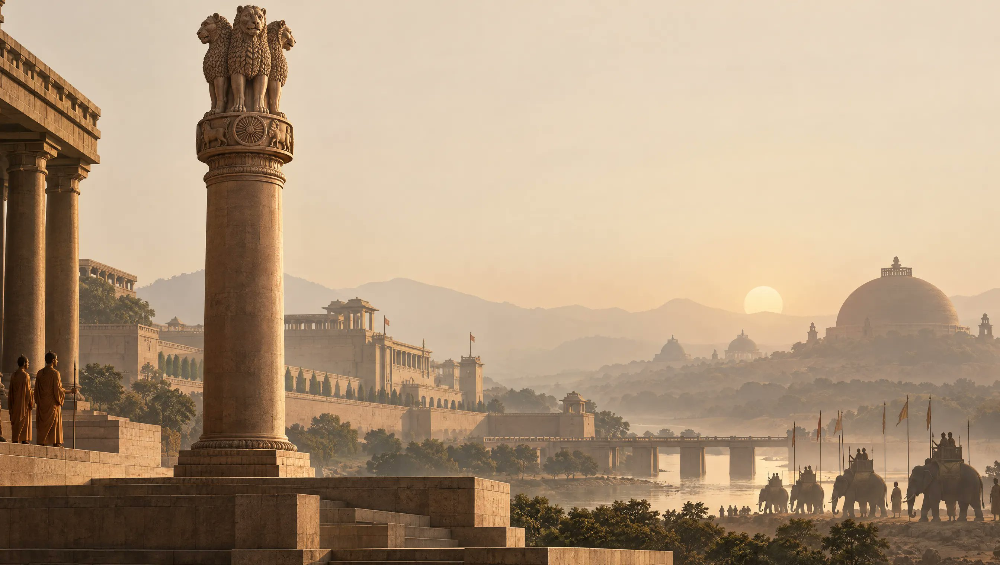

# Functional-Minimalism Empire Wallpaper: Swap the Civilization for a Series

**中文标题：** 功能极简帝国壁纸：换文明名批量出系列  
**ID:** `gi25-x-565` · **Mode:** `generate`  
**Categories:** `poster-typography`  
**Tags:** `x-twitter`, `community`, `gpt-image-2.5`, `xianyu`, `en`



### Functional-Minimalism Empire Wallpaper: Swap the Civilization for a Series

```text
Functional Minimalism style wallpaper of the [EMPIRE/KINGDOM/CIVILIZATION], featuring [ICONIC ARCHITECTURE/LANDMARK], [CULTURAL OR RELIGIOUS SYMBOL], [MILITARY OR HISTORICAL ELEMENT], and [REGION-SPECIFIC LANDSCAPE], with subtle silhouettes of [PEOPLE/ARMY/SHIPS/ANIMALS], using clean geometric forms, restrained historically accurate details, [PRIMARY COLOR] and [ACCENT COLOR] tones, generous negative space, soft [LIGHTING TYPE] atmospheric lighting, strong visual hierarchy, balanced composition, historically inspired cinematic aesthetic, no modern elements, no text, premium ultra-clean wallpaper, [ASPECT RATIO] aspect ratio
```

- **Recommended model:** `gpt-image-2.5-sunburst`
- **Settings:** _(defaults)_
- **Source:** [community](https://x.com/shushant_l/status/2098397177437659591) — @shushant_l (via xianyu110/awesome-gpt-image2.5)
- **License note:** Community X post mirrored in xianyu110/awesome-gpt-image2.5; remix with attribution
- **Notes:** xianyu110 case 2098397177437659591; category=海报排版; verified=True
- **Preview:** `previews/gi25-x-565.jpg`
