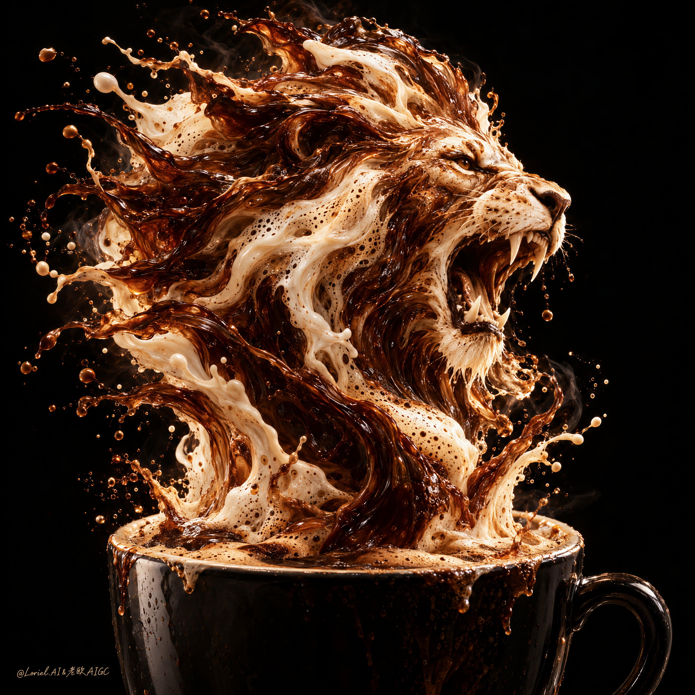

# Liquid Lion Coffee Poster: Lock Brow, Nose and Mouth First, Then Splash the Mane

**中文标题：** 液态狮子海报：先锁眉骨口鼻，再放鬃毛飞溅  
**ID:** `gi25-x-570` · **Mode:** `generate`  
**Categories:** `poster-typography`  
**Tags:** `x-twitter`, `community`, `gpt-image-2.5`, `xianyu`, `en`



### Liquid Lion Coffee Poster: Lock Brow, Nose and Mouth First, Then Splash the Mane

```text
Create a Cannes-level ultra-premium commercial coffee poster for the fictional brand FEROX ROAST, merging Transit material precision with Orbit mythic atmosphere while rigorously preserving the exact visual type of the reference: a near-black studio void, one dark cup cropped low in the frame, and a violent sculptural eruption of coffee and milk from the cup that forms the head and upper mane of a roaring lion. Keep the overall image text-free, with no headline, no promotional copy, and no extra graphic clutter. The cup and the liquid lion must remain the full commercial story.

Core composition: use a vertical poster with one dark ceramic cup positioned low and centrally, partially cropped by the bottom edge to feel close and monumental. From the cup surface, coffee and cream explode upward in a single continuous fluid transformation, forming a roaring lion in three-quarter profile. The lion head must dominate the upper-middle frame, clearly readable through the liquid structure, with the mane flaring backward and outward in asymmetrical splash streams. The splash should feel powerful but controlled, with the main lion silhouette always stronger than the peripheral droplets. Preserve a clean black background so the erupting form holds maximum contrast and hero dominance.

Transit material precision: render the liquid sculpture with world-class detail. The dark coffee must feel dense, hot, roasted, and syrupy, with translucent brown edges, glossy thicker cores, and realistic fluid tension. The milk and foam components must feel silky, creamy, and slightly aerated, defining the lion’s facial planes, cheek, jawline, muzzle, and mane highlights. The cup rim must show wet residue, foam disturbance, subtle splash traces, and accurate ceramic gloss. The coffee surface inside the cup must feel physically active, as if the lion is tearing itself out of a freshly agitated crema field. Every droplet, sheet, ribbon, and foam pocket must obey believable high-speed splash physics.

Orbit atmosphere: deepen the emotional tone into a nocturnal myth of strength awakened by coffee. The lion must not feel like an animal pasted from another source, but like roast energy itself becoming a beast in the dark. Let the mane feel like hot power and vaporized force, as if the roar is born from aroma, heat, and impact. The black field should remain velvety and empty, making the explosion feel ceremonial, primal, and iconic, like a sacred emblem of power emerging in darkness.

Lion-form logic: the face must remain fierce and readable, with a fluidly sculpted brow, open mouth, roaring expression, and mane direction driven by splash momentum. The teeth and mouth interior should be suggested by liquid form and tonal carving rather than literal pasted anatomy. The lion should read instantly, but still feel fully made of coffee and milk. Emphasize the tension where the face transitions into wild mane splashes, so the image feels both animal and fluid at once.

Lighting: use dramatic studio lighting with a warm directional key from upper front-left and controlled rim separation along splash edges and droplet fields. Let highlights travel across the coffee membranes, cream folds, and foam edges, giving the liquid lion museum-grade sculptural definition. Keep the cup readable but secondary to the lion head. The background must stay dark and clean, without environmental contamination.

Color direction: build the image around 60% dark espresso brown, black coffee depth, and roasted mocha, 30% cream-white, latte beige, and cappuccino foam light, and 10% amber-gold highlights and ceramic reflections. The overall palette should feel noble, hot, luxurious, and intense.

Design intent: the final poster must feel like a mythic coffee emblem expressed through high-speed liquid sculpture. It should preserve the reference’s exact same-category shock image while elevating both the tactile realism and the emotional power. The viewer should read strength, roast intensity, and premium coffee energy immediately from the cup and the lion-form eruption alone.

Rendering style: ultra-photoreal luxury coffee advertising, text-free dark studio poster, roaring lion sculpted from coffee and milk, Transit-grade splash realism, Orbit-grade nocturnal beast atmosphere, cinematic chiaroscuro, world-class beverage art direction, 8k detail.

Negative prompt: visible headline, logo, packaging text, extra layout elements, cartoon lion, pasted animal face, weak cup hierarchy, muddy liquid, plastic cream, chaotic splash, low-detail droplets, broken lion anatomy, flat lighting, messy background, cheap energy-drink aesthetic, low-end fantasy rendering, noisy composition
```

- **Recommended model:** `gpt-image-2.5-sunburst`
- **Settings:** _(defaults)_
- **Source:** [community](https://x.com/ou_zhen599/status/2098344166489293224) — @ou_zhen599 (via xianyu110/awesome-gpt-image2.5)
- **License note:** Community X post mirrored in xianyu110/awesome-gpt-image2.5; remix with attribution
- **Notes:** xianyu110 case 2098344166489293224; category=海报排版; verified=True
- **Preview:** `previews/gi25-x-570.jpg`
