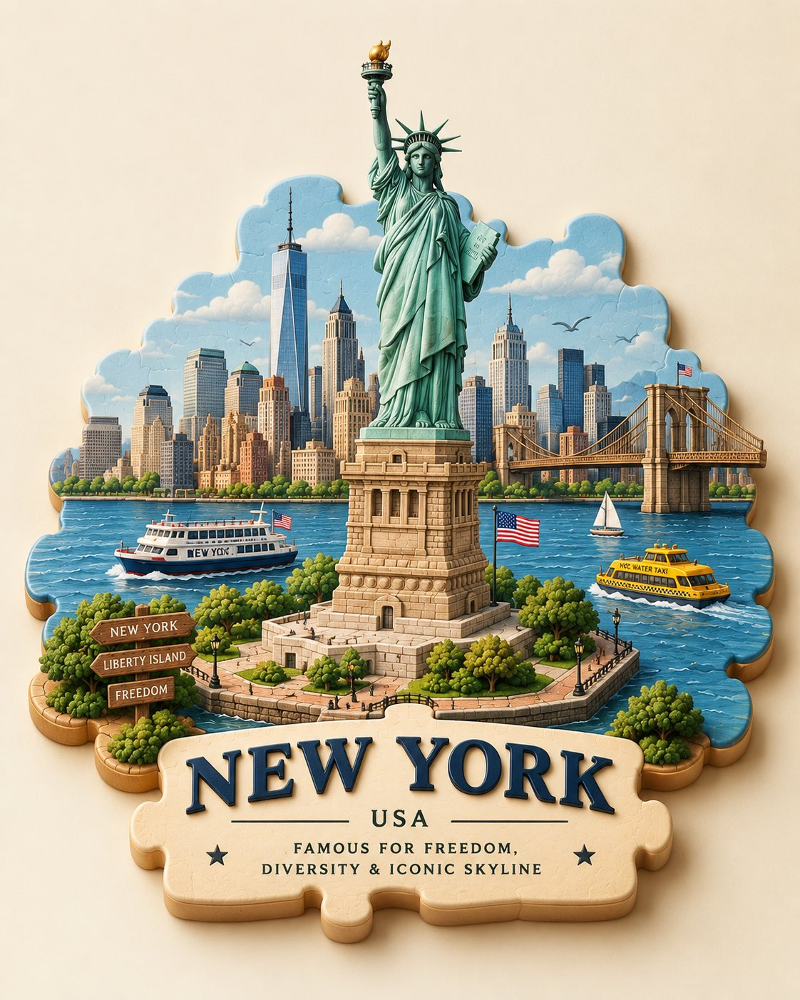

# Puzzle-Piece City Travel Miniature: Fill-in Template for Any City

**中文标题：** 拼图城市旅行微缩：填槽模板一键换城  
**ID:** `gi25-x-572` · **Mode:** `generate`  
**Categories:** `poster-typography`  
**Tags:** `x-twitter`, `community`, `gpt-image-2.5`, `xianyu`, `en`



### Puzzle-Piece City Travel Miniature: Fill-in Template for Any City

```text
Create a charming 3D puzzle-piece travel scene of [CITY, COUNTRY], designed as a single cohesive miniature world. Build the city from beautifully interlocking puzzle pieces, with [ICONIC LANDMARK] as the central focal point. Surround it with recognizable local architecture, streets, trees, transportation, landscape, and small cultural details. Make the puzzle pieces slightly raised with visible seams, rounded edges, layered depth, and soft realistic shadows. Use a sophisticated palette inspired by the city, subtle handcrafted textures, warm studio lighting, clean cream background, playful yet premium collectible-diorama aesthetic. Add elegant 3D lettering: “[CITY]” and underneath “[COUNTRY] • [FAMOUS FOR]”. Highly polished, cute, artistic, detailed, and instantly recognizable.
```

- **Recommended model:** `gpt-image-2.5-sunburst`
- **Settings:** _(defaults)_
- **Source:** [community](https://x.com/Naiknelofar788/status/2098301205365850272) — @Naiknelofar788 (via xianyu110/awesome-gpt-image2.5)
- **License note:** Community X post mirrored in xianyu110/awesome-gpt-image2.5; remix with attribution
- **Notes:** xianyu110 case 2098301205365850272; category=海报排版; verified=True
- **Preview:** `previews/gi25-x-572.jpg`
