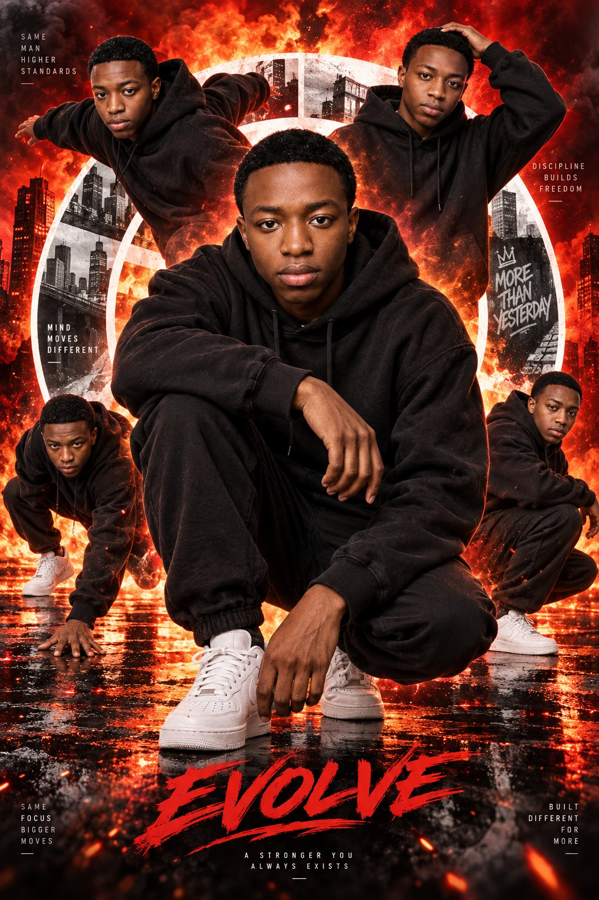

# Same-Identity Lock: Multi-Pose Cinematic Action Poster

**中文标题：** 同一身份锁：多姿势电影海报战役图  
**ID:** `gi25-x-574` · **Mode:** `generate`  
**Categories:** `poster-typography`  
**Tags:** `x-twitter`, `community`, `gpt-image-2.5`, `xianyu`, `en`



### Same-Identity Lock: Multi-Pose Cinematic Action Poster

```text
Create a high-impact cinematic action poster featuring the same handsome young adult man repeated in multiple dynamic poses. The composition should have one large central portrait and four smaller surrounding versions of the same man arranged in a bold collage layout.

The central figure is the main focus: he is crouching low in the foreground, facing the camera with a calm, confident, intense expression. He wears a black oversized hoodie, black jogger pants, and white sneakers. One knee is raised, one arm rests casually across it, and his pose feels powerful, grounded, and stylish.

Around him, place four additional versions of the same man in different expressive action/fashion poses:

one on the upper left leaning outward in motion,

one on the upper right with one hand placed on his head,

one on the lower left in a low athletic pose with one hand touching the ground,

one on the lower right in a crouched side pose.

All versions should wear the same black hoodie outfit for visual consistency.

Use a dramatic fiery red and orange background filled with flames, smoke, glowing heat, and intense energy. Behind the figures, include a large white circular geometric ring or abstract round graphic element that frames the collage and adds structure. Add subtle urban textures and monochrome abstract fragments inside parts of the circle for a modern editorial look.

Style should feel like a premium sports-fashion poster, with:

photorealistic details

sharp facial features

strong dramatic lighting

high contrast

bold red/orange glow

clean compositing

dynamic depth and layering

luxury action-campaign aesthetic

Make it visually striking, energetic, and poster-worthy, with the central figure dominant and the surrounding poses supporting the composition. Vertical 2:3 ratio, ultra-detailed, cinematic, high resolution.
```

- **Recommended model:** `gpt-image-2.5-sunburst`
- **Settings:** _(defaults)_
- **Source:** [community](https://x.com/abs_uiux/status/2098282894368084350) — @abs_uiux (via xianyu110/awesome-gpt-image2.5)
- **License note:** Community X post mirrored in xianyu110/awesome-gpt-image2.5; remix with attribution
- **Notes:** xianyu110 case 2098282894368084350; category=海报排版; verified=True
- **Preview:** `previews/gi25-x-574.jpg`
