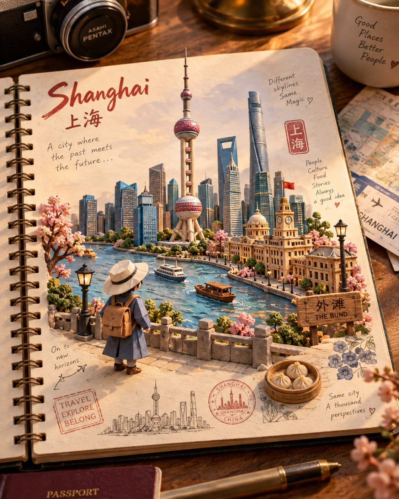

# Travel Journal [LOCATION]: Clay Miniatures + Origami Traveler

**中文标题：** 旅行手账 [LOCATION]：黏土微缩 + 折纸旅人  
**ID:** `gi25-x-575` · **Mode:** `generate`  
**Categories:** `poster-typography`  
**Tags:** `x-twitter`, `community`, `gpt-image-2.5`, `xianyu`, `en`



### Travel Journal [LOCATION]: Clay Miniatures + Origami Traveler

```text
Create a premium, Instagram-worthy handcrafted travel-journal scene representing [LOCATION].

Show an open cream-colored spiral notebook resting on a warm rustic wooden desk, photographed from a slightly elevated top-down angle in soft, cinematic golden-hour light.

Turn the destination into a charming mixed-media miniature world. Build the architecture, landscape, plants, water, and cultural details from realistic, tactile hand-sculpted clay, with subtle handmade imperfections and fine textures. Add a small origami traveler, unmistakably folded from textured paper with visible creases and elegant, simple shapes, naturally exploring the miniature environment.

Make one iconic landmark or visual symbol of [LOCATION] the clear hero, supported by a few authentic local elements such as architecture, terrain, vegetation, transportation, or cultural details. Avoid generic tourist objects. Dress the origami traveler in a tasteful outfit subtly inspired by the destination without relying on stereotypes.

Use a sophisticated color palette inspired by [LOCATION], with detailed clay textures, realistic paper folds, miniature craftsmanship, soft shadows, atmospheric depth, and warm cinematic illumination. Make the miniature world feel physically integrated into the notebook page—not like a pasted photograph.

Surround the artwork with subtle handwritten travel-journal notes, tiny doodles, arrows, stamps, and location-inspired sketches, keeping them secondary to the main scene.

Composition: strong focal point, clear visual hierarchy, generous negative space, immersive depth, premium editorial photography, highly detailed handcrafted textures, whimsical yet sophisticated, emotionally evocative, visually distinctive, and highly shareable.

Avoid: photorealistic people, clutter, excessive text, generic landmarks, flat digital illustration, plastic-looking materials, oversaturated colors, distorted architecture, and unnecessary decorations.

Overall feel: a beautifully crafted tiny world inside a traveler's notebook—artistic, tactile, authentic, sophisticated, and unmistakably connected to [LOCATION], rather than a conventional travel photograph.
STRICT FORMAT: Vertical 4:5 aspect ratio only - do not generate square, landscape, or any other aspect ratio.
```

- **Recommended model:** `gpt-image-2.5-sunburst`
- **Settings:** _(defaults)_
- **Source:** [community](https://x.com/Goodmanprotocol/status/2098269046022238289) — @Goodmanprotocol (via xianyu110/awesome-gpt-image2.5)
- **License note:** Community X post mirrored in xianyu110/awesome-gpt-image2.5; remix with attribution
- **Notes:** xianyu110 case 2098269046022238289; category=海报排版; verified=True
- **Preview:** `previews/gi25-x-575.jpg`
