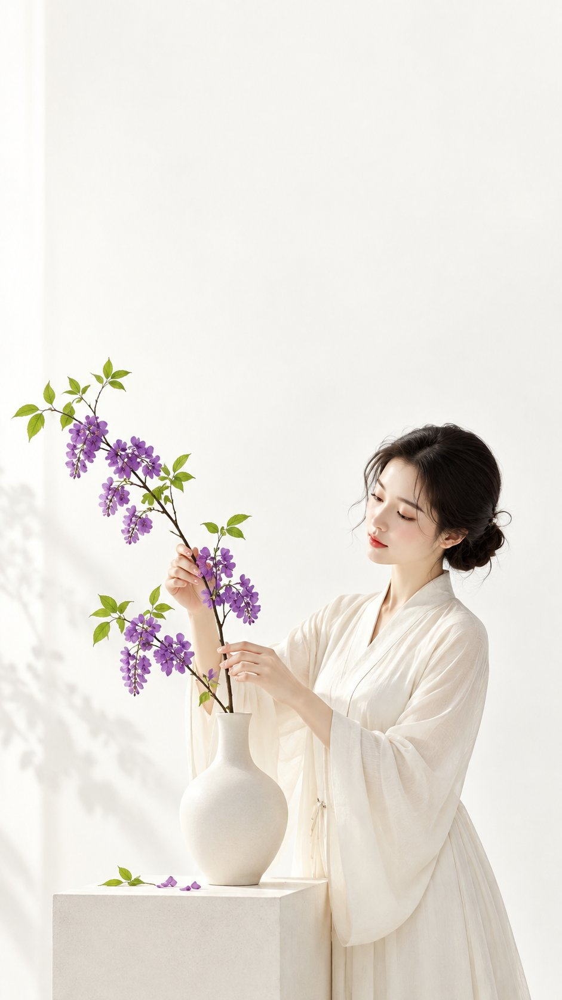

# Eastern Minimalist Cover: Sectioned Chinese Prompt

**中文标题：** 东方极简封面：分段中文 prompt  
**ID:** `gi25-x-579` · **Mode:** `generate`  
**Categories:** `poster-typography`  
**Tags:** `x-twitter`, `community`, `gpt-image-2.5`, `xianyu`, `zh`



### Eastern Minimalist Cover: Sectioned Chinese Prompt

```text
主题方向：东方禅意极简封面海报
风格分支：女性审美高对比型
主体内容：一位女子站在极简花器旁，轻轻整理一枝花
情绪母题：精致、明亮、轻奢东方感
场景与意象：白色空间、葡萄紫花朵、青柠绿叶片、白瓷花器、女子
构图与空间：9:16 竖版构图，花器与人物位于下半部分偏一侧，上方保留完整白色标题区，花枝形成第一视觉点
色彩控制：纯白或奶油白作为高明度基底，葡萄紫只用于花朵，青柠绿用于叶片，花器保持白色或浅米色，人物服装用浅暖白；避免紫绿污染整张画面
光线与质感：明亮柔光，轮廓清晰，干净平面海报质感
画幅比例：9:16
补充要求：颜色要鲜明现代，整体高级精致，适合女性审美封面
```

- **Recommended model:** `gpt-image-2.5-sunburst`
- **Settings:** _(defaults)_
- **Source:** [community](https://x.com/liyue_ai/status/2098246112159420546) — @liyue_ai (via xianyu110/awesome-gpt-image2.5)
- **License note:** Community X post mirrored in xianyu110/awesome-gpt-image2.5; remix with attribution
- **Notes:** xianyu110 case 2098246112159420546; category=海报排版; verified=True
- **Preview:** `previews/gi25-x-579.jpg`
