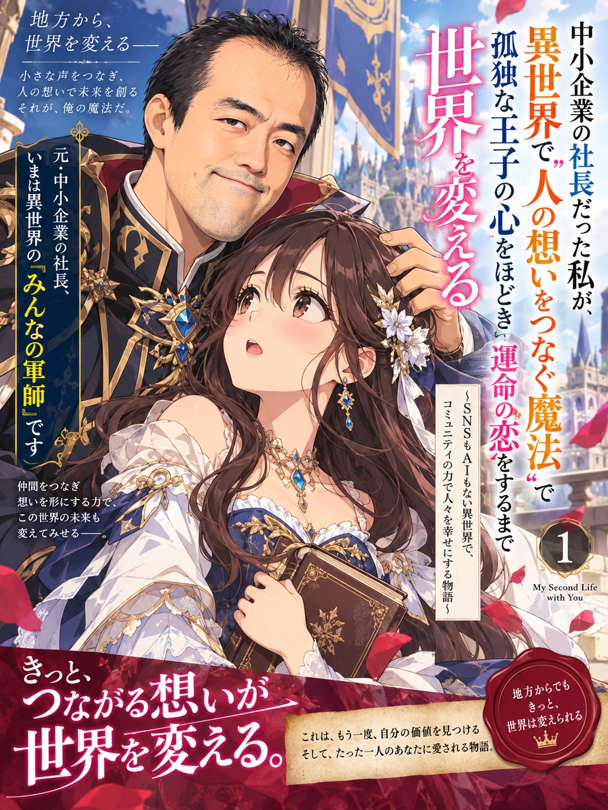

# Chat-History Diagnosis to a Light-Novel Cover Long Prompt

**中文标题：** 对话诊断 → 轻小说封面长 prompt  
**ID:** `gi25-x-580` · **Mode:** `edit`  
**Categories:** `poster-typography`  
**Tags:** `x-twitter`, `community`, `gpt-image-2.5`, `xianyu`, `ja`



### Chat-History Diagnosis to a Light-Novel Cover Long Prompt

```text
あなたは、会話履歴から人物像を物語へ変換する編集者であり、日本のライトノベル表紙を企画するクリエイティブディレクターです。

私との会話履歴・この会話で確認できる内容をもとに、私の思考傾向、悩み方、強み、こだわり、価値観、人生のテーマやミッションの仮説を分析し、その結果を「私が主人公の異世界恋愛ファンタジーライトノベル第1巻」に落とし込んでください。

最後に、添付した私の写真をアニメイラスト化し、長い日本語タイトル入りのラノベ表紙画像を1枚生成してください。

【分析ルール】
- 根拠は参照可能な会話だけ
- 不明な点は不明と書く
- 分析と創作を分ける
- 公開向けなので個人情報は伏せる
- 写真から内面を決めつけない

【ストーリーの軸】
- 私の会話から見える強みや願いを、異世界での役割や能力に変換する
- 弱みや葛藤も、物語上の障害として活かす
- テーマは「自分の価値を見つけること」「運命の相手との関係を通じた成長」
- ラブロマンス要素を強めに入れる
- 関係性には、契約、共闘、秘密、身分差のいずれかを自然に盛り込む

【パートナー設定】
- 主人公と異性の、美しいパートナーを必ず登場させる
- パートナーは圧倒的な美形で、どこか危うく、でも主人公にだけ執着や特別扱いを見せる
- 関係性は「護衛と主」「契約相手」「敵対から共闘」「婚約者候補」など、ドラマが生まれるものにする
- 主人公との間に、視線や手の触れ方だけで伝わるロマンスの緊張感を持たせる

【タイトル】
- 日本のライトノベルらしい長いタイトルを1案
- 60〜90字程度
- 「自己分析から見えた私らしさ」「異世界での立場」「美しい異性パートナーとの関係」を入れる
- 帯コピー25字以内
- あらすじ120字程度

【表紙画像の方向性】
- 添付写真の私を、顔立ち・髪型・年齢感を活かしてアニメ化する
- 主人公の顔も含め、イラスト全体を完全にアニメのベタ塗り画風にすること
- 半写実、厚塗り、3DCG風、写真風、油彩風、リアル寄りの陰影表現は避けること
- 日本の商業アニメやライトノベル表紙らしい、くっきりした線画、明快な輪郭、セル画風の塗り、フラットで鮮やかな色面、影の境界がはっきりしたアニメ塗りで描くこと
- 肌、髪、瞳、衣装、装飾、背景に至るまで、全体の統一感を持ったアニメベタ塗りで仕上げること
- 主人公は実写の写真感を残すのではなく、「本人の特徴を反映したアニメキャラクター」として自然に再構成すること

- 主人公は異世界衣装。ドレス、ローブ、騎士服、魔導装束など、物語設定に合う華やかな衣装
- パートナーも非常に美しく、気高く、見る人の印象に残る異世界衣装

- 参考画像のように、2人が大きく配置され、恋愛感情や距離感が伝わる表紙にする
- ただし、そのままの構図・色・文字配置・衣装にはしない
- オリジナルなアレンジとして、斜めの体の向き、上下の視線差、手元の演技、衣装の差異などで個性を出す

- 主人公の表情は単調にせず、感情が伝わる豊かな表情にすること
- 瞳の向き、口元、眉の動きまで含めて、主人公が感情豊かに見えるようにすること

- 主人公のポーズも棒立ちにせず、動きとドラマが感じられる豊かなポーズにすること
- 主人公とパートナーの手元や距離感にも演技を持たせ、関係性が一目で伝わるようにすること

- 画面のどこかに契約・魔法・身分差を象徴するモチーフを入れる
- 色調は、深い赤、ネイビー、金、白などをベースにした高級感ある配色
- タイトルは大きく、縦組みと横組みを混ぜて、ラノベらしい勢いある装丁にする
- 顔に文字が重ならないようにする
- 画角は縦長の3:4比率
- 平面の表紙デザインにする
- 実在の作品や既存装丁の模倣は禁止

【出力順】
1. 参照できた情報範囲
2. 自己分析の要点
3. 主人公設定
4. パートナー設定
5. タイトル
6. 帯コピー
7. あらすじ
8. 表紙画像を1枚生成
```

- **Recommended model:** `gpt-image-2.5-sunburst`
- **Settings:** _(defaults)_
- **Source:** [community](https://x.com/nyattta/status/2098243466576994450) — @nyattta (via xianyu110/awesome-gpt-image2.5)
- **License note:** Community X post mirrored in xianyu110/awesome-gpt-image2.5; remix with attribution
- **Notes:** xianyu110 case 2098243466576994450; category=海报排版; verified=True
- **Preview:** `previews/gi25-x-580.jpg`
