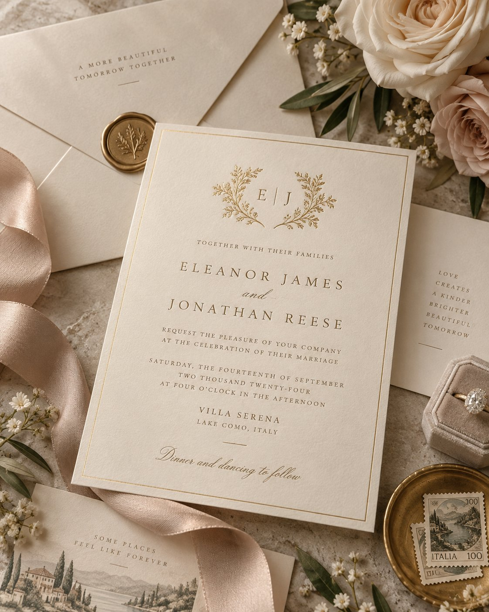

# Luxury Wedding Invitation Mockup with Full Prompt

**中文标题：** 奢华婚礼请柬 mockup + 完整 prompt  
**ID:** `gi25-x-582` · **Mode:** `generate`  
**Categories:** `poster-typography`  
**Tags:** `x-twitter`, `community`, `gpt-image-2.5`, `xianyu`, `en`



### Luxury Wedding Invitation Mockup with Full Prompt

```text
Create a premium luxury wedding invitation stationery mockup photographed from a slightly elevated top-down angle on a warm beige textured stone surface.

Place a large rectangular wedding invitation card at the center, printed on thick premium ivory cotton paper with visible fine paper texture and slightly raised edges. Add a very thin champagne-gold foil border around the card.

At the top center, include a delicate botanical gold-foil monogram made from elegant leafy branches surrounding the couple’s initials.

Use sophisticated editorial typography throughout:

- elegant high-contrast serif font for the couple’s names
- refined small uppercase serif lettering for supporting information
- subtle handwritten calligraphy for words such as “and” and the closing line
- generous letter spacing and carefully balanced alignment

Example invitation wording:

“TOGETHER WITH THEIR FAMILIES

ELEANOR JAMES
and
JONATHAN REESE

REQUEST THE PLEASURE OF YOUR COMPANY
AT THE CELEBRATION OF THEIR MARRIAGE

SATURDAY, THE FOURTEENTH OF SEPTEMBER
TWO THOUSAND TWENTY-SIX
AT FOUR O’CLOCK IN THE AFTERNOON

VILLA SERENA
LAKE COMO, ITALY

Dinner and dancing to follow”

Surround the invitation with coordinated luxury stationery pieces, including matching ivory envelopes, small information cards, and decorative paper inserts.

Add romantic styling elements around the composition:
soft ivory and blush roses, tiny white flowers, olive-green foliage, a flowing champagne satin ribbon, a vintage brass wax seal with a botanical emblem, a velvet engagement-ring box with a diamond ring, and subtle vintage postage stamps.

Keep the palette warm and refined: ivory, cream, champagne gold, dusty blush, beige, muted olive green, and soft bronze.

Use soft natural window lighting with delicate shadows, realistic metallic foil reflections, premium paper texture, shallow depth of field, and elegant editorial wedding photography.

Overall aesthetic: timeless European wedding, Lake Como romance, quiet luxury, sophisticated bridal stationery, high-end wedding editorial, minimal but richly detailed, photorealistic, luxurious and romantic.
```

- **Recommended model:** `gpt-image-2.5-sunburst`
- **Settings:** _(defaults)_
- **Source:** [community](https://x.com/abs_uiux/status/2097977120441925720) — @abs_uiux (via xianyu110/awesome-gpt-image2.5)
- **License note:** Community X post mirrored in xianyu110/awesome-gpt-image2.5; remix with attribution
- **Notes:** xianyu110 case 2097977120441925720; category=海报排版; verified=True
- **Preview:** `previews/gi25-x-582.jpg`
