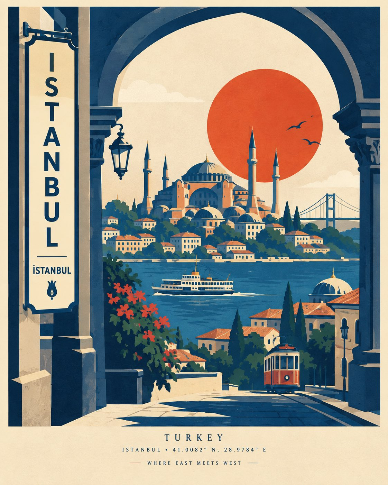

# Travel Poster [CITY, COUNTRY]: Screen-Print Template

**中文标题：** 旅行海报 [CITY, COUNTRY] 丝网印刷模板  
**ID:** `gi25-x-584` · **Mode:** `generate`  
**Categories:** `poster-typography`  
**Tags:** `x-twitter`, `community`, `gpt-image-2.5`, `xianyu`, `en`



### Travel Poster [CITY, COUNTRY]: Screen-Print Template

```text
Create a premium modern travel poster for [CITY, COUNTRY], inspired by bold vintage screen-print and mid-century graphic design, but with an original architectural portal composition.

Place a large distinctive [LOCAL ARCHITECTURAL ELEMENT / GATE / ARCH] in the foreground, acting as a window into the destination. Through the opening, reveal a stylized layered scene featuring [ICONIC LANDMARK], [FAMOUS NATURAL FEATURE], simplified rooftops, local streets, trees, transportation, and a few subtle cultural details.

Add one large bold geometric sun / moon / circle behind the main landmark, using a shape and placement that feels visually striking rather than traditional. Include 2–3 recognizable local symbols naturally within the scene instead of presenting them as separate objects.

Use a limited sophisticated color palette inspired by the destination: [2–5 COLORS]. Flat geometric shapes, strong silhouettes, clean edges, subtle overlapping layers, slight screen-print texture, and elegant negative space.

Add a tall integrated sign or architectural panel featuring:

[CITY]
[LOCAL SCRIPT]

Include small refined editorial typography at the bottom:

[COUNTRY]
[CITY] • [COORDINATES]
[SHORT DESTINATION PHRASE]

Minimal, artistic, cohesive, collectible travel-poster aesthetic, not photorealistic, not a collage, no excessive details, sophisticated composition, strong visual hierarchy, balanced asymmetry, warm paper background, subtle print imperfections, 4:5 vertical format.
```

- **Recommended model:** `gpt-image-2.5-sunburst`
- **Settings:** _(defaults)_
- **Source:** [community](https://x.com/Naiknelofar788/status/2097920025617399875) — @Naiknelofar788 (via xianyu110/awesome-gpt-image2.5)
- **License note:** Community X post mirrored in xianyu110/awesome-gpt-image2.5; remix with attribution
- **Notes:** xianyu110 case 2097920025617399875; category=海报排版; verified=True
- **Preview:** `previews/gi25-x-584.jpg`
