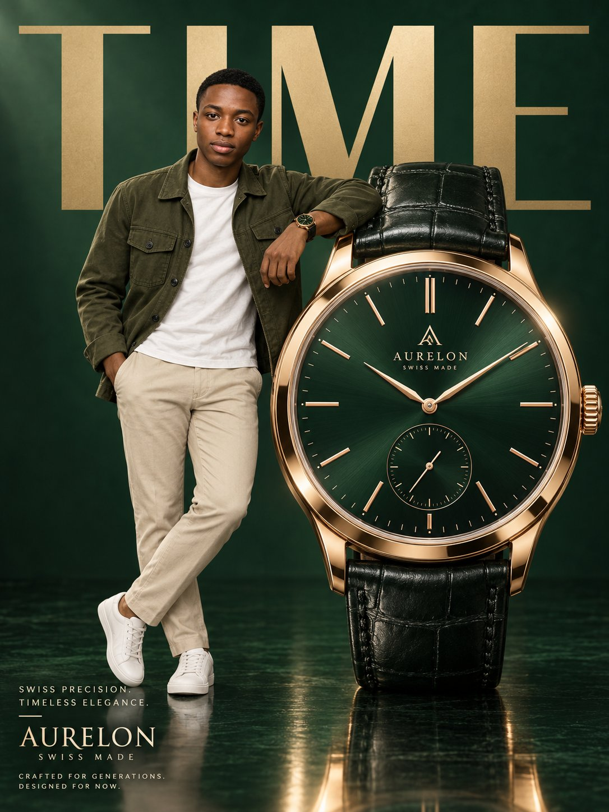

# Vertical Luxury Watch Advertisement

**中文标题：** 竖版奢华腕表广告  
**ID:** `gi25-x-595` · **Mode:** `generate`  
**Categories:** `poster-typography`  
**Tags:** `x-twitter`, `community`, `gpt-image-2.5`, `atlascloud`, `en`



### Vertical Luxury Watch Advertisement

```text
Create a vertical 3:4 luxury editorial advertisement inside a sophisticated dark emerald-green studio. Position an enormous luxury wristwatch on the right side of the frame, approximately 2–3 times taller than the male model. The watch stands vertically on a glossy dark-green reflective floor, producing a subtle premium reflection underneath.

Place an adult male model on the left side of the oversized watch. He should lean casually against the upper-left edge of the watch case with one elbow resting naturally on it. His legs are relaxed and slightly crossed at the ankles, creating an effortless, confident luxury-fashion pose. Maintain realistic human-to-product scale and believable contact shadows where his arm touches the watch.

Male Model:
Stylish adult Black male, neat short low-cut haircut, warm natural skin tone, attractive but realistic facial features, confident friendly smile. Dress him in:

premium muted olive-green utility jacket with two chest pockets

clean plain white crew-neck T-shirt

tailored beige/stone chinos

minimal white leather sneakers

no necklace or unnecessary jewelry

The styling should feel sophisticated, modern, relaxed, and aspirational rather than overly formal.

Hero Watch:
Design an ultra-premium Swiss-inspired mechanical dress watch with:

oversized circular polished rose-gold case

deep forest-green sunburst dial

slim rose-gold baton hour markers

elegant minimalist rose-gold hour and minute hands

small seconds subdial positioned around 6 o’clock

finely detailed crown on the right side

rich black or extremely dark green crocodile-textured leather strap

realistic stitching, leather grain, polished metal reflections, crystal refraction, and microscopic craftsmanship

physically accurate proportions and immaculate product-render quality

Place a small original luxury emblem and custom watch brand name in the center-upper portion of the dial. Keep the dial uncluttered and sophisticated.

Background & Typography:
Use a seamless dark emerald-green background with subtle tonal gradients and gentle atmospheric falloff.

Behind the subject and watch, add one enormous uppercase word:

TIME

Set it in an elegant, bold, high-fashion sans-serif typeface. Use muted champagne-gold lettering. Allow parts of the letters to disappear naturally behind the model and oversized watch to create strong editorial depth.

On the lower-left side, add refined luxury-brand typography:

SWISS PRECISION.
TIMELESS ELEGANCE.

Then display the custom logo and brand name underneath in larger elegant serif or luxury-style typography.

Example:

[BRAND NAME]
SWISS MADE

At the very bottom-left, include tiny spaced uppercase campaign copy such as:

CRAFTED FOR GENERATIONS.
DESIGNED FOR NOW.

Keep all typography perfectly aligned, correctly spelled, sharp, minimal, and professionally typeset.

Lighting:
Use cinematic high-end commercial studio lighting. A large soft key light from the upper-left should illuminate the model and reveal the watch's dial texture. Add subtle warm rim lighting around the rose-gold case and model. Use controlled specular highlights across the polished metal while retaining deep emerald shadows. The leather should have soft directional highlights showing its premium texture.

Create believable floor reflections without making them mirror-perfect.

Camera & Rendering:
Slightly low eye-level perspective to emphasize the monumental scale of the watch. Full-body model visible from head to shoes. Premium medium-format advertising photography, approximately 70–85mm lens aesthetic, natural perspective compression, extremely sharp watch face, realistic skin texture, controlled depth of field.
```

- **Recommended model:** `gpt-image-2.5-sunburst`
- **Settings:** _(defaults)_
- **Source:** [community](https://x.com/abs_uiux/status/2097293382577954907) — @abs_uiux (via AtlasCloudAI/awesome-gpt-image-2.5-prompts)
- **License note:** CC BY 4.0 (AtlasCloudAI/awesome-gpt-image-2.5-prompts); original X post — remix with attribution
- **Notes:** AtlasCloudAI record 192; category=Layout & Typography; prompt text taken from the original X post; verified=True
- **Preview:** `previews/gi25-x-595.jpg`
