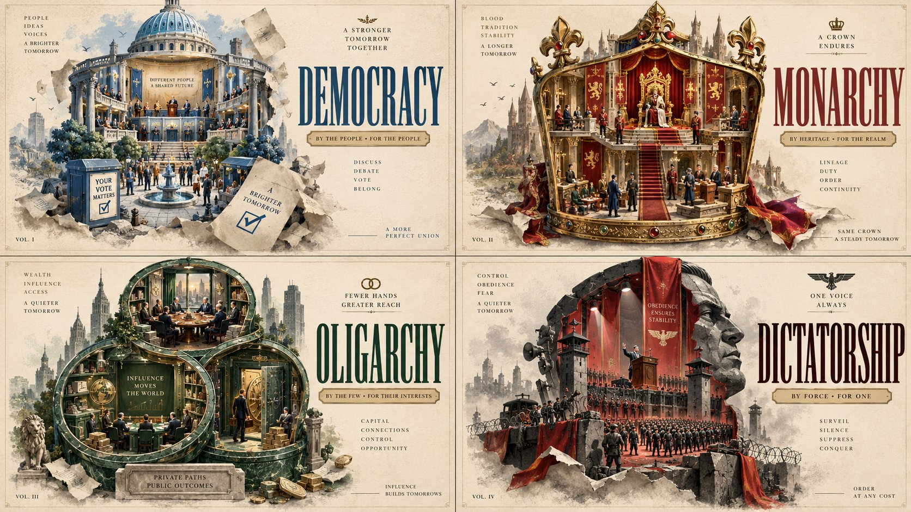

# Systems Of Government Grid

**中文标题：** 政体系统网格图  
**ID:** `gi25-x-600` · **Mode:** `generate`  
**Categories:** `poster-typography`  
**Tags:** `x-twitter`, `community`, `gpt-image-2.5`, `atlascloud`, `en`



### Systems Of Government Grid

```text
2x2 grid, 16:9, do this for 4 systems of government: 2x2 grid, 16:9, do this for famous manga: <instructions> CONCEPT ANCHOR 1: "Pastel storybook cutaway collectible diorama — spherical or capsule-like cross-sections, miniature rooms and habitats, matte toy materials, tiny props, plaque presentation, warm editorial lighting"  :: CONCEPT ANCHOR 2: "Vintage literary screenprint cover — cream paper field, limited duotone palette, tall condensed typography, silhouette profiles, embedded skylines and iconography, elegant poster frontality"  :: CONCEPT ANCHOR 3: "Graphite fantasy plate interrupted by dimensional page-burst drama — whisper-soft pencil rendering, atmospheric negative space, drifting dust and paper fragments, selective sculptural emergence from flat image space"  INSTRUCTION: Find the exact visual center of these three concepts. Ignore the literal books, monsters, spaceships, authors, and riders. Capture only the style essence.  Render {$SUBJECT} as a deluxe literary-artifact hybrid image where the subject exists simultaneously as: 1. a finely crafted cutaway miniature world, 2. a classic screenprinted book-cover silhouette, 3. a soft graphite illustration with vast breathing room, 4. and a partially ruptured page-space where select elements burst forward into dimensional reality.  STYLE RULES: - Main composition should feel like a collector’s edition book-cover poster for {$SUBJECT}. - The outer silhouette or framing device should be iconic and poster-readable from far away. - Inside that silhouette, AI should infer a tiny layered micro-world built from handcrafted miniature diorama logic. - The micro-world should include inferred props, architecture, creatures, tools, furniture, terrain, machinery, ornaments, or symbolic story fragments drawn from {$SUBJECT}. - Most of the composition should retain elegant restraint: cream paper, negative space, clean typography zones, and selective pencil softness. - One or two focal elements should rupture the flat printed world and emerge forward with suspended debris, torn paper fibers, dust motes, broken margins, and dimensional energy. - Use tactile material contrast: matte miniature surfaces, flat ink print fields, graphite softness, and sharp burst-depth accents. - Typography should be inferred from {$SUBJECT}: title, subtitle, author-like credit, edition badge, or series plaque. - Layout should feel premium, collectible, literary, and gallery-worthy.  COLOR RULES: - Base field: warm cream, parchment, pale ivory. - Main print palette: infer one restrained duotone family from {$SUBJECT}. - Diorama interior: softened pastel variants of the same palette, with subtle toy-like warmth. - Graphite zones: smoky grays, silver pencil values, soft edge falloff. - Burst zones: one higher-contrast accent family inferred from the emotional charge of {$SUBJECT}.  OUTPUT: A premium hybrid literary key art for {$SUBJECT} that feels like a vintage cover, a handcrafted miniature museum piece, a graphite illustration, and a book-page eruption frozen in one elegant image.
```

- **Recommended model:** `gpt-image-2.5-sunburst`
- **Settings:** _(defaults)_
- **Source:** [community](https://x.com/Gdgtify/status/2098193553470226903) — @Gdgtify (via AtlasCloudAI/awesome-gpt-image-2.5-prompts)
- **License note:** CC BY 4.0 (AtlasCloudAI/awesome-gpt-image-2.5-prompts); original X post — remix with attribution
- **Notes:** AtlasCloudAI record 1167; category=Layout & Typography; prompt text taken from the original X post; verified=True
- **Preview:** `previews/gi25-x-600.jpg`
