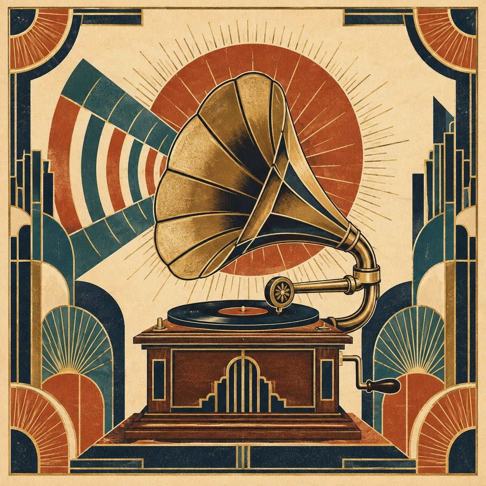

# Art Deco Poster Base Prompt

**中文标题：** Art Deco Base Prompt  
**ID:** `gi25-x-615` · **Mode:** `generate`  
**Categories:** `poster-typography`  
**Tags:** `x-twitter`, `community`, `gpt-image-2.5`, `xianyu`, `en`



### Art Deco Poster Base Prompt

```text
Square 1:1 Art Deco poster illustration, elegant gold and deep navy line work on warm cream paper, limited palette of terracotta, teal, and antique gold. Stylized geometric forms, sharp symmetry, radiating sunburst and fan motifs, clean flat shapes with subtle paper grain. Subject: [SUBJECT]. Timeless luxury graphic design, no photorealism, no 3D, no modern clothing or gadgets, museum-quality print look.
```

- **Recommended model:** `gpt-image-2.5-sunburst`
- **Settings:** _(defaults)_
- **Source:** [community](https://x.com/MrDasCreates/status/2097550067213504848) — @MrDasCreates (via xianyu110/awesome-gpt-image2.5)
- **License note:** Community X post mirrored in xianyu110/awesome-gpt-image2.5; remix with attribution
- **Notes:** xianyu110 case 2097550067213504848; category=海报排版; verified=True; handle renamed since mirroring (was @MrDasOnX)
- **Preview:** `previews/gi25-x-615.jpg`
