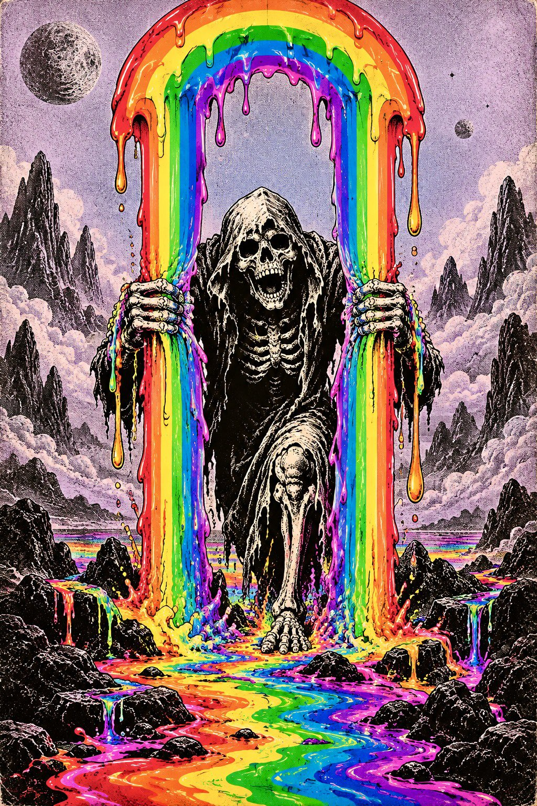

# Rainbow Grim-Reaper Psychedelic Poster

**中文标题：** 彩虹死神迷幻海报  
**ID:** `gi25-x-624` · **Mode:** `generate`  
**Categories:** `poster-typography`  
**Tags:** `x-twitter`, `community`, `gpt-image-2.5`, `bravoneo`, `en`



### Rainbow Grim-Reaper Psychedelic Poster

```text
A surreal psychedelic poster illustration of a skeletal grim-reaper figure emerging through a towering rainbow arch, gripping two vertical streams of liquid color like curtains. The skull and body are rendered in stark black-and-white with heavy inked shadows and gritty stippled texture, creating a macabre contrast against intensely saturated rainbow bands of red, orange, yellow, green, blue, and violet. The rainbow melts and drips downward into glossy neon puddles across a dark rocky foreground, with colorful liquid splashes clinging to the skeleton’s hands and limbs. Pale lavender-gray sky, strange mountainous silhouettes, dreamlike cosmic atmosphere. Retro 1970s underground, blacklight psychedelic print aesthetic, hand-drawn linework, screen-print texture, high contrast, surreal horror fused with cheerful rainbow imagery, vertical composition, centered symmetrical framing, slightly distressed vintage print finish
```

- **Recommended model:** `gpt-image-2.5-sunburst`
- **Settings:** _(defaults)_
- **Source:** [community](https://x.com/LANDCASTER_92/status/2103241456475369627) — @LANDCASTER_92 (via BravoNeo/awesome-gpt-image-2-5-prompts)
- **License note:** Original X post credited via BravoNeo/awesome-gpt-image-2-5-prompts (third-party source, no new license granted); remix with attribution
- **Notes:** BravoNeo entry x-2103241456475369627; use=posters; style=psychedelic,retro; prompt matches original X post text; verified=True
- **Preview:** `previews/gi25-x-624.jpg`
