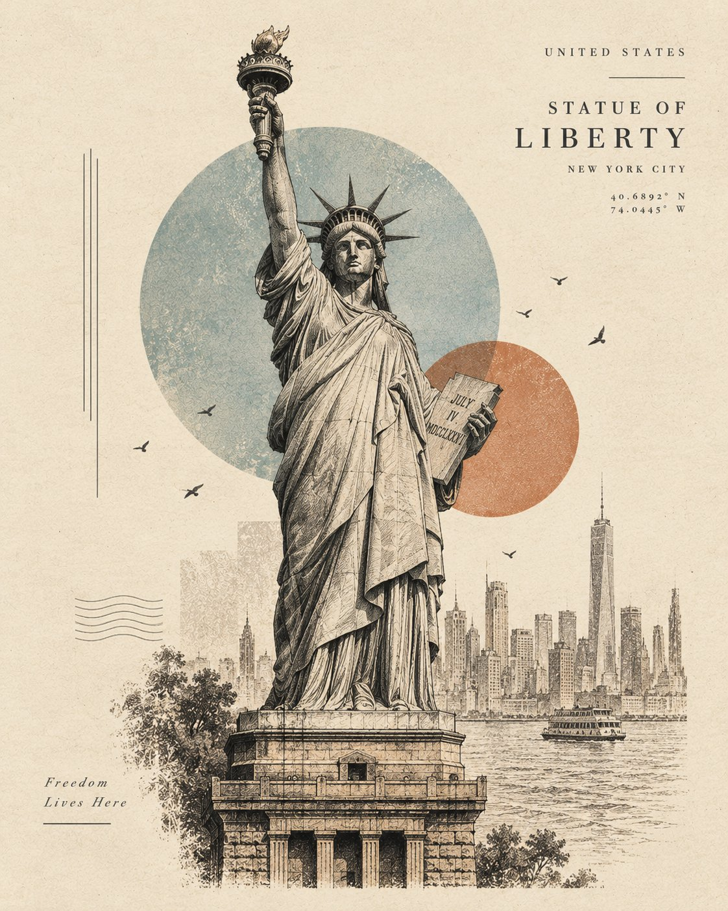

# Minimal Architectural Sketch Poster

**中文标题：** 极简建筑手绘海报  
**ID:** `gi25-x-625` · **Mode:** `generate`  
**Categories:** `poster-typography`  
**Tags:** `x-twitter`, `community`, `gpt-image-2.5`, `bravoneo`, `en`



### Minimal Architectural Sketch Poster

```text
A sophisticated minimalist architectural art poster featuring [LANDMARK / STRUCTURE] as the central subject, illustrated in a refined hand-drawn architectural sketch style. Preserve the landmark’s recognizable silhouette, proportions, and defining architectural details, while transforming it into an elegant artistic composition.

Use a limited monochromatic color palette inspired by the location, with soft vintage tones on a warm ivory/off-white paper background. Combine delicate ink lines, fine architectural hatching, subtle halftone texture, and lightly distressed print details.

Surround the structure with a few abstract geometric shapes, soft translucent circles, subtle atmospheric elements, birds, or tiny contextual details that complement the landmark without overpowering it. Add a subtle sense of depth through overlapping layers and faded linework.

Include small minimalist typography on one side: [CITY / COUNTRY], [LANDMARK NAME], and optional coordinates or a short location descriptor, arranged like a premium travel-art print.

Clean negative space, editorial graphic design, museum-quality travel poster aesthetic, elegant composition, understated luxury, vintage screen-print texture, artistic architectural illustration, no people, no photorealistic background, no unnecessary objects, 4:5 vertical composition.

[LANDMARK] reimagined as a collectible minimalist travel-art poster, combining architectural sketching, vintage printmaking, geometric abstract shapes, delicate linework, halftone texture, muted location-inspired colors, and elegant negative space. The landmark remains instantly recognizable but feels like a hand-crafted piece of modern graphic art. Add tiny birds, subtle environmental elements, coordinates, and minimal location typography. Premium editorial aesthetic, artistic, sophisticated, highly shareable, 4:5 vertical.
```

- **Recommended model:** `gpt-image-2.5-sunburst`
- **Settings:** _(defaults)_
- **Source:** [community](https://x.com/Naiknelofar788/status/2103337128868590047) — @Naiknelofar788 (via BravoNeo/awesome-gpt-image-2-5-prompts)
- **License note:** Original X post credited via BravoNeo/awesome-gpt-image-2-5-prompts (third-party source, no new license granted); remix with attribution
- **Notes:** BravoNeo entry x-2103337128868590047; use=posters; style=architectural-sketch,minimalist; prompt matches original X post text; verified=True
- **Preview:** `previews/gi25-x-625.jpg`
