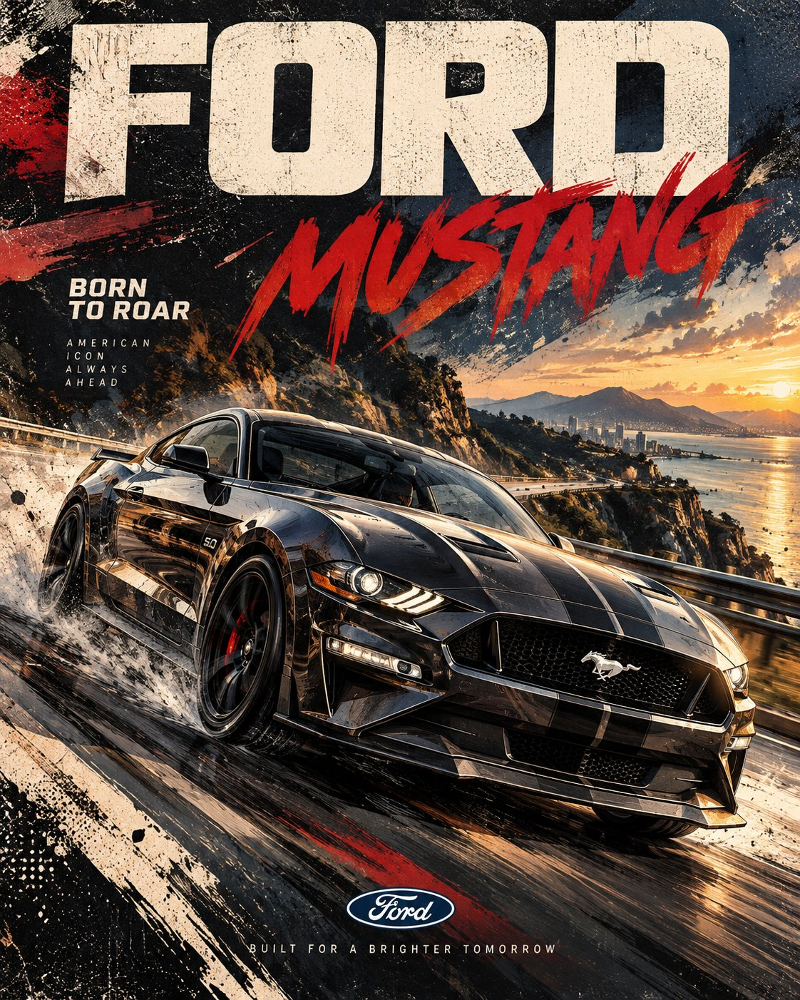

# Expressive Automotive Motion Poster

**中文标题：** 表现性汽车动态海报  
**ID:** `gi25-x-626` · **Mode:** `generate`  
**Categories:** `poster-typography`, `ecommerce`  
**Tags:** `x-twitter`, `community`, `gpt-image-2.5`, `bravoneo`, `en`



### Expressive Automotive Motion Poster

```text
Create a premium 4:5 vertical automotive editorial poster featuring a [YEAR] [CAR] in [COLOR], captured from an aggressive low three-quarter perspective as it speeds through [SCENERY]. Emphasize the car’s authentic proportions, distinctive body lines, aerodynamic surfaces, wheels, headlights, grille, reflections, and mechanical details while maintaining a dynamic sense of forward motion.

Build the artwork around expressive hand-painted brush strokes, sweeping diagonal marks, controlled ink splashes, dry-brush textures, screen-printed grain, subtle halftone patterns, bold graphic shadows, and layered atmospheric shapes. Add directional motion trails, subtle environmental blur, dust or road particles, and energetic background strokes that reinforce speed without obscuring the vehicle.

Use a sophisticated high-contrast palette of [COLORS], with carefully balanced highlights, deep shadows, and selective accent tones. Keep the composition bold but refined, combining vintage motorsport graphics with contemporary automotive editorial design.

Place the large, clean geometric sans-serif title “[TITLE]” prominently at the top, with the bold editorial headline “[HEADLINE]” integrated naturally into the artwork. Position the authentic [BRAND] logo cleanly at the bottom, maintaining accurate proportions and strong visual hierarchy.

Crisp illustrated vehicle detailing, dramatic perspective, tactile print texture, refined typography, balanced negative space, premium poster composition, energetic retro racing aesthetic, sophisticated editorial finish, highly polished 4:5 vertical format.
```

- **Recommended model:** `gpt-image-2.5-sunburst`
- **Settings:** _(defaults)_
- **Source:** [community](https://x.com/Goodmanprotocol/status/2103361503881838850) — @Goodmanprotocol (via BravoNeo/awesome-gpt-image-2-5-prompts)
- **License note:** Original X post credited via BravoNeo/awesome-gpt-image-2-5-prompts (third-party source, no new license granted); remix with attribution
- **Notes:** BravoNeo entry x-2103361503881838850; use=posters,products; style=hand-drawn,retro; prompt matches original X post text; verified=True
- **Preview:** `previews/gi25-x-626.jpg`
