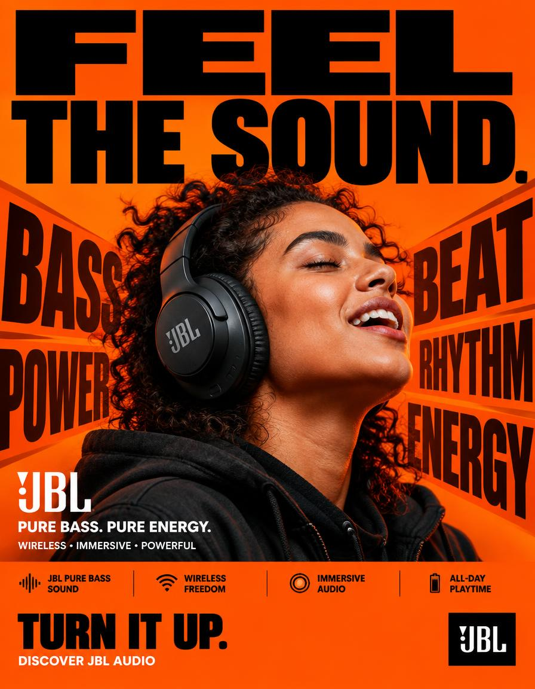

# Feel the Sound Headphone Campaign Poster

**中文标题：** FEEL THE SOUND耳机广告海报  
**ID:** `gi25-x-628` · **Mode:** `generate`  
**Categories:** `poster-typography`, `ecommerce`  
**Tags:** `x-twitter`, `community`, `gpt-image-2.5`, `bravoneo`, `en`



### Feel the Sound Headphone Campaign Poster

```text
JBL — “FEEL THE SOUND.”
FORMAT:
4:5 vertical hyper-commercial JBL headphone campaign poster, ultra-high-resolution 8K, global OOH + Instagram + Meta advertising, BOLD TYPOGRAPHY–FIRST DESIGN, aggressive editorial graphic design, premium product photography, contemporary JBL advertising language
⸻
🧠 CORE IDEA
FEEL THE SOUND.
Make typography the dominant visual element, with JBL’s signature orange brand color controlling the entire visual environment.
The poster should communicate powerful JBL audio through a physical graphic metaphor:
SOUND → IMPACT → MOVEMENT
The typography appears to react to the sound, creating a visual sense of bass, rhythm and energy.
⸻
🎬 MASTER COMPOSITION
Create a highly graphic, typography-dominated composition.
TOP 40% — TYPOGRAPHY DOMINATION
Massive stacked headline:
FEEL
THE
SOUND.
Use extremely bold condensed sans-serif typography.
The words should occupy almost the entire width of the poster.
Aggressive scale.
Some letters cropped by the edges.
Typography should feel physically pushed by sound pressure.
⸻
🟠 BRAND-COLOR BACKGROUND
Use JBL’s signature orange as the dominant full-frame background.
Strong, saturated JBL orange.
Build subtle tonal variations within the orange rather than introducing unrelated background colors.
Use:
* Deep orange shadows
* Bright orange highlights
* Slight darker orange graphic blocks
* Black typography
* White microcopy
The entire poster should immediately feel like JBL even before the logo is seen.
⸻
🎧 PRODUCT + SUBJECT
Place a realistic person wearing a JBL headphone prominently in the center/lower-middle section.
The headphone must remain highly recognizable and physically accurate.
Subject positioned directly within the typography composition.
The person should feel energetic and immersed in the music.
Natural expression.
No exaggerated fashion pose.
The headphone is the product hero.
⸻
💥 TYPOGRAPHIC VISUAL METAPHOR
Create oversized graphic words around the product:
BASS
BEAT
POWER
RHYTHM
ENERGY
These words should appear as huge background typography.
Some letters can stretch, overlap and partially disappear behind the subject.
Use typography to create the sensation of sound physically moving through the poster.
Add subtle directional typographic distortion around the headphone.
No literal sound waves.
No futuristic holograms.
⸻
✍️ TYPOGRAPHY SYSTEM
Typography is the hero graphic element.
PRIMARY HEADLINE
FEEL THE SOUND.
Extremely heavy bold grotesk / condensed sans-serif.
Huge scale.
Tight kerning.
Strong black typography against JBL orange.
SECONDARY COPY
JBL
PURE BASS. PURE ENERGY.
MICROCOPY
WIRELESS • IMMERSIVE • POWERFUL
Small uppercase commercial typography.
⸻
📦 FEATURE STRIP
Bottom section contains a highly structured commercial information bar:
JBL PURE BASS SOUND
WIRELESS FREEDOM
IMMERSIVE AUDIO
ALL-DAY PLAYTIME
Use compact uppercase typography separated by thin black rules.
Keep the information visually organized and highly legible.
⸻
📣 CTA
Large bold CTA:
TURN IT UP.
Below:
DISCOVER JBL AUDIO
JBL logo positioned prominently but cleanly.
⸻
🎨 COLOR SYSTEM
PRIMARY: JBL signature orange.
SECONDARY: Deep black.
ACCENT: White.
Orange must dominate the entire background.
Black provides the major typography contrast.
White is reserved for small supporting information and selected graphic details.
No unnecessary blue, purple, cyan or neon gradients.
⸻
💡 LIGHTING
High-end commercial product photography.
Strong directional studio lighting.
Controlled highlights on the headphones.
Natural skin texture.
Subtle orange environmental bounce light.
Deep controlled shadows.
High contrast.
The product must separate clearly from the orange background.
⸻
🔍 HYPER DETAILING
Ultra-realistic headphone materials:
* precise matte and gloss surfaces
* realistic ear cushions
* detailed controls
* subtle reflections
* accurate JBL branding
* realistic skin pores
* natural clothing texture
Typography must remain razor sharp and professionally typeset.
⸻
📐 COMPOSITION FLOW
1. MASSIVE “FEEL THE SOUND.” HEADLINE
↓
2. JBL ORANGE GRAPHIC FIELD
↓
3. PRODUCT + HUMAN HERO
↓
4. GIANT BASS / BEAT / POWER TYPOGRAPHY
↓
5. PRODUCT NAME / BRANDING
↓
6. FEATURE STRIP
↓
7. CTA + JBL LOGO
The concept must be understood within one second.
⸻
🎥 CAMERA / RENDER
Professional commercial photography.
50mm lens.
Slightly low-angle perspective to give the product presence.
Ultra-realistic 8K product detail.
Sharp commercial focus.
Clean edges.
Print-quality typography.
Premium global advertising execution.
⸻
🚫 NEGATIVE DIRECTION
No generic headphone advertisement.
No blue background.
No purple neon.
No cyberpunk aesthetic.
No holograms.
No floating headphones.
No random particles.
No excessive lens flares.
No fantasy environment.
No excessive cinematic VFX.
No tiny headline.
No minimalist typography.
No luxury-fashion-only aesthetic.
No cluttered unreadable layout.
No incorrect JBL logo.
No distorted headphones.
No fake product details.
⸻
🔥 FINAL FEEL
JBL × BOLD TYPOGRAPHY × ORANGE BRAND WORLD × PRODUCT PHOTOGRAPHY × SOUND ENERGY
BIG TYPE.
JBL ORANGE.
REAL PRODUCT.
PHYSICAL SOUND.
MAXIMUM COMMERCIAL IMPACT.
```

- **Recommended model:** `gpt-image-2.5-sunburst`
- **Settings:** _(defaults)_
- **Source:** [community](https://x.com/Diplomeme/status/2103429083652821045) — @Diplomeme (via BravoNeo/awesome-gpt-image-2-5-prompts)
- **License note:** Original X post credited via BravoNeo/awesome-gpt-image-2-5-prompts (third-party source, no new license granted); remix with attribution
- **Notes:** BravoNeo entry x-2103429083652821045; use=posters,products; style=graphic-design,photorealistic; prompt matches original X post text; verified=True
- **Preview:** `previews/gi25-x-628.jpg`
