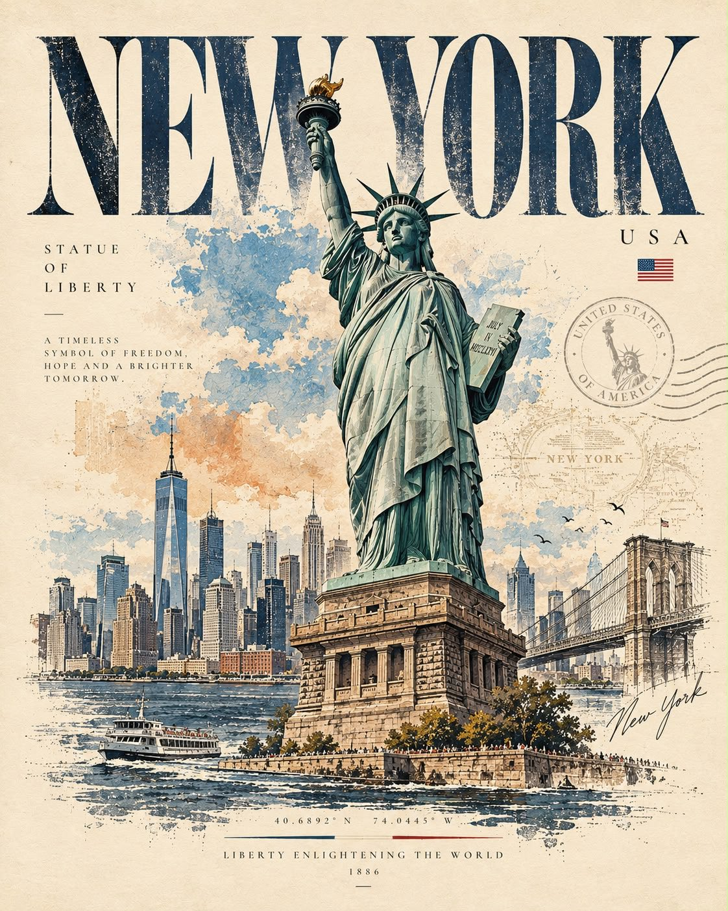

# Timeless Editorial Travel Art

**中文标题：** 永恒视觉故事旅行画页  
**ID:** `gi25-x-630` · **Mode:** `generate`  
**Categories:** `poster-typography`, `general`  
**Tags:** `x-twitter`, `community`, `gpt-image-2.5`, `bravoneo`, `en`



### Timeless Editorial Travel Art

```text
Create a sophisticated minimalist editorial art poster featuring [PERSON / LANDMARK / STRUCTURE] as the central subject, inspired by premium travel photography and refined hand-drawn illustration.

Preserve the subject’s recognizable identity, proportions, silhouette, defining details, and visual character. Combine realistic elements with elegant artistic interpretation.

Use a warm ivory paper background with a limited vintage color palette inspired by the subject’s location or personality. Add delicate ink outlines, architectural sketch lines, subtle hatching, halftone texture, faded print effects, and soft watercolor-like washes.

Create a sense of visual storytelling by incorporating subtle surrounding elements connected to the subject — such as [CITY / COUNTRY / CULTURE / PROFESSION / LANDMARK DETAILS / NATURE] — while maintaining generous negative space and a clean luxury-editorial composition.

Add small, tasteful typography:
[NAME / LANDMARK]
[CITY / COUNTRY]
[SHORT DESCRIPTOR / YEAR / COORDINATES]

Style: museum-quality travel poster, contemporary editorial illustration, vintage printmaking, refined hand-drawn detail, understated luxury, sophisticated composition.

No unnecessary objects, no clutter, no distorted features, no exaggerated proportions, no generic stock-art appearance.

Format: 4:5 vertical, high-resolution, premium collectible poster aesthetic.

[SUBJECT] reimagined as a timeless visual story.
```

- **Recommended model:** `gpt-image-2.5-sunburst`
- **Settings:** _(defaults)_
- **Source:** [community](https://x.com/Naiknelofar788/status/2103448130503205226) — @Naiknelofar788 (via BravoNeo/awesome-gpt-image-2-5-prompts)
- **License note:** Original X post credited via BravoNeo/awesome-gpt-image-2-5-prompts (third-party source, no new license granted); remix with attribution
- **Notes:** BravoNeo entry x-2103448130503205226; use=posters,art-editorial; style=watercolor,architectural-sketch; prompt matches original X post text; verified=True
- **Preview:** `previews/gi25-x-630.jpg`
