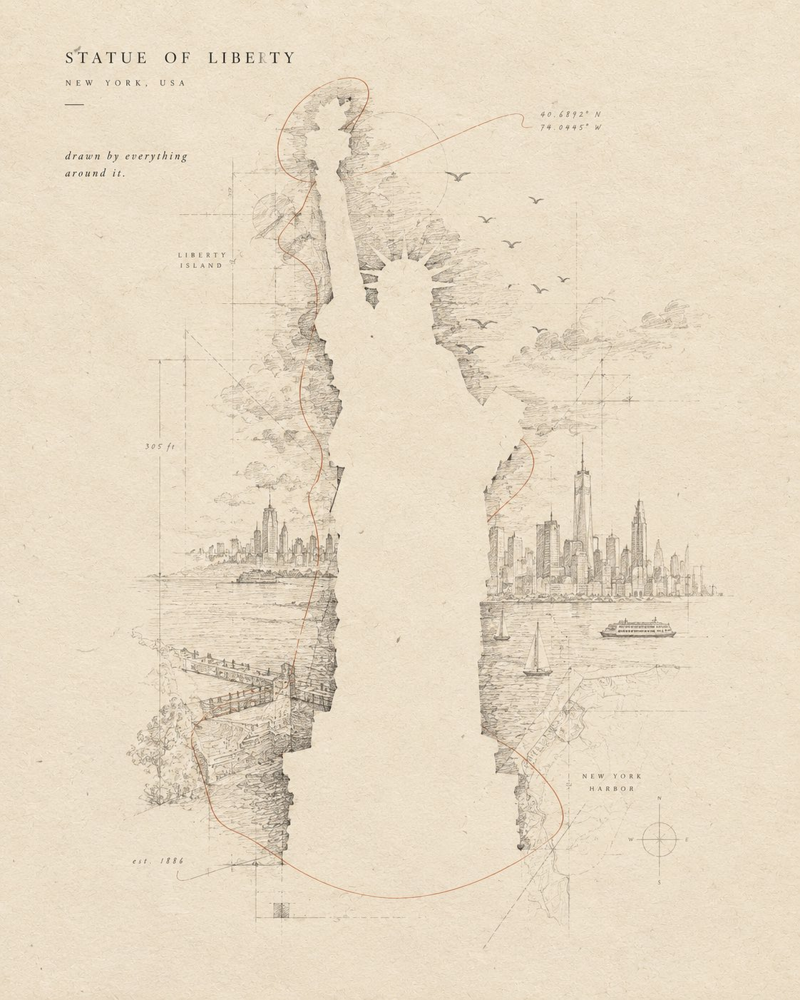

# Architecture Drawn Through Negative Space

**中文标题：** 以负空间勾勒建筑  
**ID:** `gi25-x-634` · **Mode:** `generate`  
**Categories:** `poster-typography`  
**Tags:** `x-twitter`, `community`, `gpt-image-2.5`, `bravoneo`, `en`



### Architecture Drawn Through Negative Space

```text
Create an exceptionally original minimalist architectural art poster featuring [LANDMARK].

Do NOT directly draw, paint, or fill the landmark.

Instead, create the landmark entirely through negative space.

The central silhouette of [LANDMARK] remains almost completely untouched — warm ivory paper showing through naturally. Around this empty silhouette, extremely delicate graphite lines describe the world that surrounds it: architectural measurements, tiny streets, distant rooftops, clouds, birds, shadows, perspective guides, fragments of maps and subtle environmental contours.

The surrounding drawing becomes denser near the edges of the landmark, making the untouched negative space gradually reveal the unmistakable silhouette of [LANDMARK].

Some construction lines intentionally continue through the empty silhouette but become extremely faint, as if the artist started drawing the landmark and then erased it.

Add one unexpected detail: a single continuous pencil line travels around the landmark without ever drawing its actual outline. At one point, the line breaks and leaves a tiny handwritten coordinate or date.

Use warm ivory paper, graphite pencil, extremely fine architectural linework, subtle eraser dust, paper fibers, faint halftone imperfections and soft natural shadows.

Color palette: almost entirely monochrome graphite and ivory, with one extremely subtle accent inspired by [CITY/COUNTRY].

Small refined typography placed in generous negative space:

[LANDMARK NAME]
[CITY, COUNTRY]

“drawn by everything around it.”

The composition must feel mysterious, intelligent and unexpectedly beautiful — like a contemporary museum artwork rather than a conventional travel poster.

No photorealistic background. No obvious illustration of the landmark. No decorative clutter. No excessive typography. No people.

4:5 vertical, ultra-minimal, sophisticated editorial design, tactile handmade paper, elegant negative space, precise architectural details, smooth visual flow, premium contemporary gallery aesthetic.
```

- **Recommended model:** `gpt-image-2.5-sunburst`
- **Settings:** _(defaults)_
- **Source:** [community](https://x.com/Naiknelofar788/status/2104137134047433042) — @Naiknelofar788 (via BravoNeo/awesome-gpt-image-2-5-prompts)
- **License note:** Original X post credited via BravoNeo/awesome-gpt-image-2-5-prompts (third-party source, no new license granted); remix with attribution
- **Notes:** BravoNeo entry x-2104137134047433042; use=posters; style=architectural-sketch,minimalist; prompt matches original X post text; verified=True
- **Preview:** `previews/gi25-x-634.jpg`
