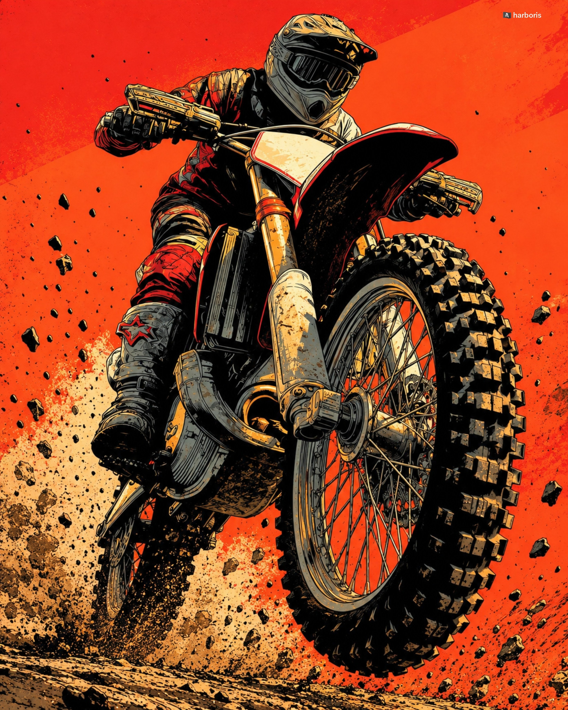

# Low-Angle Motocross Wheelie Illustration

**中文标题：** 低机位越野摩托翘头插画  
**ID:** `gi25-x-635` · **Mode:** `generate`  
**Categories:** `poster-typography`  
**Tags:** `x-twitter`, `community`, `gpt-image-2.5`, `bravoneo`, `en`



### Low-Angle Motocross Wheelie Illustration

```text
Create a high-impact vertical editorial illustration of a motocross rider performing an aggressive wheelie directly toward the camera on a dirt bike. Use an extremely low front-facing camera angle, making the large front knobby tire dominate the lower-right foreground while the rider appears powerful and imposing above it.

The rider wears a full motocross helmet with a dark tinted visor, protective motocross jersey, padded riding pants, gloves, and rugged motocross boots. Show realistic protective gear with layered fabric, stitching, armor panels, folds, scratches, and worn textures. 

The motorcycle should have detailed handlebars, handguards, front suspension forks, spokes, brake components, engine parts, frame, mudguards, and thick off-road tires.

Use a bold graphic comic-book illustration style with heavy black ink outlines, rough hand-drawn linework, crosshatching, imperfect ink edges, expressive contour lines, subtle paper grain, and screen-print-like texture. Use a limited high-contrast palette of vivid red-orange, black, cream, muted yellow, and warm gray.

The background is a flat intense red-orange field with subtle geometric color variation, distressed paint texture, scattered black dirt particles, and small debris around the motorcycle. Add a dusty ground surface beneath the bike with splashes of dirt and gritty texture.
Dynamic action composition, dramatic perspective, exaggerated scale, crisp illustrated details, strong shadows, vintage motocross poster aesthetic, modern editorial graphic design, energetic and rebellious mood.

No text, no letters, no numbers, no logos, no usernames, no watermark, no signature, no typography anywhere in the image.

Vertical 4:5 composition.
```

- **Recommended model:** `gpt-image-2.5-sunburst`
- **Settings:** _(defaults)_
- **Source:** [community](https://x.com/harboriis/status/2104185048652255275) — @harboriis (via BravoNeo/awesome-gpt-image-2-5-prompts)
- **License note:** Original X post credited via BravoNeo/awesome-gpt-image-2-5-prompts (third-party source, no new license granted); remix with attribution
- **Notes:** BravoNeo entry x-2104185048652255275; use=posters; style=comic,hand-drawn,retro; prompt matches original X post text; verified=True
- **Preview:** `previews/gi25-x-635.jpg`
