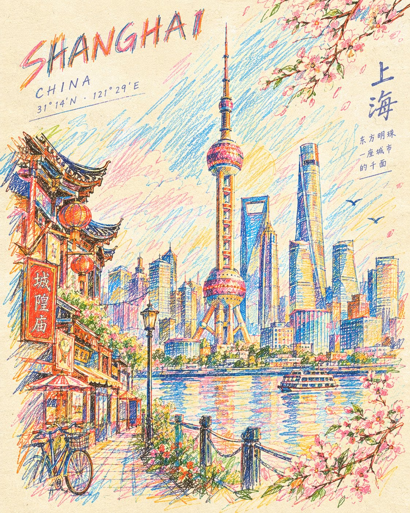

# Handcrafted Colored-Pencil Travel Poster

**中文标题：** 手绘彩铅旅行海报  
**ID:** `gi25-x-639` · **Mode:** `generate`  
**Categories:** `poster-typography`  
**Tags:** `x-twitter`, `community`, `gpt-image-2.5`, `bravoneo`, `en`



### Handcrafted Colored-Pencil Travel Poster

```text
Create a sophisticated handcrafted travel-art poster of [LANDMARK / CITY / COUNTRY], illustrated entirely with colored pencils and wax crayons on warm ivory paper.

Depict [LANDMARK / CITY / COUNTRY] as if it has been drawn from memory by an exceptionally talented artist — recognizable architecture and proportions, but expressed through energetic imperfect pencil strokes, layered wax-crayon marks, loose cross-hatching, scribbled shading, overlapping colors, and visible hand pressure.

Instead of filling the landmark with flat color, let hundreds of expressive pencil strokes build its form. Allow certain strokes to extend beyond the architectural edges, creating a sense of movement and imagination. Add tiny hand-drawn visual memories around and within the composition: local patterns, plants, birds, windows, streets, clouds, cultural motifs, landscape elements and subtle symbols associated with the place.

Use a limited but vibrant destination-inspired palette: [COLORS]. Keep some areas intentionally unfinished, allowing the ivory paper to remain visible.

Add small imperfect handwritten-style typography:
[COUNTRY / CITY]
[LANDMARK NAME]
[COORDINATES OR SHORT PHRASE]

The result should feel like a rare artist’s sketchbook page transformed into a premium contemporary travel poster — playful, tactile, nostalgic, artistic and highly detailed.

Visible colored-pencil grain, wax-crayon texture, imperfect outlines, layered strokes, subtle paper fibers, hand-drawn imperfections, sophisticated composition, strong negative space, no photorealism, no 3D rendering, no glossy digital effects, no people, 4:5 vertical.

An even more unique variation: “Pencil Explosion”

The landmark stays recognizable in the center, but its colors and pencil strokes progressively break apart into tiny illustrated memories of the city — almost like the drawing is coming alive.

That would preserve the exact crayon/pencil aesthetic of your reference while giving it a much more original concept.
```

- **Recommended model:** `gpt-image-2.5-sunburst`
- **Settings:** _(defaults)_
- **Source:** [community](https://x.com/Naiknelofar788/status/2104795155782148399) — @Naiknelofar788 (via BravoNeo/awesome-gpt-image-2-5-prompts)
- **License note:** Original X post credited via BravoNeo/awesome-gpt-image-2-5-prompts (third-party source, no new license granted); remix with attribution
- **Notes:** BravoNeo entry x-2104795155782148399; use=posters; style=colored-pencil,crayon; prompt matches original X post text; verified=True
- **Preview:** `previews/gi25-x-639.jpg`
