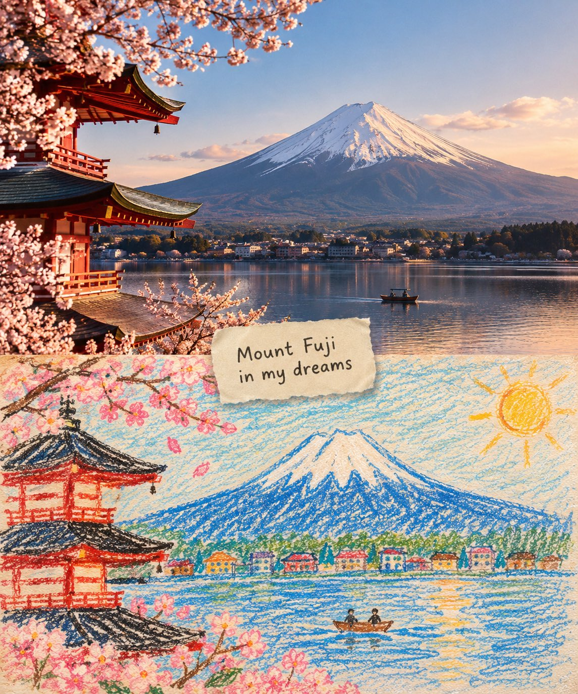

# Split-Scene Landmark: Reality Turning into Childhood Memory

**中文标题：** 现实与童年记忆的地标分屏  
**ID:** `gi25-x-641` · **Mode:** `generate`  
**Categories:** `poster-typography`  
**Tags:** `x-twitter`, `community`, `gpt-image-2.5`, `bravoneo`, `en`



### Split-Scene Landmark: Reality Turning into Childhood Memory

```text
Create a visually striking split-scene artwork showing [LANDMARK / CITY / COUNTRY] in two artistic worlds.

Top half: a cinematic, photorealistic view of [LANDMARK], captured during a beautiful [morning/golden-hour/evening], with authentic architecture, local people, atmosphere, street details, natural lighting, realistic textures, and strong cinematic depth. Include recognizable cultural details that immediately establish the location.

Bottom half: the exact same scene reimagined as a handmade child’s drawing, created with rough colored pencils, wax crayons, imperfect strokes, scribbled textures, uneven outlines, innocent proportions, visible paper grain, playful colors, and charming imperfections. Keep the important landmarks and visual elements recognizable but make them feel lovingly drawn from memory.

Between the two worlds, place a small torn piece of cream paper with handwritten text: “[SHORT EMOTIONAL PHRASE]”.

The transition should feel like reality turning into a childhood memory. Warm nostalgic atmosphere, tactile paper texture, subtle imperfections, editorial composition, emotionally charming, highly detailed, artistic but believable. No clean digital illustration, no glossy 3D render, no overly polished cartoon.
The strongest visual hook is keeping the same composition in both halves so the viewer immediately recognizes that the crayon drawing is the child’s imaginative/memory version of the real place.
```

- **Recommended model:** `gpt-image-2.5-sunburst`
- **Settings:** _(defaults)_
- **Source:** [community](https://x.com/Naiknelofar788/status/2105146737359024184) — @Naiknelofar788 (via BravoNeo/awesome-gpt-image-2-5-prompts)
- **License note:** Original X post credited via BravoNeo/awesome-gpt-image-2-5-prompts (third-party source, no new license granted); remix with attribution
- **Notes:** BravoNeo entry x-2105146737359024184; use=posters; style=photorealistic,crayon; prompt matches original X post text; verified=True
- **Preview:** `previews/gi25-x-641.jpg`
