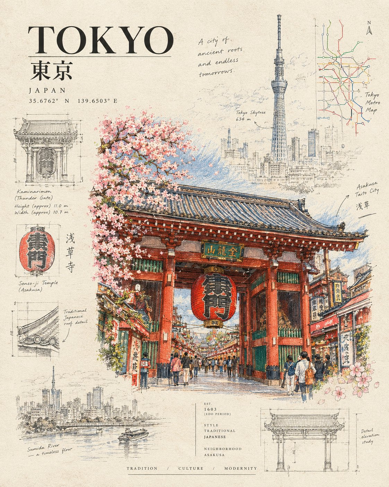

# Architectural Passport Travel Poster

**中文标题：** 建筑护照式旅行海报  
**ID:** `gi25-x-644` · **Mode:** `generate`  
**Categories:** `poster-typography`  
**Tags:** `x-twitter`, `community`, `gpt-image-2.5`, `bravoneo`, `en`



### Architectural Passport Travel Poster

```text
Create a highly detailed “Architectural Passport” travel poster for [CITY / LANDMARK], designed to look like a premium collectible art print that blends colored-pencil illustration, fine ink drawing, vintage architectural documentation, and subtle watercolor texture.

Place the landmark as the dramatic hero, drawn with intricate hand-rendered details, realistic perspective, delicate pencil hatching, visible paper grain, and carefully controlled pops of natural color. Surround it with a faint city map, street names, architectural measurements, tiny elevation sketches, construction lines, botanical details, directional arrows, and miniature diagrammatic studies.

Use an elegant warm ivory paper background with mostly muted graphite, charcoal, terracotta, olive green, dusty blue, and warm beige tones. Keep the background extremely clean and editorial, allowing the landmark to visually emerge from the page.

Add sophisticated typography:
[CITY]
[LANDMARK NAME]
small coordinates, founding/construction date, architectural style, neighborhood name, and tiny archival annotations.

Include one or two miniature architectural detail drawings beside the main structure, as if taken from an architect’s sketchbook. Add subtle imperfections: pencil smudges, uneven ink pressure, erased construction marks, paper fibers, faint halftone texture, and hand-drawn annotation marks.

The composition should feel like a cross between a vintage travel poster, an architectural magazine cover, a museum exhibition print, and a designer’s sketchbook.

Visual hook: make the landmark extremely detailed and colorful while the surrounding city information remains almost ghost-like, creating a striking contrast between “the place” and “the blueprint of the place.”

Vertical 4:5 composition, premium editorial design, sophisticated negative space, ultra-detailed hand illustration, realistic architectural perspective, tactile paper texture, collectible poster aesthetic, visually striking at thumbnail size, no photorealistic rendering, no 3D CGI look.
```

- **Recommended model:** `gpt-image-2.5-sunburst`
- **Settings:** _(defaults)_
- **Source:** [community](https://x.com/Naiknelofar788/status/2105486629586796891) — @Naiknelofar788 (via BravoNeo/awesome-gpt-image-2-5-prompts)
- **License note:** Original X post credited via BravoNeo/awesome-gpt-image-2-5-prompts (third-party source, no new license granted); remix with attribution
- **Notes:** BravoNeo entry x-2105486629586796891; use=posters; style=colored-pencil,watercolor; prompt matches original X post text; verified=True
- **Preview:** `previews/gi25-x-644.jpg`
