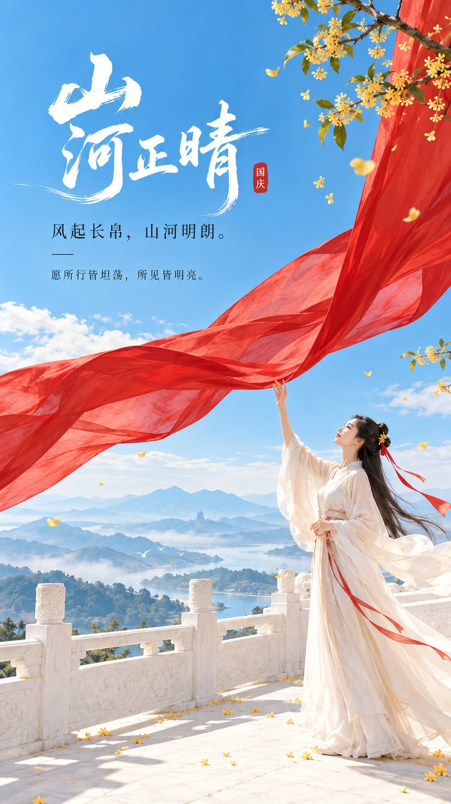

# Minimal National Day Cover with Red Silk

**中文标题：** 朱红长帛国庆极简封面  
**ID:** `gi25-x-647` · **Mode:** `generate`  
**Categories:** `poster-typography`, `xiaohongshu`  
**Tags:** `x-twitter`, `community`, `gpt-image-2.5`, `bravoneo`, `zh`



### Minimal National Day Cover with Red Silk

```text
主题方向： 东方禅意极简国庆封面海报
风格分支： 国庆女性审美明亮高传播型
主体内容： 一位古风女子站在白色高台边，抬手望向被风轻轻吹起的一幅朱红长帛
情绪母题： 明朗、喜悦、向上、山河清朗
场景与意象： 象牙白高台、朱红长帛、晴空蓝天空、少量金桂枝叶、女子、极淡远山
构图与空间： 9:16 竖版，女子位于画面下方偏右，朱红长帛从右上方斜向进入并形成明显视觉动线，天空与白色墙面占据约三分之二画幅，上方偏左保留完整标题区，远山只作为极淡空间层次
色彩控制： 象牙白作为高明度空间基底，晴空蓝用于天空和少量远景空气层，朱红只用于迎风长帛和极少局部点睛，桂花金用于少量枝叶与细节，人物服装保持月白或浅杏白；形成红、蓝、白之间鲜明但干净的节庆对比，避免全图泛红、泛金或套暖色滤镜
光线与质感： 国庆晴日上午明亮自然光，空气清透，轮廓清晰，白色高台有干净高光，长帛保留轻薄透光与自然褶皱，现代东方平面海报感，轻微纸面质感即可
画幅比例： 9:16
补充要求： 节庆感要鲜明但不要传统宣传画感；不要烟花、彩带、人群、复杂建筑和大面积红色背景；女子比例纤细自然，姿态舒展；整体高明度、低灰度、轻盈通透，有明显女性审美和小红书高传播封面感；留白处配置少量东方书法标题和现代宋体小字
```

- **Recommended model:** `gpt-image-2.5-sunburst`
- **Settings:** _(defaults)_
- **Source:** [community](https://x.com/liyue_ai/status/2105538964082069710) — @liyue_ai (via BravoNeo/awesome-gpt-image-2-5-prompts)
- **License note:** Original X post credited via BravoNeo/awesome-gpt-image-2-5-prompts (third-party source, no new license granted); remix with attribution
- **Notes:** BravoNeo entry x-2105538964082069710; use=posters; style=minimalist,graphic-design; prompt matches original X post text; verified=True
- **Preview:** `previews/gi25-x-647.jpg`
