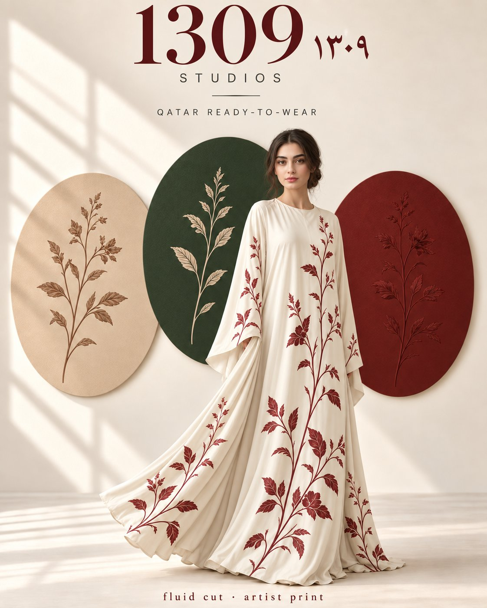

# 1309 Studios Silk Abaya Brand Poster

**中文标题：** 1309 Studios 丝绸长袍品牌海报  
**ID:** `gi25-x-661` · **Mode:** `generate`  
**Categories:** `poster-typography`  
**Tags:** `x-twitter`, `community`, `gpt-image-2.5`, `x-direct`, `en`



### 1309 Studios Silk Abaya Brand Poster

```text
Vertical brand poster for 1309 Studios. A woman in her late twenties wears a fluid ivory silk abaya with a restrained oxblood botanical print, modest clean silhouette, fabric moving as if caught mid-step, full garment readable. Contemporary romance, not streetwear, not atelier chalk. Behind her, three large artist-print plates in sand, deep green, and oxblood, each plate a flat graphic field with one restrained botanical motif, not a photo collage. Soft daylight from the left, gentle shadow, quiet luxury. Palette: ivory silk, sand, deep green, oxblood. Title “1309” in the upper register, with the small mark “١٣٠٩” beside it. Caption “fluid cut · artist print” at the base in condensed type. Elegant, fluid, sophisticated, generous negative space. 4:5
```

- **Recommended model:** `gpt-image-2.5-sunburst`
- **Settings:** _(defaults)_
- **Source:** [community](https://x.com/miratechtool/status/2107002007219310621) — @miratechtool
- **License note:** Original public X post; quoted with attribution — remix with attribution
- **Notes:** Collected directly from X; original post https://x.com/miratechtool/status/2107002007219310621 (prompt posted as the author's reply to https://x.com/miratechtool/status/2107002003285033209, which carries the images); post text names GPT Image 2.5; verified=True
- **Preview:** `previews/gi25-x-661.jpg`
