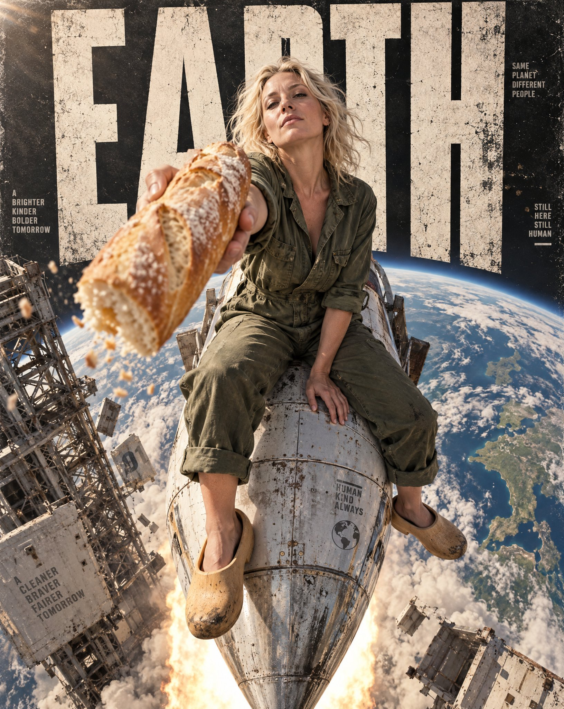

# Overhead Rocket-Nose Street Editorial Poster

**中文标题：** 俯拍火箭头街头大片海报  
**ID:** `gi25-x-664` · **Mode:** `generate`  
**Categories:** `poster-typography`  
**Tags:** `x-twitter`, `community`, `gpt-image-2.5`, `x-direct`, `en`



### Overhead Rocket-Nose Street Editorial Poster

```text
Brutal street editorial poster, vertical 4:5, direct overhead bird's-eye camera looking straight down, 16mm ultra-wide lens with strong forced perspective. A blonde woman in her forties sits on the nose of a weathered silver rocket, wearing a loose olive green workwear overall with rolled cuffs and wooden clogs dangling over the edge of the hull. She holds a traditional golden-crusted baguette in one hand, the bread scored and dusted with flour, her posture relaxed yet defiant as the rocket plunges toward Earth. The baguette, close to the lens and slightly blurred, becomes the foreground hook, crumbs drifting toward the viewer. Below, a vast curving blue and green planet fills the lower frame, its clouds streaked by the rocket's exhaust trail, with a brutalist steel launch gantry and concrete platform fragments drifting past. Monumental ultra-bold ultra-condensed distressed uppercase lettering reading EARTH fills the background, stacked in massive vertical scale, partially occluded by the woman's shoulders and the rocket's silhouette, with ink wear and weathered print finish. Hard warm sunlight from the upper left casting crisp shadows across the hull, rim light on the flour-dusted bread and blonde hair, controlled palette of olive green, burnt orange, warm ivory, concrete gray and deep charcoal. Visible print grain, worn poster texture, subtle imperfections, natural skin microtexture, authentic fabric detail, restrained motion blur on the exhaust trail. Photographic, not an illustration. ratio 4:5
```

- **Recommended model:** `gpt-image-2.5-sunburst`
- **Settings:** _(defaults)_
- **Source:** [community](https://x.com/MathisYanis/status/2108091375879119212) — @MathisYanis
- **License note:** Original public X post; quoted with attribution — remix with attribution
- **Notes:** Collected directly from X; original post https://x.com/MathisYanis/status/2108091375879119212 (prompt posted as the author's reply to https://x.com/MathisYanis/status/2108091361656262791, which carries the images); post text names GPT Image 2.5; verified=True
- **Preview:** `previews/gi25-x-664.jpg`
