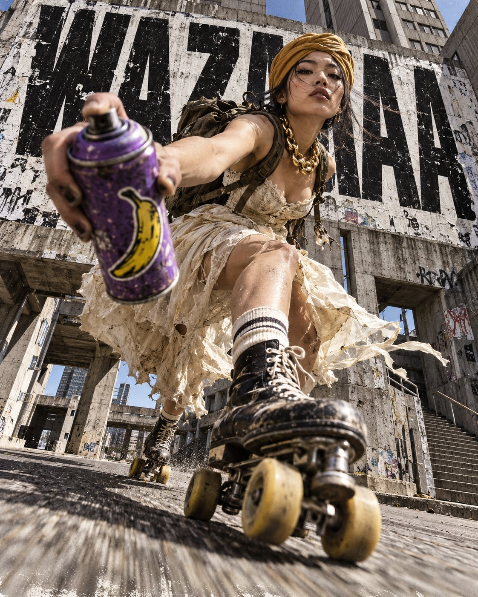

# Roller-Skating Bride Brutalist Street Poster

**中文标题：** 粗野主义街头轮滑新娘海报  
**ID:** `gi25-x-665` · **Mode:** `generate`  
**Categories:** `poster-typography`  
**Tags:** `x-twitter`, `community`, `gpt-image-2.5`, `x-direct`, `en`



### Roller-Skating Bride Brutalist Street Poster

```text
A raw street editorial poster of a 25-year-old Japanese woman aggressively roller skating through a brutalist concrete urban environment. She wears a mustard-colored dastar, a champagne wedding dress styled in a tougher, more deconstructed way, a heavy oversized gold coffee-bean necklace, and a worn backpack strapped to her back. She thrusts a purple spray paint can directly toward the lens, making it dominate the foreground with intense forced perspective; the can has a bright yellow banana sticker. She rides retro 1980s roller skates with speed and attitude, body leaning forward, fabric and loose details caught in motion. Shot from an extreme low angle with a 16mm lens, gritty full-body composition, strong distortion, harsh sunlight, deep shadows, and a confrontational stance. Huge distressed black condensed typography behind her reads “WAZAAAA”, integrated like a street poster wall, partially blocked by her silhouette. Visible texture, dust, asphalt grit, rough print finish, rebellious urban energy, raw campaign aesthetic, high contrast, bold and unapologetic. ratio 4:5
```

- **Recommended model:** `gpt-image-2.5-sunburst`
- **Settings:** _(defaults)_
- **Source:** [community](https://x.com/MathisYanis/status/2108091372477546965) — @MathisYanis
- **License note:** Original public X post; quoted with attribution — remix with attribution
- **Notes:** Collected directly from X; original post https://x.com/MathisYanis/status/2108091372477546965 (prompt posted as the author's reply to https://x.com/MathisYanis/status/2108091361656262791, which carries the images); post text names GPT Image 2.5; verified=True
- **Preview:** `previews/gi25-x-665.jpg`
