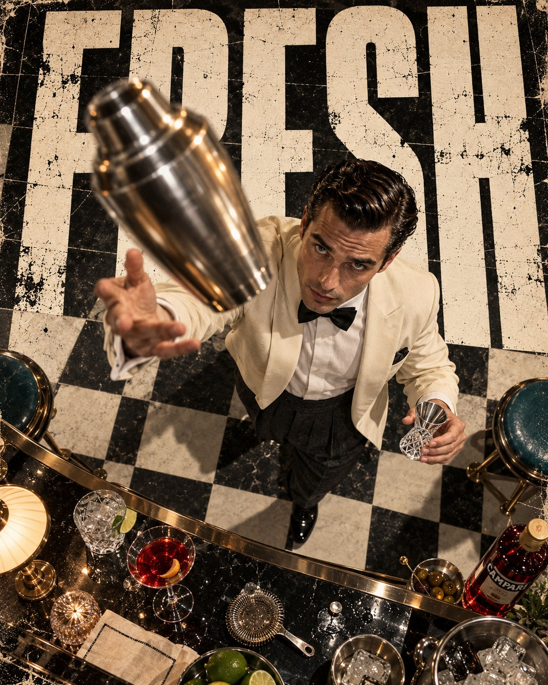

# Overhead 1950s Bartender Shaker-Toss Poster

**中文标题：** 俯拍 1950 年代调酒师抛壶海报  
**ID:** `gi25-x-666` · **Mode:** `generate`  
**Categories:** `poster-typography`  
**Tags:** `x-twitter`, `community`, `gpt-image-2.5`, `x-direct`, `en`



### Overhead 1950s Bartender Shaker-Toss Poster

```text
Brutal street editorial poster, vertical 4:5, direct overhead bird's-eye camera looking straight down, 16mm ultra-wide lens with strong forced perspective. A 1950s man in a cream dinner jacket, black bow tie, crisp white shirt and high-waisted pleated charcoal trousers, slicked-back dark hair, seen from above at a mid-century cocktail bar. His right hand grips a brushed stainless steel cocktail shaker, his left hand holds a faceted Baccarat crystal jigger, and mid-motion he tosses the shaker in a tight arc between his hands, like a card magician performing a flourish. The brushed steel shaker, caught in mid-air and blurred slightly, becomes the foreground hook, rushing toward the lens with reflections of the ceiling lights. Below, a glossy black and white checkered floor, scattered cocktail glasses, a lime wedge, a silver cocktail strainer and a bottle of crimson liqueur on the counter. Monumental ultra-bold ultra-condensed distressed uppercase lettering reading FRESH fills the background, stacked in massive scale, partially occluded by the man's shoulders and the arc of the shaker, with ink wear and weathered print finish. Hard warm overhead spotlight with crisp shadows, specular highlights on the chrome and crystal, controlled palette of cream, charcoal, crimson, chrome and a single teal accent. Visible print grain, worn poster texture, subtle imperfections, natural skin microtexture, authentic fabric detail, restrained motion blur on the shaker. Photographic, not an illustration. Ratio 4:5
```

- **Recommended model:** `gpt-image-2.5-sunburst`
- **Settings:** _(defaults)_
- **Source:** [community](https://x.com/MathisYanis/status/2108091369130439050) — @MathisYanis
- **License note:** Original public X post; quoted with attribution — remix with attribution
- **Notes:** Collected directly from X; original post https://x.com/MathisYanis/status/2108091369130439050 (prompt posted as the author's reply to https://x.com/MathisYanis/status/2108091361656262791, which carries the images); post text names GPT Image 2.5; verified=True
- **Preview:** `previews/gi25-x-666.jpg`
