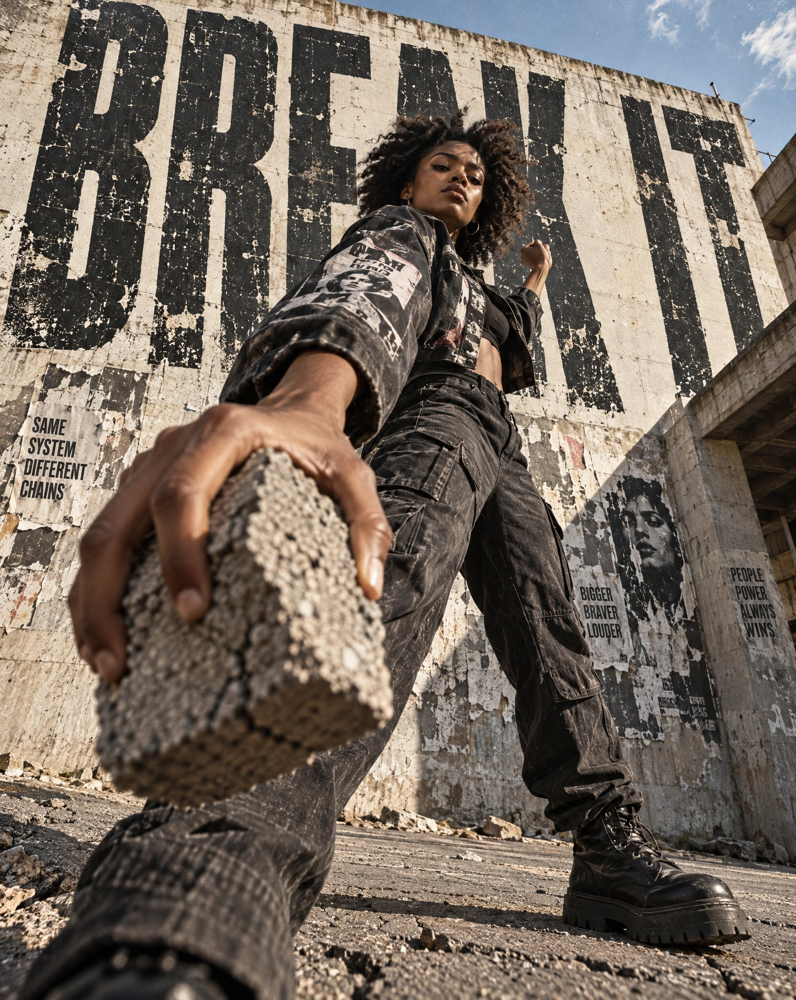

# Brick-Throw Forced-Perspective Campaign Poster

**中文标题：** 掷砖强透视街头大片海报  
**ID:** `gi25-x-667` · **Mode:** `generate`  
**Categories:** `poster-typography`  
**Tags:** `x-twitter`, `community`, `gpt-image-2.5`, `x-direct`, `en`



### Brick-Throw Forced-Perspective Campaign Poster

```text
Full-body shot of a young Black woman in her early 20s, natural coiled hair, sharp jawline, fierce unapologetic gaze, caught mid-throw, arm cocked back with raw explosive energy, a cracked concrete brick held close to the camera in extreme forced foreground perspective, knuckles sharp and dominant, filling the lower frame. Ultra-wide 16mm lens distortion, extreme low angle looking up from ground level, her figure towering monumental against a bleached urban sky. She wears a cropped oversized graphic jacket, cargo pants, heavy boots planted wide on cracked asphalt. Behind her, massive monumental condensed distressed typography fills the entire background, the words BREAK IT in worn capital letters, partially eclipsed by her silhouette, paint-scraped and flaking like a torn billboard. Brutalist minimal environment, raw concrete walls, peeling posters, urban decay. Hard warm directional sunlight raking across her face at a sharp angle, deep shadows carving her features. Visible print grain, worn matte poster texture, subtle halftone imperfections throughout. Mood: raw, rebellious, unstoppable. Premium editorial campaign aesthetic, bold, scroll-stopping, visually magnetic. Shot for a high-impact social media poster, vertical 4:5 format.
```

- **Recommended model:** `gpt-image-2.5-sunburst`
- **Settings:** _(defaults)_
- **Source:** [community](https://x.com/MathisYanis/status/2108091365099798829) — @MathisYanis
- **License note:** Original public X post; quoted with attribution — remix with attribution
- **Notes:** Collected directly from X; original post https://x.com/MathisYanis/status/2108091365099798829 (prompt posted as the author's reply to https://x.com/MathisYanis/status/2108091361656262791, which carries the images); post text names GPT Image 2.5; verified=True
- **Preview:** `previews/gi25-x-667.jpg`
